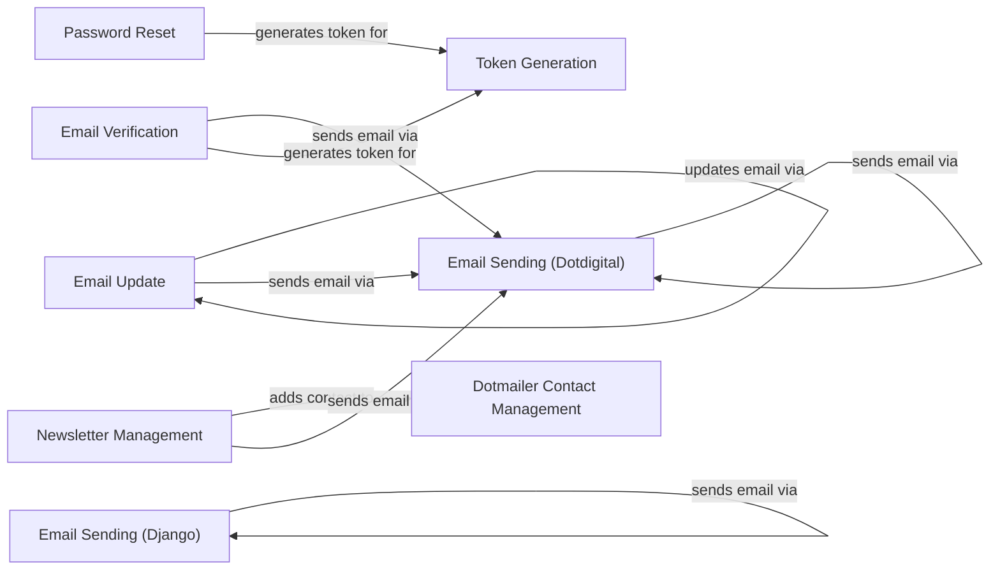

## Component Details

The Communication Services component manages all email-related functionalities within the application. It encompasses sending various types of emails, including verification emails, password reset instructions, and newsletters. The component integrates with external services like Dotdigital and Django's built-in email functionality to ensure reliable and efficient email delivery. It also handles user consent management for newsletters and other communications.

### Email Sending (Dotdigital)
This component is responsible for sending emails using the Dotdigital service. It abstracts the interaction with the Dotdigital API, allowing other components to easily send emails via Dotdigital by specifying the campaign ID, recipient addresses, and other optional parameters.
- **Related Classes/Methods**: `cfl_common.common.mail:send_dotdigital_email`

### Email Sending (Django)
This component sends emails using Django's built-in email functionality. It renders email templates and sends the email. It provides an alternative to Dotdigital for sending emails.
- **Related Classes/Methods**: `cfl_common.common.mail:django_send_email`

### Token Generation
This component generates unique tokens for email verification and password reset purposes. It encodes user information, such as email and expiration time, into a JWT (JSON Web Token). These tokens are used to create secure URLs for verification and password reset.
- **Related Classes/Methods**: `cfl_common.common.helpers.emails:generate_token`, `cfl_common.common.helpers.emails:generate_token_for_email`

### Email Verification
This component handles the email verification process. It generates a verification token, constructs the verification URL, and sends the verification email to the user using the Email Sending (Dotdigital) component.
- **Related Classes/Methods**: `cfl_common.common.helpers.emails:send_verification_email`

### Newsletter Management
This component manages newsletter subscriptions. It includes adding users to Dotmailer address books, processing newsletter subscription forms, and handling user consent for newsletters. It interacts with the Dotmailer API to manage contacts and consent records.
- **Related Classes/Methods**: `cfl_common.common.helpers.emails:add_to_dotmailer`, `portal.views.dotmailer:process_newsletter_form`, `portal.views.dotmailer:dotmailer_consent_form`, `cfl_common.common.helpers.emails:create_contact`, `cfl_common.common.helpers.emails:add_contact_to_address_book`, `cfl_common.common.helpers.emails:get_dotmailer_user_by_email`, `cfl_common.common.helpers.emails:add_consent_record_to_dotmailer_user`, `cfl_common.common.helpers.emails:send_dotmailer_consent_confirmation_email_to_user`

### Password Reset
This component handles password reset requests. It generates a token for password reset purposes and sends an email to the user with instructions on how to reset their password.
- **Related Classes/Methods**: `portal.views.registration:password_reset`

### Email Update
This component handles the process of updating a user's email address. It sends notifications to both the old and new email addresses and triggers the email verification process for the new email address.
- **Related Classes/Methods**: `cfl_common.common.helpers.emails:update_indy_email`, `cfl_common.common.helpers.emails:update_email`

### Dotmailer Contact Management
This component provides functionalities to manage contacts in Dotmailer, including creating contacts, adding contacts to address books, retrieving user information, adding consent records, and deleting contacts.
- **Related Classes/Methods**: `cfl_common.common.helpers.emails:create_contact`, `cfl_common.common.helpers.emails:add_contact_to_address_book`, `cfl_common.common.helpers.emails:get_dotmailer_user_by_email`, `cfl_common.common.helpers.emails:add_consent_record_to_dotmailer_user`, `cfl_common.common.helpers.emails:delete_contact`
