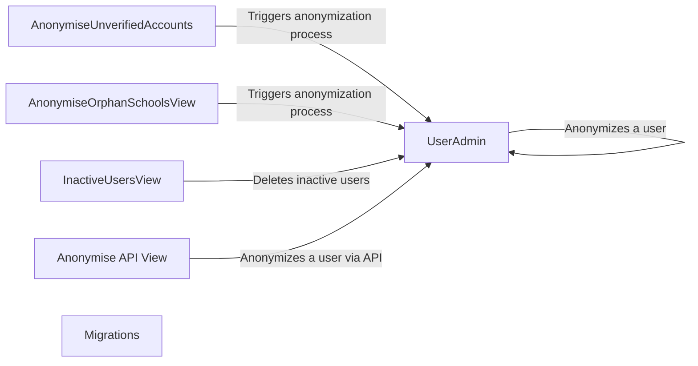

## Component Details

The Data Management and Migrations component is responsible for maintaining the integrity and privacy of user data within the Code for Life portal. It encompasses database schema migrations, anonymization of user data (both active and inactive), and management of orphan school data. The component ensures compliance with data retention policies and data privacy regulations by providing mechanisms for automated and manual data anonymization and deletion.

### AnonymiseUnverifiedAccounts
This component is a cron job that periodically anonymizes unverified user accounts based on predefined criteria, such as accounts not verified within a specific timeframe. It helps enforce data retention policies by automatically removing or anonymizing data that is no longer needed.
- **Related Classes/Methods**: `codeforlife-portal.portal.views.cron.user.AnonymiseUnverifiedAccounts:get`

### AnonymiseOrphanSchoolsView
This API endpoint anonymizes orphan schools, which are schools without active users or schools meeting specific anonymization criteria. It provides a way to clean up and anonymize data related to inactive schools, ensuring that sensitive school data is not retained indefinitely.
- **Related Classes/Methods**: `codeforlife-portal.portal.views.api.AnonymiseOrphanSchoolsView:get`

### InactiveUsersView
This API endpoint allows for the deletion of inactive users. It provides a mechanism for administrators or automated processes to remove user accounts that are no longer active, helping to maintain data hygiene and reduce storage overhead.
- **Related Classes/Methods**: `codeforlife-portal.portal.views.api.InactiveUsersView:delete`

### UserAdmin
The UserAdmin class in the Django admin interface provides an action to anonymize users. This allows administrators to manually trigger the anonymization process for specific user accounts through the Django admin panel, providing a manual override for anonymization.
- **Related Classes/Methods**: `codeforlife-portal.portal.admin.UserAdmin:anonymise_user`

### Anonymise API View
This API endpoint anonymizes a user. It provides a way to trigger the anonymization process for a specific user account via an API request, offering a programmatic way to anonymize user data.
- **Related Classes/Methods**: `codeforlife-portal.portal.views.api:anonymise`

### Migrations
This component handles database schema migrations, ensuring that the database structure is up-to-date with the latest application requirements. It manages the evolution of the database schema over time, applying necessary changes to tables, fields, and indexes.
- **Related Classes/Methods**: `cfl_common.common.migrations`
