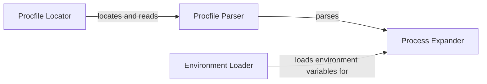

## Component Details

The Procfile Parser and Environment Loader component is responsible for reading and interpreting the Procfile, which defines the processes to be run, and loading environment variables from .env files. It parses the Procfile content, extracts process definitions, loads environment variables, and expands these variables for use by the processes. This ensures that the application has access to the correct environment configuration when it is started.

### Procfile Locator
The Procfile Locator component is responsible for finding the Procfile within the project directory. It searches for a file named 'Procfile' in the current directory or a specified path. Once found, it reads the content of the Procfile and passes it to the Procfile Parser.
- **Related Classes/Methods**: `honcho.honcho.command:_procfile`

### Procfile Parser
The Procfile Parser component takes the content of the Procfile as input and parses it to extract process definitions. It transforms the Procfile content into a structured representation, typically a dictionary-like object, where keys are process names and values are the corresponding command-line instructions.
- **Related Classes/Methods**: `honcho.honcho.environ:parse_procfile`

### Environment Loader
The Environment Loader component is responsible for reading environment variables from a .env file. It parses the .env file, extracts the key-value pairs representing environment variables, and stores them in a dictionary-like structure. These variables are then made available for use by the Process Expander.
- **Related Classes/Methods**: `honcho.honcho.command:_read_env`

### Process Expander
The Process Expander component takes the process definitions extracted by the Procfile Parser and the environment variables loaded by the Environment Loader. It expands the process definitions by interpolating environment variables into the command-line instructions. This ensures that the processes have access to the correct environment variables when they are executed.
- **Related Classes/Methods**: `honcho.honcho.environ:expand_processes`
