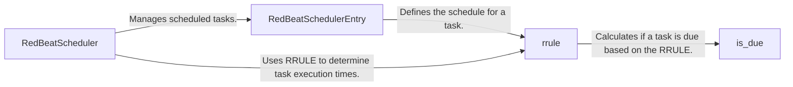

## Component Details

The RedBeat scheduling system utilizes a recurrence rule engine to define task schedules. The core functionality revolves around defining when a task should be executed based on a defined pattern. The `RedBeatScheduler` manages the overall scheduling process, interacting with `RedBeatSchedulerEntry` to represent individual scheduled tasks. The `rrule` component from the `dateutil` library is central to defining the recurrence pattern, and the `is_due` method determines if a task is ready for execution based on the current time and the recurrence rule.

### RedBeatSchedulerEntry
Represents a single entry in the RedBeat scheduler, encapsulating the task, schedule (RRULE), and other relevant parameters. It's responsible for creating and managing the Celery task schedule.
- **Related Classes/Methods**: `redbeat.redbeat.RedBeatSchedulerEntry`

### rrule
Defines the recurrence pattern for a task using the RRULE standard. It's responsible for calculating the next occurrence of the task based on the defined rule. This component is part of the `dateutil` library.
- **Related Classes/Methods**: `dateutil.rrule`

### is_due
Determines if a scheduled task is due to be run based on the RRULE. It calculates the next occurrence and compares it to the current time.
- **Related Classes/Methods**: `redbeat.redbeat.schedules.rrule.is_due`

### RedBeatScheduler
The main scheduler class in RedBeat, responsible for managing and executing scheduled tasks. It interacts with the Redis database to store and retrieve schedule information.
- **Related Classes/Methods**: `redbeat.redbeat.RedBeatScheduler`
