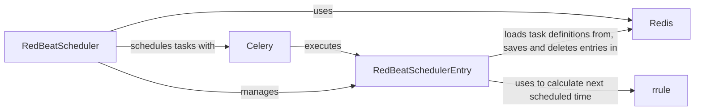

## Component Details

The RedBeat scheduler extends Celery's capabilities by providing a way to schedule tasks persistently using Redis as a storage backend. It allows defining periodic tasks with complex schedules using rrule, persisting these schedules across Celery worker restarts. The core components work together to load, manage, and execute scheduled tasks, ensuring tasks are run at their defined times, even if the Celery worker is restarted.

### RedBeatSchedulerEntry
Represents a single scheduled task entry. It's responsible for loading task definitions from Redis, managing task metadata, calculating the next scheduled time using rrule, saving and deleting entries from Redis, and rescheduling tasks. It acts as an intermediary between the scheduler and the task definition stored in Redis, providing a consistent interface for managing individual tasks.
- **Related Classes/Methods**: `redbeat.redbeat.schedulers.RedBeatSchedulerEntry`

### RedBeatScheduler
The scheduler that manages the scheduled tasks. It's responsible for loading entries from Redis, rescheduling tasks based on their schedule, and syncing the entries with the Redis database to persist the schedule. It uses Celery's scheduling mechanisms to add and remove tasks from the Celery beat scheduler.
- **Related Classes/Methods**: `redbeat.redbeat.schedulers.RedBeatScheduler`

### Redis
Redis database used for storing and retrieving task definitions and schedule information. It acts as the persistent storage for the RedBeat scheduler, allowing tasks to be scheduled and executed even after Celery worker restarts. The scheduler interacts with Redis to load, save, and delete task entries.
- **Related Classes/Methods**: _None_

### Celery
Celery task queue used for executing the scheduled tasks. The RedBeat scheduler integrates with Celery to add and remove tasks from the Celery beat scheduler. When a scheduled task is due, Celery executes the task based on its definition.
- **Related Classes/Methods**: _None_

### rrule
The `rrule` component is used for calculating the next scheduled time based on the task's recurrence rule. It provides a flexible way to define complex schedules for tasks, such as running every Monday, Wednesday, and Friday, or on the last day of the month. The `RedBeatSchedulerEntry` uses `rrule` to determine when a task should be executed next.
- **Related Classes/Methods**: _None_
