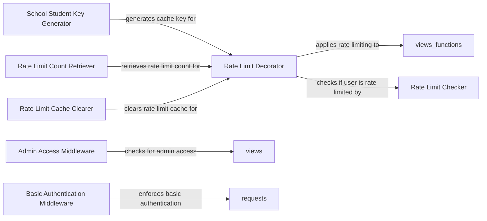

## Component Details

The Security and Rate Limiting component protects the platform from abuse and unauthorized access. It employs rate limiting to prevent brute-force attacks and other malicious activities, ensuring the platform remains secure and available. This is achieved through decorators that limit the number of requests a user can make within a specific time frame. Additionally, middleware components enforce authentication and authorization policies, restricting access to sensitive resources based on user roles and permissions.

### Rate Limit Decorator
A decorator function that applies rate limiting to specific views or functions. It checks if a user has exceeded their allowed request limit within a given time frame, using the cache to store request counts. If the limit is exceeded, it returns a 429 Too Many Requests error.
- **Related Classes/Methods**: `codeforlife-portal.portal.helpers.decorators:ratelimit`

### School Student Key Generator
A function that generates a unique cache key for rate limiting based on the school and student. This allows for different rate limits to be applied to different schools or students, providing granular control over rate limiting. The key is constructed using the school ID and student ID.
- **Related Classes/Methods**: `codeforlife-portal.portal.helpers.ratelimit:school_student_key`

### Rate Limit Count Retriever
Retrieves the current rate limit count for a given user from the cache. This function is used to determine how many requests a user has made within the rate limit window, enabling the system to track user activity. It fetches the count from the cache using a generated key.
- **Related Classes/Methods**: `codeforlife-portal.portal.helpers.ratelimit:get_ratelimit_count_for_user`

### Rate Limit Cache Clearer
Clears the rate limit cache for a specific user. This can be used to reset the rate limit counter for a user, for example, after a successful action or when debugging, providing a mechanism to manage rate limits. It deletes the cache entry associated with the user.
- **Related Classes/Methods**: `codeforlife-portal.portal.helpers.ratelimit:clear_ratelimit_cache_for_user`

### Rate Limit Checker
Checks if a user is currently rate limited. This function likely compares the user's request count against the allowed limit and returns a boolean indicating whether the user should be blocked, enforcing the rate limiting policy. It determines if the user has exceeded the allowed number of requests.
- **Related Classes/Methods**: `codeforlife-portal.portal.helpers.ratelimit:is_ratelimited`

### Admin Access Middleware
Middleware that checks if a user has admin access before allowing them to access certain views. It intercepts requests and verifies the user's permissions, ensuring that only authorized users can access administrative functions. It redirects non-admin users to the home page.
- **Related Classes/Methods**: `codeforlife-portal.deploy.middleware.admin_access.AdminAccessMiddleware:process_view`

### Basic Authentication Middleware
Middleware that enforces basic authentication for certain parts of the application. It intercepts requests and prompts the user for credentials if they are not already authenticated, providing a first line of defense against unauthorized access. It uses HTTP basic authentication.
- **Related Classes/Methods**: `codeforlife-portal.deploy.middleware.basicauth.BasicAuthMiddleware:process_request`
