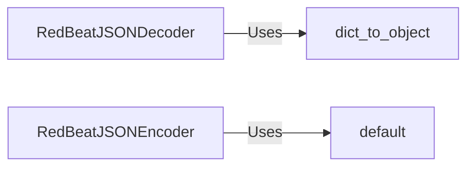

## Component Details

The Task Data Serializer component in RedBeat is responsible for converting task data between Python objects and JSON strings, enabling the storage and retrieval of task information in Redis. It uses custom JSON encoder and decoder classes to handle non-standard JSON types like datetime objects and objects with a '__class__' attribute, ensuring data consistency and integrity during serialization and deserialization.

### RedBeatJSONDecoder
Custom JSON Decoder for RedBeat. It provides a way to convert JSON strings from Redis back into Python objects, especially `datetime` objects and objects with a `__class__` attribute, allowing the reconstruction of Python objects from their JSON representation.
- **Related Classes/Methods**: `redbeat.redbeat.decoder.RedBeatJSONDecoder`

### RedBeatJSONEncoder
Custom JSON Encoder for RedBeat. It provides a way to convert Python objects into JSON strings for storage in Redis, handling `datetime` objects and other non-standard JSON types. It ensures that all task data can be serialized into a format suitable for storage.
- **Related Classes/Methods**: `redbeat.redbeat.decoder.RedBeatJSONEncoder`

### dict_to_object
Method within `RedBeatJSONDecoder` that attempts to reconstruct Python objects from dictionaries that were originally JSON objects. It checks for a `__class__` key to determine the object's type and reconstructs the object.
- **Related Classes/Methods**: `redbeat.redbeat.decoder.RedBeatJSONDecoder:dict_to_object`

### default
Method within `RedBeatJSONEncoder` that handles the serialization of Python objects that are not directly JSON serializable, such as `datetime` objects. It converts these objects into string representations for JSON storage.
- **Related Classes/Methods**: `redbeat.redbeat.decoder.RedBeatJSONEncoder:default`
