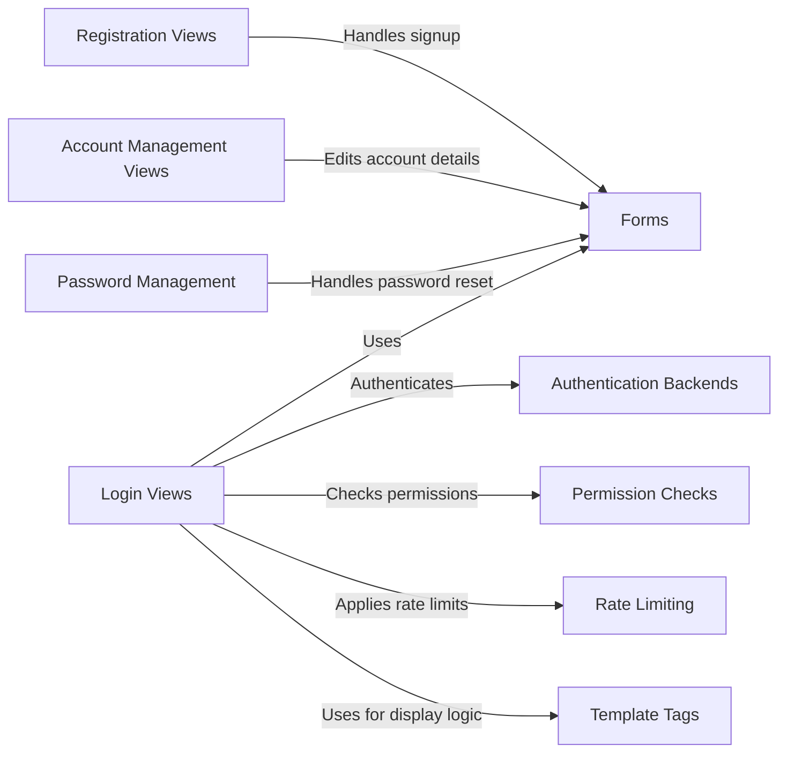

## Component Details

The User Management and Authentication subsystem provides the functionality for user registration, login, profile management, and access control. It supports different user roles (teachers, students, independent students) and authentication methods, ensuring secure access to the platform's features and resources. The subsystem handles user creation, authentication, and authorization, providing a secure and personalized experience for all users. The main flow involves users accessing login views, submitting forms, being authenticated against a backend, and then being redirected to the appropriate dashboard. Password resets and account edits are also supported.

### Login Views
Handles user login functionality for different user types (teachers, students, independent students). It authenticates users and redirects them upon successful login. It also applies rate limiting and checks permissions.
- **Related Classes/Methods**: `portal.views.login.teacher.TeacherLoginView`, `portal.views.login.student.StudentLoginView`, `portal.views.login.independent_student.IndependentStudentLoginView`

### Authentication Backends
Authenticates users against different criteria. `StudentLoginBackend` authenticates students using class codes.
- **Related Classes/Methods**: `portal.backends.StudentLoginBackend`

### Forms
Provides forms for user login, registration, and account management. Includes forms for teachers, students, and independent students.
- **Related Classes/Methods**: `portal.forms.play.IndependentStudentLoginForm`, `portal.forms.teach.TeacherLoginForm`, `portal.forms.play.IndependentStudentSignupForm`, `portal.forms.registration`, `portal.forms.play.StudentEditAccountForm`, `portal.forms.play.IndependentStudentEditAccountForm`, `portal.forms.teach.TeacherEditAccountForm`

### Password Management
Handles password reset functionality, including generating reset links and sending emails. It also includes password strength validation.
- **Related Classes/Methods**: `portal.forms.registration.PasswordResetForm`, `portal.views.registration`

### Account Management Views
Provides views for editing user account details, specific to school students and independent students.
- **Related Classes/Methods**: `portal.views.student.edit_account_details`

### Registration Views
Handles user registration, including rendering signup forms and processing the submitted data.
- **Related Classes/Methods**: `portal.views.home`

### Permission Checks
Defines permission checks for different user roles (teacher, student, etc.).
- **Related Classes/Methods**: `cfl_common.common.permissions`

### Rate Limiting
Rate limits user actions, such as login attempts.
- **Related Classes/Methods**: `portal.helpers.decorators`, `portal.helpers.ratelimit`

### Template Tags
Custom template tags used to control the display of content based on user roles and status.
- **Related Classes/Methods**: `portal.templatetags.app_tags`
