```mermaid
graph LR
    User_Management_and_Authentication["User Management and Authentication"]
    Classroom_and_Resource_Management["Classroom and Resource Management"]
    Communication_Services["Communication Services"]
    Background_Task_Management["Background Task Management"]
    Security_and_Rate_Limiting["Security and Rate Limiting"]
    Data_Management_and_Migrations["Data Management and Migrations"]
    User_Management_and_Authentication -- "Authenticates" --> Classroom_and_Resource_Management
    User_Management_and_Authentication -- "Authenticates" --> Classroom_and_Resource_Management
    User_Management_and_Authentication -- "Creates accounts" --> User_Management_and_Authentication
    Classroom_and_Resource_Management -- "Manages classes and students" --> Classroom_and_Resource_Management
    User_Management_and_Authentication -- "Edits account details" --> User_Management_and_Authentication
    Communication_Services -- "Sends emails" --> User_Management_and_Authentication
    Communication_Services -- "Sends emails" --> User_Management_and_Authentication
    Communication_Services -- "Sends emails" --> Classroom_and_Resource_Management
    Background_Task_Management -- "Schedules tasks" --> Communication_Services
    Security_and_Rate_Limiting -- "Protects user accounts" --> User_Management_and_Authentication
    Data_Management_and_Migrations -- "Applies database changes" --> User_Management_and_Authentication
    Data_Management_and_Migrations -- "Applies database changes" --> Classroom_and_Resource_Management
    Data_Management_and_Migrations -- "Applies database changes" --> Classroom_and_Resource_Management
    User_Management_and_Authentication -- "Verifies user" --> Communication_Services
    click User_Management_and_Authentication href "https://github.com/CodeBoarding/GeneratedOnBoardings/blob/main/codeforlife-portal/User Management and Authentication.md" "Details"
    click Classroom_and_Resource_Management href "https://github.com/CodeBoarding/GeneratedOnBoardings/blob/main/codeforlife-portal/Classroom and Resource Management.md" "Details"
    click Communication_Services href "https://github.com/CodeBoarding/GeneratedOnBoardings/blob/main/codeforlife-portal/Communication Services.md" "Details"
    click Background_Task_Management href "https://github.com/CodeBoarding/GeneratedOnBoardings/blob/main/codeforlife-portal/Background Task Management.md" "Details"
    click Security_and_Rate_Limiting href "https://github.com/CodeBoarding/GeneratedOnBoardings/blob/main/codeforlife-portal/Security and Rate Limiting.md" "Details"
    click Data_Management_and_Migrations href "https://github.com/CodeBoarding/GeneratedOnBoardings/blob/main/codeforlife-portal/Data Management and Migrations.md" "Details"
```

## Component Details

The Code for Life Portal is a web application designed to provide coding education resources to students and teachers. It offers features for user authentication, registration, classroom management, learning resource delivery, and communication. The system incorporates background tasks for maintenance and security utilities to protect user data and prevent abuse. Data management ensures the integrity and consistency of the platform's data.

### User Management and Authentication
This component encompasses user registration, login, profile management, and access control. It supports different user roles (teachers, students) and authentication methods, ensuring secure access to the platform's features and resources. It handles user creation, authentication, and authorization, providing a secure and personalized experience for all users.
- **Related Classes/Methods**: `portal.backends.StudentLoginBackend`, `portal.views.login.independent_student.IndependentStudentLoginView`, `portal.views.login.teacher.TeacherLoginView`, `portal.views.login.student.StudentLoginView`, `portal.forms.play.IndependentStudentLoginForm`, `portal.forms.teach.TeacherLoginForm`, `cfl_common.common.permissions`, `portal.views.registration`, `portal.views.home`, `portal.forms.play.IndependentStudentSignupForm`, `portal.forms.registration`, `portal.views.student.edit_account_details`, `portal.forms.play.StudentEditAccountForm`, `portal.forms.play.IndependentStudentEditAccountForm`, `portal.forms.teach.TeacherEditAccountForm`

### Classroom and Resource Management
This component provides teachers with the tools to create and manage classes, enroll students, and organize learning resources. It enables teachers to monitor student progress and tailor the learning experience to meet individual needs. Students can access learning materials and coding games through this component, facilitating an engaging and effective learning environment.
- **Related Classes/Methods**: `portal.views.teacher.dashboard`, `portal.views.teacher.teach`, `portal.forms.teach`, `cfl_common.common.models`, `portal.views.student.play`, `portal.forms.play`, `portal.templatetags.app_tags`

### Communication Services
This component handles all email-related functionalities, including sending verification emails, password reset instructions, and newsletters. It integrates with email service providers to ensure reliable and efficient communication with users. It facilitates user engagement and provides important notifications related to account management and platform updates.
- **Related Classes/Methods**: `cfl_common.common.mail`, `cfl_common.common.helpers.emails`, `portal.views.dotmailer`

### Background Task Management
This component manages scheduled tasks that run in the background, such as sending reminders to users with unverified accounts and anonymizing inactive user data. It ensures the platform remains secure, up-to-date, and compliant with data privacy regulations. These tasks are essential for maintaining the health and integrity of the system.
- **Related Classes/Methods**: `portal.views.cron.user`

### Security and Rate Limiting
This component implements security measures to protect the platform from abuse and unauthorized access. It includes rate limiting to prevent brute-force attacks and other malicious activities. It ensures the platform remains secure and available to all users.
- **Related Classes/Methods**: `portal.helpers.ratelimit`, `portal.helpers.decorators`

### Data Management and Migrations
This component handles database migrations and data anonymization processes. It ensures that the database schema is up-to-date and that sensitive user data is protected. It is crucial for maintaining data integrity and complying with data privacy regulations.
- **Related Classes/Methods**: `cfl_common.common.migrations`