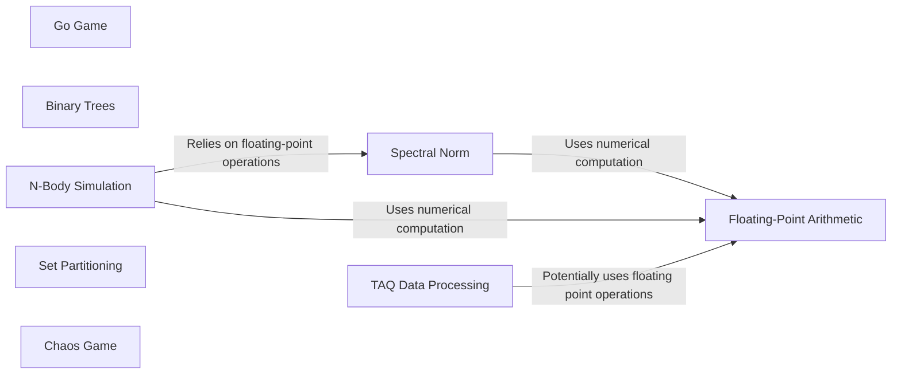

## Component Details

The Benchmark Suite provides a set of programs designed to evaluate Codon's performance across various computational tasks. These benchmarks cover areas such as numerical computation, game simulation, data processing, and tree manipulation. The suite aims to offer a standardized method for measuring Codon's efficiency and comparing it against other Python implementations, providing insights into its strengths and weaknesses in different scenarios.

### Spectral Norm
This component calculates the spectral norm of a matrix using the power method. It involves iterative matrix-vector multiplications to approximate the largest eigenvalue, serving as a benchmark for numerical computation performance.
- **Related Classes/Methods**: `codon.bench.spectral_norm.spectral_norm`

### Go Game
This component implements a simplified Go game with a computer player using the UCT (Upper Confidence Bound applied to Trees) algorithm. It tests Codon's ability to handle game simulations and decision-making processes.
- **Related Classes/Methods**: `codon.bench.go.go`

### Binary Trees
This component constructs and checks binary trees of a specified depth. It measures Codon's performance in tree data structures and recursive algorithms.
- **Related Classes/Methods**: `codon.bench.binary_trees.binary_trees`

### N-Body Simulation
This component simulates the motion of N bodies under gravitational forces. It benchmarks Codon's performance in scientific simulations and floating-point arithmetic.
- **Related Classes/Methods**: `codon.bench.nbody.nbody`

### Set Partitioning
This component partitions a set into two subsets based on a filtering condition. It evaluates Codon's performance in data processing and set operations.
- **Related Classes/Methods**: `codon.bench.set_partition.set_partition`

### Chaos Game
This component generates a visualization of the Chaos Game (Sierpinski gasket). It tests Codon's performance in graphical computations and geometric transformations.
- **Related Classes/Methods**: `codon.bench.chaos.chaos`

### Floating-Point Arithmetic
This component benchmarks floating-point arithmetic operations to measure the performance of floating-point calculations in Codon.
- **Related Classes/Methods**: `codon.bench.float.float`

### TAQ Data Processing
This component processes TAQ (Trade and Quote) data, involving parsing and analysis of financial market data. It evaluates Codon's performance in data-intensive tasks and financial applications.
- **Related Classes/Methods**: `codon.bench.taq.taq`
