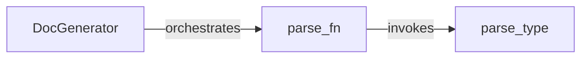

## Component Details

The Documentation Generator component automates the creation of documentation from source code. It parses code to extract information like type annotations, function signatures, and docstrings, then formats this data into a readable documentation format. This ensures documentation remains consistent and up-to-date with the codebase. The core flow involves parsing source files, extracting relevant information using dedicated parsing functions, and then formatting this information into a structured documentation output.

### DocGenerator
The DocGenerator class is the central component responsible for orchestrating the documentation generation process. It takes source code as input, utilizes parsing functions to extract relevant information, and then formats this information into a structured documentation output. It manages the overall flow of documentation generation.
- **Related Classes/Methods**: `codon.docs.docgen`

### parse_type
The `parse_type` function is responsible for parsing type annotation strings found in the source code. It extracts information about the type, including its name and any generic parameters. This information is crucial for accurately documenting function arguments and return types.
- **Related Classes/Methods**: `codon.docs.docgen`

### parse_fn
The `parse_fn` function is responsible for parsing function definitions within the source code. It extracts key information such as the function's name, arguments, return type, and docstring. It leverages the `parse_type` function to handle the parsing of type annotations associated with the function's arguments and return value.
- **Related Classes/Methods**: `codon.docs.docgen`
