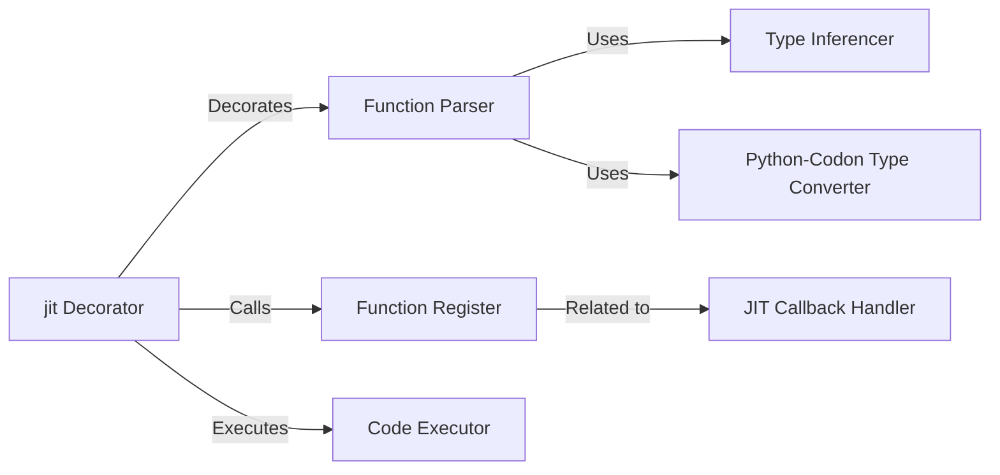

## Component Details

The JIT compiler in Codon enables just-in-time compilation of Python functions, translating them into optimized machine code at runtime for significant performance gains. The process begins with the `@jit` decorator, which marks a function for JIT compilation. The decorated function is then parsed to extract type information and other relevant details. This information is used to register the function for compilation, and the compiled code is executed when the function is called. Type inference is performed to determine the common type of input types, and Python types are converted to Codon types for compatibility. Callbacks are handled to allow the compiled code to interact with the Python runtime.

### jit Decorator
The `jit` decorator is the entry point for marking Python functions for JIT compilation. It parses arguments, registers the function, and executes the compiled code.
- **Related Classes/Methods**: `codon.jit.codon.decorator:jit`

### Function Parser
Parses the decorated function and its arguments to extract type information and other relevant details for JIT compilation.
- **Related Classes/Methods**: `codon.jit.codon.decorator:_parse_decorated`

### Function Register
Registers a function for JIT compilation, storing its metadata and preparing it for the compilation process.
- **Related Classes/Methods**: `codon.jit.codon.decorator:_jit_register_fn`

### Code Executor
Executes the JIT-compiled function. This is the entry point for calling the compiled code after the initial compilation.
- **Related Classes/Methods**: `codon.jit.codon.decorator:execute`

### Type Inferencer
Determines the common type of a set of input types. This is used for type inference during JIT compilation.
- **Related Classes/Methods**: `codon.jit.codon.decorator:_common_type`

### Python-Codon Type Converter
Converts a Python type to a Codon type. This is necessary for bridging the gap between Python's type system and Codon's type system.
- **Related Classes/Methods**: `codon.jit.codon.decorator:_codon_type`, `codon.jit.codon.decorator:_codon_types`

### JIT Callback Handler
Handles callbacks from the JIT-compiled code to Python. This allows the compiled code to interact with the Python runtime.
- **Related Classes/Methods**: `codon.jit.codon.decorator:_jit_callback_fn`
