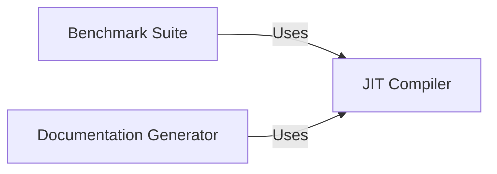

## Component Details

Codon is a high-performance Python compiler that leverages JIT compilation and static compilation techniques to accelerate Python code execution. The core functionality revolves around compiling Python code, either at runtime or ahead-of-time, to generate optimized machine code. This compilation process involves type inference, code optimization, and native code generation. Additionally, Codon provides a suite of benchmark programs for performance evaluation and a documentation generator for automatic documentation creation.

### JIT Compiler
The JIT Compiler component is responsible for just-in-time compilation of Python functions decorated with `@jit`. It translates Python code into optimized machine code at runtime, enabling significant performance improvements. It handles type inference, code optimization, and native code generation.
- **Related Classes/Methods**: `codon.jit.codon.decorator`

### Benchmark Suite
The Benchmark Suite component comprises a collection of benchmark programs designed to evaluate the performance of Codon. These benchmarks cover a range of computational tasks, including numerical computation, game simulation, data processing, and tree manipulation. It provides a standardized way to measure Codon's performance and compare it to other Python implementations.
- **Related Classes/Methods**: `codon.bench.spectral_norm.spectral_norm`, `codon.bench.go.go`, `codon.bench.binary_trees.binary_trees`, `codon.bench.nbody.nbody`, `codon.bench.set_partition.set_partition`, `codon.bench.chaos.chaos`, `codon.bench.float.float`, `codon.bench.taq.taq`

### Documentation Generator
The Documentation Generator component is responsible for automatically generating documentation from the source code. It parses the code, extracts type information, function signatures, and docstrings, and formats them into a readable documentation format. This ensures that the documentation is always up-to-date and consistent with the code.
- **Related Classes/Methods**: `codon.docs.docgen`