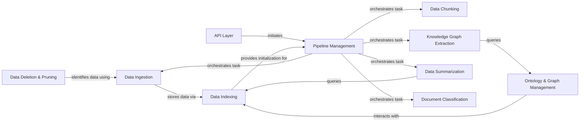

## Component Details

The Data Management & Processing subsystem is responsible for the complete lifecycle of data within the system, from its initial ingestion and classification to advanced processing like chunking, summarization, and knowledge graph extraction. It leverages a robust pipeline management system to orchestrate these tasks, ensuring efficient and reliable data flow. The subsystem also handles the creation, manipulation, and management of the knowledge graph, along with data indexing for quick retrieval and deletion/pruning for data hygiene. An API layer provides the external interface for all data operations.

### Data Ingestion
Manages the initial intake of raw data, including classification of data types, identification of content, and preparation for storage and further processing within the system.

**Related Classes/Methods**:

- <a href="https://github.com/topoteretes/cognee/blob/master/cognee/modules/ingestion/classify.py#L9-L22" target="_blank" rel="noopener noreferrer">`cognee.modules.ingestion.classify` (9:22)</a>
- <a href="https://github.com/topoteretes/cognee/blob/master/cognee/tasks/ingestion/ingest_data.py#L20-L192" target="_blank" rel="noopener noreferrer">`cognee.tasks.ingestion.ingest_data` (20:192)</a>
- <a href="https://github.com/topoteretes/cognee/blob/master/cognee/modules/data/methods/create_dataset.py#L11-L33" target="_blank" rel="noopener noreferrer">`cognee.modules.data.methods.create_dataset` (11:33)</a>

### Data Chunking
Breaks down large textual or binary data into smaller, manageable segments (chunks) based on various strategies, optimizing them for indexing, analysis, and retrieval.

**Related Classes/Methods**:

- <a href="https://github.com/topoteretes/cognee/blob/master/cognee/infrastructure/data/chunking/DefaultChunkEngine.py#L11-L204" target="_blank" rel="noopener noreferrer">`cognee.infrastructure.data.chunking.DefaultChunkEngine.DefaultChunkEngine` (11:204)</a>
- <a href="https://github.com/topoteretes/cognee/blob/master/cognee/tasks/chunks/chunk_by_sentence.py#L32-L101" target="_blank" rel="noopener noreferrer">`cognee.tasks.chunks.chunk_by_sentence` (32:101)</a>

### Knowledge Graph Extraction
Extracts structured entities and relationships from unstructured data, forming a knowledge graph that represents semantic connections and facilitates advanced querying and reasoning.

**Related Classes/Methods**:

- <a href="https://github.com/topoteretes/cognee/blob/master/cognee/modules/data/extraction/knowledge_graph/extract_content_graph.py#L9-L30" target="_blank" rel="noopener noreferrer">`cognee.modules.data.extraction.knowledge_graph.extract_content_graph` (9:30)</a>
- <a href="https://github.com/topoteretes/cognee/blob/master/cognee/tasks/graph/extract_graph_from_data_v2.py#L17-L48" target="_blank" rel="noopener noreferrer">`cognee.tasks.graph.extract_graph_from_data_v2.extract_graph_from_data` (17:48)</a>

### Ontology & Graph Management
Manages the system's knowledge graph, including adding nodes and edges, projecting graph structures from databases, and inferring or applying ontological models to data.

**Related Classes/Methods**:

- <a href="https://github.com/topoteretes/cognee/blob/master/cognee/tasks/graph/infer_data_ontology.py#L291-L310" target="_blank" rel="noopener noreferrer">`cognee.tasks.graph.infer_data_ontology.infer_data_ontology` (291:310)</a>
- <a href="https://github.com/topoteretes/cognee/blob/master/cognee/modules/graph/cognee_graph/CogneeGraph.py#L14-L178" target="_blank" rel="noopener noreferrer">`cognee.modules.graph.cognee_graph.CogneeGraph.CogneeGraph` (14:178)</a>
- <a href="https://github.com/topoteretes/cognee/blob/master/cognee/modules/graph/utils/convert_node_to_data_point.py#L4-L7" target="_blank" rel="noopener noreferrer">`cognee.modules.graph.utils.convert_node_to_data_point.convert_node_to_data_point` (4:7)</a>

### Data Summarization
Generates concise summaries of textual content, distilling key information and insights from larger documents using advanced language models.

**Related Classes/Methods**:

- <a href="https://github.com/topoteretes/cognee/blob/master/cognee/tasks/summarization/summarize_text.py#L11-L57" target="_blank" rel="noopener noreferrer">`cognee.tasks.summarization.summarize_text.summarize_text` (11:57)</a>
- <a href="https://github.com/topoteretes/cognee/blob/master/cognee/modules/data/extraction/extract_summary.py#L16-L23" target="_blank" rel="noopener noreferrer">`cognee.modules.data.extraction.extract_summary.extract_summary` (16:23)</a>

### Data Indexing
Indexes processed data points for efficient storage and retrieval, ensuring that information can be quickly accessed for search and analysis.

**Related Classes/Methods**:

- <a href="https://github.com/topoteretes/cognee/blob/master/cognee/tasks/storage/index_data_points.py#L10-L49" target="_blank" rel="noopener noreferrer">`cognee.tasks.storage.index_data_points.index_data_points` (10:49)</a>

### Document Classification
Classifies documents based on their content and type, facilitating organized storage and targeted processing within the system.

**Related Classes/Methods**:

- <a href="https://github.com/topoteretes/cognee/blob/master/cognee/tasks/documents/classify_documents.py#L91-L127" target="_blank" rel="noopener noreferrer">`cognee.tasks.documents.classify_documents.classify_documents` (91:127)</a>

### Pipeline Management
Orchestrates the execution of complex data processing workflows by defining, running, and logging sequences of tasks. It ensures data flows correctly through various stages.

**Related Classes/Methods**:

- <a href="https://github.com/topoteretes/cognee/blob/master/cognee/modules/pipelines/operations/pipeline.py#L30-L103" target="_blank" rel="noopener noreferrer">`cognee.modules.pipelines.operations.pipeline.cognee_pipeline` (30:103)</a>
- <a href="https://github.com/topoteretes/cognee/blob/master/cognee/modules/pipelines/operations/run_tasks.py#L71-L104" target="_blank" rel="noopener noreferrer">`cognee.modules.pipelines.operations.run_tasks.run_tasks` (71:104)</a>
- <a href="https://github.com/topoteretes/cognee/blob/master/cognee/modules/pipelines/tasks/task.py#L5-L97" target="_blank" rel="noopener noreferrer">`cognee.modules.pipelines.tasks.task.Task` (5:97)</a>

### API Layer
Provides the external interface for the Cognee system, enabling users to add, cognify, delete, and prune data through defined endpoints.

**Related Classes/Methods**:

- <a href="https://github.com/topoteretes/cognee/blob/master/cognee/api/v1/add/add.py#L9-L19" target="_blank" rel="noopener noreferrer">`cognee.api.v1.add.add` (9:19)</a>
- <a href="https://github.com/topoteretes/cognee/blob/master/cognee/api/v1/cognify/cognify.py#L27-L39" target="_blank" rel="noopener noreferrer">`cognee.api.v1.cognify.cognify` (27:39)</a>
- <a href="https://github.com/topoteretes/cognee/blob/master/cognee/api/v1/prune/prune.py#L4-L11" target="_blank" rel="noopener noreferrer">`cognee.api.v1.prune.prune` (4:11)</a>
- <a href="https://github.com/topoteretes/cognee/blob/master/cognee/api/v1/delete/delete.py#L26-L70" target="_blank" rel="noopener noreferrer">`cognee.api.v1.delete.delete` (26:70)</a>

### Data Deletion & Pruning
Handles the removal of data from the system, including specific documents or entire system-level data, ensuring data hygiene and compliance.

**Related Classes/Methods**:

- <a href="https://github.com/topoteretes/cognee/blob/master/cognee/api/v1/prune/prune.py#L4-L11" target="_blank" rel="noopener noreferrer">`cognee.api.v1.prune.prune` (4:11)</a>
- <a href="https://github.com/topoteretes/cognee/blob/master/cognee/api/v1/delete/delete.py#L26-L70" target="_blank" rel="noopener noreferrer">`cognee.api.v1.delete.delete` (26:70)</a>

### [FAQ](https://github.com/CodeBoarding/GeneratedOnBoardings/tree/main?tab=readme-ov-file#faq)