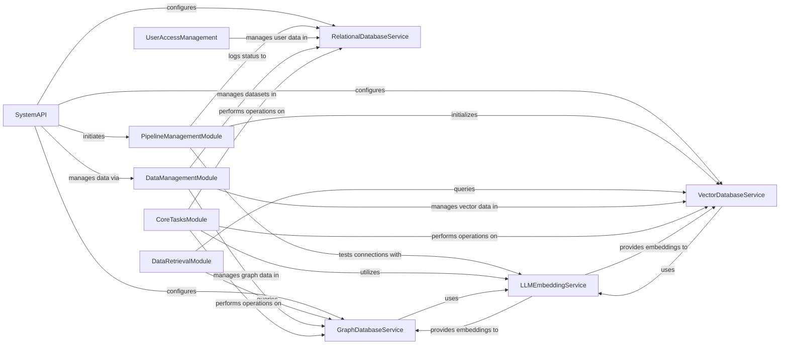

## Component Details

The system is structured around core data persistence services (relational, graph, and vector databases) and an LLM embedding service. The SystemAPI serves as the central entry point, responsible for configuring these foundational services and initiating data processing pipelines. Background operations, including data ingestion, chunking, graph extraction, and database migrations, are managed by the CoreTasksModule, which heavily relies on the various database services and the LLMEmbeddingService. Data retrieval is handled by the DataRetrievalModule, querying both graph and vector databases. The PipelineManagementModule orchestrates the lifecycle of data pipelines, logging their status to the relational database and leveraging vector and LLM services. User and data management functionalities, encompassing user accounts, roles, permissions, and dataset operations, are provided by the UserAccessManagement and DataManagementModule components, respectively, interacting with the appropriate database services. The LLMEmbeddingService is a crucial underlying component, providing embedding capabilities utilized by both the graph and vector database services for advanced data representation and search.

### RelationalDatabaseService
Manages relational database connections, configurations, and basic CRUD operations for various data entities like pipeline runs, users, roles, and datasets. It uses SQLAlchemy as an adapter and handles database migrations.

**Related Classes/Methods**:

- <a href="https://github.com/topoteretes/cognee/blob/master/cognee/infrastructure/databases/relational/get_relational_engine.py#L5-L21" target="_blank" rel="noopener noreferrer">`cognee.infrastructure.databases.relational.get_relational_engine` (5:21)</a>
- <a href="https://github.com/topoteretes/cognee/blob/master/cognee/infrastructure/databases/relational/sqlalchemy/SqlAlchemyAdapter.py#L22-L593" target="_blank" rel="noopener noreferrer">`cognee.infrastructure.databases.relational.sqlalchemy.SqlAlchemyAdapter.SQLAlchemyAdapter` (22:593)</a>
- `cognee.infrastructure.databases.relational.config` (full file reference)
- <a href="https://github.com/topoteretes/cognee/blob/master/cognee/infrastructure/databases/relational/create_relational_engine.py#L6-L46" target="_blank" rel="noopener noreferrer">`cognee.infrastructure.databases.relational.create_relational_engine` (6:46)</a>
- <a href="https://github.com/topoteretes/cognee/blob/master/cognee/infrastructure/databases/relational/create_db_and_tables.py#L4-L13" target="_blank" rel="noopener noreferrer">`cognee.infrastructure.databases.relational.create_db_and_tables` (4:13)</a>
- <a href="https://github.com/topoteretes/cognee/blob/master/cognee/infrastructure/databases/relational/get_migration_relational_engine.py#L5-L28" target="_blank" rel="noopener noreferrer">`cognee.infrastructure.databases.relational.get_migration_relational_engine` (5:28)</a>
- <a href="https://github.com/topoteretes/cognee/blob/master/alembic/versions/1d0bb7fede17_add_pipeline_run_status.py#L23-L29" target="_blank" rel="noopener noreferrer">`cognee.alembic.versions.1d0bb7fede17_add_pipeline_run_status:upgrade` (23:29)</a>
- <a href="https://github.com/topoteretes/cognee/blob/master/alembic/versions/8057ae7329c2_initial_migration.py#L20-L22" target="_blank" rel="noopener noreferrer">`cognee.alembic.versions.8057ae7329c2_initial_migration:upgrade` (20:22)</a>
- <a href="https://github.com/topoteretes/cognee/blob/master/alembic/versions/8057ae7329c2_initial_migration.py#L25-L27" target="_blank" rel="noopener noreferrer">`cognee.alembic.versions.8057ae7329c2_initial_migration:downgrade` (25:27)</a>

### GraphDatabaseService
Provides an abstraction layer for interacting with various graph databases (FalkorDB, Kuzu, Neo4j, Memgraph, NetworkX). It handles graph operations like adding/deleting nodes and edges, querying graph data, and calculating graph metrics.

**Related Classes/Methods**:

- <a href="https://github.com/topoteretes/cognee/blob/master/cognee/infrastructure/databases/graph/get_graph_engine.py#L11-L37" target="_blank" rel="noopener noreferrer">`cognee.infrastructure.databases.graph.get_graph_engine` (11:37)</a>
- `cognee.infrastructure.databases.graph.config` (full file reference)
- <a href="https://github.com/topoteretes/cognee/blob/master/cognee/infrastructure/databases/hybrid/falkordb/FalkorDBAdapter.py#L31-L781" target="_blank" rel="noopener noreferrer">`cognee.infrastructure.databases.hybrid.falkordb.FalkorDBAdapter.FalkorDBAdapter` (31:781)</a>
- <a href="https://github.com/topoteretes/cognee/blob/master/cognee/infrastructure/databases/graph/kuzu/adapter.py#L28-L998" target="_blank" rel="noopener noreferrer">`cognee.infrastructure.databases.graph.kuzu.adapter.KuzuAdapter` (28:998)</a>
- <a href="https://github.com/topoteretes/cognee/blob/master/cognee/infrastructure/databases/graph/neo4j_driver/adapter.py#L33-L1000" target="_blank" rel="noopener noreferrer">`cognee.infrastructure.databases.graph.neo4j_driver.adapter.Neo4jAdapter` (33:1000)</a>
- `cognee.infrastructure.databases.graph.memgraph.memgraph_adapter.MemgraphAdapter` (full file reference)
- `cognee.infrastructure.databases.graph.networkx.adapter.NetworkXAdapter` (full file reference)
- `cognee.infrastructure.databases.graph.graph_db_interface` (full file reference)

### VectorDatabaseService
Manages vector database connections and operations, including creating collections, indexing data points, searching, and retrieving vector embeddings. It supports various vector databases like Weaviate, Qdrant, Milvus, ChromaDB, LanceDB, and PGVector.

**Related Classes/Methods**:

- <a href="https://github.com/topoteretes/cognee/blob/master/cognee/infrastructure/databases/vector/get_vector_engine.py#L5-L14" target="_blank" rel="noopener noreferrer">`cognee.infrastructure.databases.vector.get_vector_engine` (5:14)</a>
- <a href="https://github.com/topoteretes/cognee/blob/master/cognee/infrastructure/databases/vector/create_vector_engine.py#L8-L144" target="_blank" rel="noopener noreferrer">`cognee.infrastructure.databases.vector.create_vector_engine` (8:144)</a>
- `cognee.infrastructure.databases.vector.config` (full file reference)
- <a href="https://github.com/topoteretes/cognee/blob/master/cognee/infrastructure/databases/vector/weaviate_db/WeaviateAdapter.py#L33-L499" target="_blank" rel="noopener noreferrer">`cognee.infrastructure.databases.vector.weaviate_db.WeaviateAdapter.WeaviateAdapter` (33:499)</a>
- <a href="https://github.com/topoteretes/cognee/blob/master/cognee/infrastructure/databases/vector/qdrant/QDrantAdapter.py#L108-L523" target="_blank" rel="noopener noreferrer">`cognee.infrastructure.databases.vector.qdrant.QDrantAdapter.QDrantAdapter` (108:523)</a>
- <a href="https://github.com/topoteretes/cognee/blob/master/cognee/infrastructure/databases/vector/milvus/MilvusAdapter.py#L32-L483" target="_blank" rel="noopener noreferrer">`cognee.infrastructure.databases.vector.milvus.MilvusAdapter.MilvusAdapter` (32:483)</a>
- <a href="https://github.com/topoteretes/cognee/blob/master/cognee/infrastructure/databases/vector/chromadb/ChromaDBAdapter.py#L147-L555" target="_blank" rel="noopener noreferrer">`cognee.infrastructure.databases.vector.chromadb.ChromaDBAdapter.ChromaDBAdapter` (147:555)</a>
- <a href="https://github.com/topoteretes/cognee/blob/master/cognee/infrastructure/databases/vector/lancedb/LanceDBAdapter.py#L38-L346" target="_blank" rel="noopener noreferrer">`cognee.infrastructure.databases.vector.lancedb.LanceDBAdapter.LanceDBAdapter` (38:346)</a>
- <a href="https://github.com/topoteretes/cognee/blob/master/cognee/infrastructure/databases/vector/pgvector/PGVectorAdapter.py#L38-L357" target="_blank" rel="noopener noreferrer">`cognee.infrastructure.databases.vector.pgvector.PGVectorAdapter.PGVectorAdapter` (38:357)</a>
- <a href="https://github.com/topoteretes/cognee/blob/master/cognee/infrastructure/databases/vector/pgvector/create_db_and_tables.py#L5-L18" target="_blank" rel="noopener noreferrer">`cognee.cognee.infrastructure.databases.vector.pgvector.create_db_and_tables` (5:18)</a>
- <a href="https://github.com/topoteretes/cognee/blob/master/cognee/infrastructure/databases/vector/pgvector/serialize_data.py#L5-L34" target="_blank" rel="noopener noreferrer">`cognee.cognee.infrastructure.databases.vector.pgvector.serialize_data` (5:34)</a>

### LLMEmbeddingService
Provides functionalities related to Language Model (LLM) and embedding operations, including embedding text, managing embedding rate limits, and configuring LLM clients. It integrates various embedding engines and tokenizers.

**Related Classes/Methods**:

- `cognee.infrastructure.llm.embedding_rate_limiter` (full file reference)
- <a href="https://github.com/topoteretes/cognee/blob/master/cognee/infrastructure/llm/rate_limiter.py#L86-L220" target="_blank" rel="noopener noreferrer">`cognee.infrastructure.llm.rate_limiter.llm_rate_limiter` (86:220)</a>
- `cognee.infrastructure.llm.config` (full file reference)
- `cognee.infrastructure.llm.utils` (full file reference)
- <a href="https://github.com/topoteretes/cognee/blob/master/cognee/infrastructure/llm/get_llm_client.py#L30-L123" target="_blank" rel="noopener noreferrer">`cognee.infrastructure.llm.get_llm_client` (30:123)</a>
- <a href="https://github.com/topoteretes/cognee/blob/master/cognee/infrastructure/databases/vector/embeddings/LiteLLMEmbeddingEngine.py#L23-L183" target="_blank" rel="noopener noreferrer">`cognee.infrastructure.databases.vector.embeddings.LiteLLMEmbeddingEngine.LiteLLMEmbeddingEngine` (23:183)</a>
- <a href="https://github.com/topoteretes/cognee/blob/master/cognee/infrastructure/databases/vector/embeddings/OllamaEmbeddingEngine.py#L20-L137" target="_blank" rel="noopener noreferrer">`cognee.infrastructure.databases.vector.embeddings.OllamaEmbeddingEngine.OllamaEmbeddingEngine` (20:137)</a>
- <a href="https://github.com/topoteretes/cognee/blob/master/cognee/infrastructure/databases/vector/embeddings/FastembedEmbeddingEngine.py#L14-L116" target="_blank" rel="noopener noreferrer">`cognee.infrastructure.databases.vector.embeddings.FastembedEmbeddingEngine.FastembedEmbeddingEngine` (14:116)</a>
- <a href="https://github.com/topoteretes/cognee/blob/master/cognee/infrastructure/databases/vector/embeddings/get_embedding_engine.py#L7-L34" target="_blank" rel="noopener noreferrer">`cognee.infrastructure.databases.vector.embeddings.get_embedding_engine` (7:34)</a>
- `cognee.infrastructure.databases.vector.embeddings.config` (full file reference)
- `cognee.infrastructure.llm.tokenizer` (full file reference)

### PipelineManagementModule
Handles the lifecycle of data processing pipelines, including logging run statuses, and setting up database connections required for pipeline execution. It also includes components for the evaluation framework.

**Related Classes/Methods**:

- <a href="https://github.com/topoteretes/cognee/blob/master/cognee/modules/pipelines/operations/log_pipeline_run_complete.py#L8-L35" target="_blank" rel="noopener noreferrer">`cognee.modules.pipelines.operations.log_pipeline_run_complete` (8:35)</a>
- <a href="https://github.com/topoteretes/cognee/blob/master/cognee/modules/pipelines/operations/log_pipeline_run_initiated.py#L6-L22" target="_blank" rel="noopener noreferrer">`cognee.modules.pipelines.operations.log_pipeline_run_initiated` (6:22)</a>
- `cognee.modules.pipelines.operations.pipeline` (full file reference)
- <a href="https://github.com/topoteretes/cognee/blob/master/cognee/modules/pipelines/operations/log_pipeline_run_error.py#L8-L41" target="_blank" rel="noopener noreferrer">`cognee.modules.pipelines.operations.log_pipeline_run_error` (8:41)</a>
- <a href="https://github.com/topoteretes/cognee/blob/master/cognee/modules/pipelines/operations/log_pipeline_run_start.py#L8-L35" target="_blank" rel="noopener noreferrer">`cognee.modules.pipelines.operations.log_pipeline_run_start` (8:35)</a>
- <a href="https://github.com/topoteretes/cognee/blob/master/cognee/modules/pipelines/operations/get_pipeline_status.py#L8-L35" target="_blank" rel="noopener noreferrer">`cognee.modules.pipelines.operations.get_pipeline_status` (8:35)</a>
- `cognee.cognee.eval_framework.answer_generation.run_question_answering_module` (full file reference)
- <a href="https://github.com/topoteretes/cognee/blob/master/cognee/eval_framework/corpus_builder/run_corpus_builder.py#L36-L68" target="_blank" rel="noopener noreferrer">`cognee.cognee.eval_framework.corpus_builder.run_corpus_builder` (36:68)</a>
- `cognee.cognee.eval_framework.evaluation.run_evaluation_module` (full file reference)

### DataRetrievalModule
Provides various strategies for retrieving data and context from the underlying databases, including code-specific retrieval, chunk-based retrieval, natural language queries, and triplet searches.

**Related Classes/Methods**:

- <a href="https://github.com/topoteretes/cognee/blob/master/cognee/modules/retrieval/code_retriever.py#L13-L148" target="_blank" rel="noopener noreferrer">`cognee.modules.retrieval.code_retriever.CodeRetriever` (13:148)</a>
- <a href="https://github.com/topoteretes/cognee/blob/master/cognee/modules/retrieval/chunks_retriever.py#L9-L75" target="_blank" rel="noopener noreferrer">`cognee.modules.retrieval.chunks_retriever.ChunksRetriever` (9:75)</a>
- <a href="https://github.com/topoteretes/cognee/blob/master/cognee/modules/retrieval/natural_language_retriever.py#L14-L160" target="_blank" rel="noopener noreferrer">`cognee.modules.retrieval.natural_language_retriever.NaturalLanguageRetriever` (14:160)</a>
- <a href="https://github.com/topoteretes/cognee/blob/master/cognee/modules/retrieval/summaries_retriever.py#L9-L75" target="_blank" rel="noopener noreferrer">`cognee.modules.retrieval.summaries_retriever.SummariesRetriever` (9:75)</a>
- <a href="https://github.com/topoteretes/cognee/blob/master/cognee/modules/retrieval/completion_retriever.py#L10-L91" target="_blank" rel="noopener noreferrer">`cognee.modules.retrieval.completion_retriever.CompletionRetriever` (10:91)</a>
- <a href="https://github.com/topoteretes/cognee/blob/master/cognee/modules/retrieval/insights_retriever.py#L11-L117" target="_blank" rel="noopener noreferrer">`cognee.modules.retrieval.insights_retriever.InsightsRetriever` (11:117)</a>
- <a href="https://github.com/topoteretes/cognee/blob/master/cognee/modules/retrieval/cypher_search_retriever.py#L12-L81" target="_blank" rel="noopener noreferrer">`cognee.modules.retrieval.cypher_search_retriever.CypherSearchRetriever` (12:81)</a>
- <a href="https://github.com/topoteretes/cognee/blob/master/cognee/modules/retrieval/utils/brute_force_triplet_search.py#L82-L105" target="_blank" rel="noopener noreferrer">`cognee.modules.retrieval.utils.brute_force_triplet_search` (82:105)</a>
- `cognee.modules.retrieval.utils.description_to_codepart_search` (full file reference)
- <a href="https://github.com/topoteretes/cognee/blob/master/cognee/modules/retrieval/context_providers/TripletSearchContextProvider.py#L18-L96" target="_blank" rel="noopener noreferrer">`cognee.modules.retrieval.context_providers.TripletSearchContextProvider.TripletSearchContextProvider` (18:96)</a>

### UserAccessManagement
Manages user accounts, roles, tenants, and permissions on documents within the system, interacting primarily with the relational database. It also handles user authentication.

**Related Classes/Methods**:

- <a href="https://github.com/topoteretes/cognee/blob/master/cognee/modules/users/get_user_db.py#L16-L17" target="_blank" rel="noopener noreferrer">`cognee.modules.users.get_user_db` (16:17)</a>
- <a href="https://github.com/topoteretes/cognee/blob/master/cognee/modules/users/roles/methods/create_role.py#L12-L26" target="_blank" rel="noopener noreferrer">`cognee.modules.users.roles.methods.create_role` (12:26)</a>
- <a href="https://github.com/topoteretes/cognee/blob/master/cognee/modules/users/roles/methods/add_user_to_role.py#L20-L38" target="_blank" rel="noopener noreferrer">`cognee.modules.users.roles.methods.add_user_to_role` (20:38)</a>
- <a href="https://github.com/topoteretes/cognee/blob/master/cognee/modules/users/tenants/methods/create_tenant.py#L8-L19" target="_blank" rel="noopener noreferrer">`cognee.modules.users.tenants.methods.create_tenant` (8:19)</a>
- <a href="https://github.com/topoteretes/cognee/blob/master/cognee/modules/users/authentication/methods/authenticate_user.py#L8-L22" target="_blank" rel="noopener noreferrer">`cognee.modules.users.authentication.methods.authenticate_user` (8:22)</a>
- <a href="https://github.com/topoteretes/cognee/blob/master/cognee/modules/users/methods/delete_user.py#L7-L18" target="_blank" rel="noopener noreferrer">`cognee.modules.users.methods.delete_user` (7:18)</a>
- <a href="https://github.com/topoteretes/cognee/blob/master/cognee/modules/users/methods/create_user.py#L13-L62" target="_blank" rel="noopener noreferrer">`cognee.modules.users.methods.create_user` (13:62)</a>
- <a href="https://github.com/topoteretes/cognee/blob/master/cognee/modules/users/methods/get_default_user.py#L12-L37" target="_blank" rel="noopener noreferrer">`cognee.modules.users.methods.get_default_user` (12:37)</a>
- <a href="https://github.com/topoteretes/cognee/blob/master/cognee/modules/users/methods/get_user.py#L8-L20" target="_blank" rel="noopener noreferrer">`cognee.modules.users.methods.get_user` (8:20)</a>
- <a href="https://github.com/topoteretes/cognee/blob/master/cognee/modules/users/permissions/methods/give_permission_on_document.py#L6-L27" target="_blank" rel="noopener noreferrer">`cognee.modules.users.permissions.methods.give_permission_on_document` (6:27)</a>
- <a href="https://github.com/topoteretes/cognee/blob/master/cognee/modules/users/permissions/methods/give_default_permission_to_role.py#L18-L56" target="_blank" rel="noopener noreferrer">`cognee.modules.users.permissions.methods.give_default_permission_to_role` (18:56)</a>
- <a href="https://github.com/topoteretes/cognee/blob/master/cognee/modules/users/permissions/methods/give_default_permission_to_user.py#L18-L55" target="_blank" rel="noopener noreferrer">`cognee.modules.users.permissions.methods.give_default_permission_to_user` (18:55)</a>
- <a href="https://github.com/topoteretes/cognee/blob/master/cognee/modules/users/permissions/methods/check_permission_on_documents.py#L16-L41" target="_blank" rel="noopener noreferrer">`cognee.modules.users.permissions.methods.check_permission_on_documents` (16:41)</a>
- <a href="https://github.com/topoteretes/cognee/blob/master/cognee/modules/users/permissions/methods/get_document_ids_for_user.py#L8-L54" target="_blank" rel="noopener noreferrer">`cognee.modules.users.permissions.methods.get_document_ids_for_user` (8:54)</a>
- <a href="https://github.com/topoteretes/cognee/blob/master/cognee/modules/users/permissions/methods/give_default_permission_to_tenant.py#L18-L57" target="_blank" rel="noopener noreferrer">`cognee.modules.users.permissions.methods.give_default_permission_to_tenant` (18:57)</a>

### DataManagementModule
Handles operations related to datasets and data points, including retrieving, deleting, and checking for new chunks. It also includes system-wide pruning functionalities.

**Related Classes/Methods**:

- `cognee.modules.data.exceptions` (full file reference)
- <a href="https://github.com/topoteretes/cognee/blob/master/cognee/modules/data/processing/has_new_chunks.py#L5-L34" target="_blank" rel="noopener noreferrer">`cognee.modules.data.processing.has_new_chunks` (5:34)</a>
- <a href="https://github.com/topoteretes/cognee/blob/master/cognee/modules/data/methods/get_dataset_data.py#L7-L17" target="_blank" rel="noopener noreferrer">`cognee.modules.data.methods.get_dataset_data` (7:17)</a>
- <a href="https://github.com/topoteretes/cognee/blob/master/cognee/modules/data/methods/delete_dataset.py#L5-L8" target="_blank" rel="noopener noreferrer">`cognee.modules.data.methods.delete_dataset` (5:8)</a>
- <a href="https://github.com/topoteretes/cognee/blob/master/cognee/modules/data/methods/get_datasets.py#L7-L15" target="_blank" rel="noopener noreferrer">`cognee.modules.data.methods.get_datasets` (7:15)</a>
- <a href="https://github.com/topoteretes/cognee/blob/master/cognee/modules/data/methods/get_datasets_by_name.py#L8-L24" target="_blank" rel="noopener noreferrer">`cognee.modules.data.methods.get_datasets_by_name` (8:24)</a>
- <a href="https://github.com/topoteretes/cognee/blob/master/cognee/modules/data/methods/get_dataset.py#L7-L16" target="_blank" rel="noopener noreferrer">`cognee.modules.data.methods.get_dataset` (7:16)</a>
- <a href="https://github.com/topoteretes/cognee/blob/master/cognee/modules/data/methods/delete_data.py#L6-L22" target="_blank" rel="noopener noreferrer">`cognee.modules.data.methods.delete_data` (6:22)</a>
- <a href="https://github.com/topoteretes/cognee/blob/master/cognee/modules/data/methods/get_data.py#L8-L28" target="_blank" rel="noopener noreferrer">`cognee.modules.data.methods.get_data` (8:28)</a>
- <a href="https://github.com/topoteretes/cognee/blob/master/cognee/modules/data/deletion/prune_system.py#L6-L17" target="_blank" rel="noopener noreferrer">`cognee.modules.data.deletion.prune_system` (6:17)</a>

### SystemAPI
Provides the main API endpoints for interacting with the Cognee system, including configuration, graph visualization, data deletion, and initiating core processes like code graph pipelines. It also handles initial system setup.

**Related Classes/Methods**:

- `cognee.api.client` (full file reference)
- `cognee.api.v1.visualize.visualize` (full file reference)
- `cognee.api.v1.cognify.code_graph_pipeline` (full file reference)
- <a href="https://github.com/topoteretes/cognee/blob/master/cognee/api/v1/config/config.py#L15-L194" target="_blank" rel="noopener noreferrer">`cognee.api.v1.config.config.config` (15:194)</a>
- <a href="https://github.com/topoteretes/cognee/blob/master/cognee/api/v1/datasets/routers/get_datasets_router.py#L42-L190" target="_blank" rel="noopener noreferrer">`cognee.api.v1.datasets.routers.get_datasets_router` (42:190)</a>
- <a href="https://github.com/topoteretes/cognee/blob/master/cognee/api/v1/delete/delete.py#L26-L70" target="_blank" rel="noopener noreferrer">`cognee.api.v1.delete.delete` (26:70)</a>
- <a href="https://github.com/topoteretes/cognee/blob/master/cognee/modules/engine/operations/setup.py#L9-L17" target="_blank" rel="noopener noreferrer">`cognee.modules.engine.operations.setup` (9:17)</a>

### CoreTasksModule
Encapsulates various background tasks and ingestion processes, such as chunking, graph extraction, ontology inference, indexing data points, and relational database migrations. It also includes search and metrics operations.

**Related Classes/Methods**:

- `cognee.tasks.chunk_naive_llm_classifier` (full file reference)
- `cognee.tasks.temporal_awareness.index_graphiti_objects` (full file reference)
- <a href="https://github.com/topoteretes/cognee/blob/master/cognee/tasks/chunks/remove_disconnected_chunks.py#L5-L38" target="_blank" rel="noopener noreferrer">`cognee.tasks.chunks.remove_disconnected_chunks` (5:38)</a>
- <a href="https://github.com/topoteretes/cognee/blob/master/cognee/tasks/chunks/chunk_by_sentence.py#L32-L101" target="_blank" rel="noopener noreferrer">`cognee.tasks.chunks.chunk_by_sentence` (32:101)</a>
- `cognee.tasks.graph.extract_graph_from_data_v2` (full file reference)
- <a href="https://github.com/topoteretes/cognee/blob/master/cognee/tasks/graph/infer_data_ontology.py#L291-L310" target="_blank" rel="noopener noreferrer">`cognee.tasks.graph.infer_data_ontology` (291:310)</a>
- <a href="https://github.com/topoteretes/cognee/blob/master/cognee/tasks/graph/extract_graph_from_data.py#L53-L77" target="_blank" rel="noopener noreferrer">`cognee.tasks.graph.extract_graph_from_data` (53:77)</a>
- <a href="https://github.com/topoteretes/cognee/blob/master/cognee/tasks/storage/index_data_points.py#L10-L49" target="_blank" rel="noopener noreferrer">`cognee.tasks.storage.index_data_points` (10:49)</a>
- <a href="https://github.com/topoteretes/cognee/blob/master/cognee/tasks/storage/add_data_points.py#L10-L46" target="_blank" rel="noopener noreferrer">`cognee.tasks.storage.add_data_points` (10:46)</a>
- <a href="https://github.com/topoteretes/cognee/blob/master/cognee/tasks/storage/index_graph_edges.py#L11-L76" target="_blank" rel="noopener noreferrer">`cognee.tasks.storage.index_graph_edges` (11:76)</a>
- <a href="https://github.com/topoteretes/cognee/blob/master/cognee/tasks/ingestion/ingest_data.py#L20-L192" target="_blank" rel="noopener noreferrer">`cognee.tasks.ingestion.ingest_data` (20:192)</a>
- <a href="https://github.com/topoteretes/cognee/blob/master/cognee/tasks/ingestion/migrate_relational_database.py#L16-L218" target="_blank" rel="noopener noreferrer">`cognee.tasks.ingestion.migrate_relational_database` (16:218)</a>
- <a href="https://github.com/topoteretes/cognee/blob/master/cognee/tasks/documents/extract_chunks_from_documents.py#L27-L46" target="_blank" rel="noopener noreferrer">`cognee.tasks.documents.extract_chunks_from_documents` (27:46)</a>
- <a href="https://github.com/topoteretes/cognee/blob/master/cognee/modules/metrics/operations/get_pipeline_run_metrics.py#L25-L60" target="_blank" rel="noopener noreferrer">`cognee.modules.metrics.operations.get_pipeline_run_metrics` (25:60)</a>
- <a href="https://github.com/topoteretes/cognee/blob/master/cognee/modules/search/operations/get_history.py#L8-L24" target="_blank" rel="noopener noreferrer">`cognee.modules.search.operations.get_history` (8:24)</a>
- <a href="https://github.com/topoteretes/cognee/blob/master/cognee/modules/search/operations/get_queries.py#L7-L20" target="_blank" rel="noopener noreferrer">`cognee.modules.search.operations.get_queries` (7:20)</a>
- <a href="https://github.com/topoteretes/cognee/blob/master/cognee/modules/search/operations/get_results.py#L7-L20" target="_blank" rel="noopener noreferrer">`cognee.modules.search.operations.get_results` (7:20)</a>
- <a href="https://github.com/topoteretes/cognee/blob/master/cognee/modules/search/operations/log_query.py#L6-L20" target="_blank" rel="noopener noreferrer">`cognee.modules.search.operations.log_query` (6:20)</a>
- <a href="https://github.com/topoteretes/cognee/blob/master/cognee/modules/search/operations/log_result.py#L6-L18" target="_blank" rel="noopener noreferrer">`cognee.modules.search.operations.log_result` (6:18)</a>
- <a href="https://github.com/topoteretes/cognee/blob/master/cognee/modules/chunking/LangchainChunker.py#L12-L59" target="_blank" rel="noopener noreferrer">`cognee.modules.chunking.LangchainChunker.LangchainChunker` (12:59)</a>

### [FAQ](https://github.com/CodeBoarding/GeneratedOnBoardings/tree/main?tab=readme-ov-file#faq)