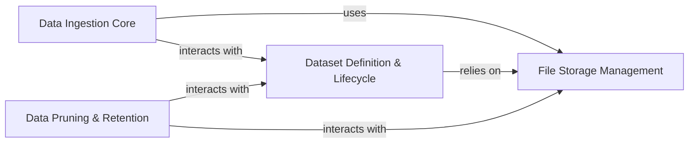

## Details

The Data Ingestion & Storage component is a critical part of the cognee system, acting as the initial gateway and management layer for all incoming raw data. It ensures data is properly received, classified, stored, and organized for subsequent processing and analysis within the AI Infrastructure/Knowledge Graph Platform.

### Data Ingestion Core
This component serves as the primary entry point for all raw data entering the cognee system. It is responsible for receiving various data types (e.g., binary, text), identifying their format, classifying their content, and orchestrating their initial saving to physical storage. It ensures that incoming data is properly categorized and staged for further processing.

**Related Classes/Methods**:

- `cognee.modules.ingestion.ingest_data`
- <a href="https://github.com/topoteretes/cognee/blob/main/cognee/modules/ingestion/classify.py#L15-L39" target="_blank" rel="noopener noreferrer">`cognee.modules.ingestion.classify` (15:39)</a>
- <a href="https://github.com/topoteretes/cognee/blob/main/cognee/modules/ingestion/identify.py#L6-L10" target="_blank" rel="noopener noreferrer">`cognee.modules.ingestion.identify` (6:10)</a>
- <a href="https://github.com/topoteretes/cognee/blob/main/cognee/modules/ingestion/save_data_to_file.py#L8-L28" target="_blank" rel="noopener noreferrer">`cognee.modules.ingestion.save_data_to_file` (8:28)</a>
- <a href="https://github.com/topoteretes/cognee/blob/main/cognee/modules/ingestion/data_types/IngestionData.py#L3-L13" target="_blank" rel="noopener noreferrer">`cognee.modules.ingestion.data_types.IngestionData` (3:13)</a>
- <a href="https://github.com/topoteretes/cognee/blob/main/cognee/modules/ingestion/data_types/BinaryData.py#L9-L36" target="_blank" rel="noopener noreferrer">`cognee.modules.ingestion.data_types.BinaryData` (9:36)</a>
- <a href="https://github.com/topoteretes/cognee/blob/main/cognee/modules/ingestion/data_types/TextData.py#L9-L31" target="_blank" rel="noopener noreferrer">`cognee.modules.ingestion.data_types.TextData` (9:31)</a>

### File Storage Management
This component provides the core functionalities for the physical persistence and retrieval of raw and processed data files. It acts as the direct interface with the underlying file system or object storage, abstracting the storage mechanism and offering operations for adding, retrieving, and removing files.

**Related Classes/Methods**:

- <a href="https://github.com/topoteretes/cognee/blob/main/cognee/infrastructure/files/add_file_to_storage.py#L6-L21" target="_blank" rel="noopener noreferrer">`cognee.infrastructure.files.add_file_to_storage` (6:21)</a>
- <a href="https://github.com/topoteretes/cognee/blob/main/cognee/infrastructure/files/remove_file_from_storage.py#L5-L22" target="_blank" rel="noopener noreferrer">`cognee.infrastructure.files.remove_file_from_storage` (5:22)</a>
- <a href="https://github.com/topoteretes/cognee/blob/main/cognee/infrastructure/files/storage/LocalStorage.py#L6-L152" target="_blank" rel="noopener noreferrer">`cognee.infrastructure.files.storage.LocalStorage` (6:152)</a>

### Dataset Definition & Lifecycle
This component manages the logical organization and metadata of datasets within the system. It provides capabilities for creating, retrieving, updating, and deleting dataset definitions, linking physical data files to logical datasets, and managing access control and permissions. It's crucial for providing a structured and discoverable view of the data.

**Related Classes/Methods**:

- <a href="https://github.com/topoteretes/cognee/blob/main/cognee/modules/data/methods/create_dataset.py#L9-L31" target="_blank" rel="noopener noreferrer">`cognee.modules.data.methods.create_dataset` (9:31)</a>
- <a href="https://github.com/topoteretes/cognee/blob/main/cognee/modules/data/methods/get_data.py#L7-L27" target="_blank" rel="noopener noreferrer">`cognee.modules.data.methods.get_data` (7:27)</a>
- <a href="https://github.com/topoteretes/cognee/blob/main/cognee/modules/data/methods/delete_data.py#L5-L21" target="_blank" rel="noopener noreferrer">`cognee.modules.data.methods.delete_data` (5:21)</a>
- <a href="https://github.com/topoteretes/cognee/blob/main/cognee/modules/data/models/Dataset.py#L9-L39" target="_blank" rel="noopener noreferrer">`cognee.modules.data.models.Dataset` (9:39)</a>
- <a href="https://github.com/topoteretes/cognee/blob/main/cognee/modules/data/models/Data.py#L10-L46" target="_blank" rel="noopener noreferrer">`cognee.modules.data.models.Data` (10:46)</a>
- <a href="https://github.com/topoteretes/cognee/blob/main/cognee/modules/data/models/DatasetData.py#L5-L11" target="_blank" rel="noopener noreferrer">`cognee.modules.data.models.DatasetData` (5:11)</a>

### Data Pruning & Retention
This component is dedicated to the systematic removal and cleanup of data and its associated metadata across all integrated storage layers (file system, relational, graph, and vector databases). Its primary purpose is to ensure data hygiene, optimize storage resources, and facilitate compliance with data retention policies by permanently deleting outdated or specified information.

**Related Classes/Methods**:

- <a href="https://github.com/topoteretes/cognee/blob/main/cognee/modules/data/deletion/prune_data.py#L4-L7" target="_blank" rel="noopener noreferrer">`cognee.modules.data.deletion.prune_data` (4:7)</a>
- <a href="https://github.com/topoteretes/cognee/blob/main/cognee/modules/data/deletion/prune_system.py#L5-L16" target="_blank" rel="noopener noreferrer">`cognee.modules.data.deletion.prune_system` (5:16)</a>
- <a href="https://github.com/topoteretes/cognee/blob/main/cognee/infrastructure/files/remove_file_from_storage.py#L5-L22" target="_blank" rel="noopener noreferrer">`cognee.infrastructure.files.remove_file_from_storage` (5:22)</a>

### [FAQ](https://github.com/CodeBoarding/GeneratedOnBoardings/tree/main?tab=readme-ov-file#faq)