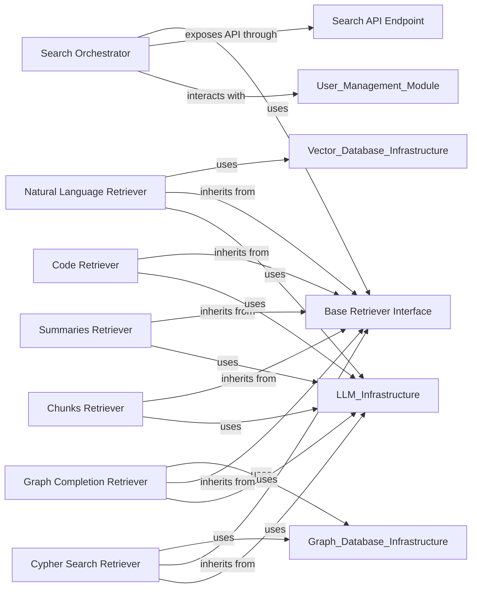

## Details

The `Information Retrieval & Query` component is the core search and retrieval engine of the Cognee platform, designed to extract relevant information from the Knowledge Base using diverse strategies. It adheres to AI Infrastructure and Knowledge Graph Platform patterns by providing a modular, extensible, and API-centric design for efficient data access and intelligent response generation.

### Search Orchestrator
This is the primary entry point for all search and retrieval operations. It orchestrates the execution of various specialized retrievers based on the user's query type and desired information. It acts as a facade, simplifying the interaction with the underlying retrieval mechanisms.

**Related Classes/Methods**:

- `cognee.modules.search.search`

### Base Retriever Interface
An abstract base class that defines the common interface and foundational methods for all specific retrieval implementations. This promotes a standardized approach to retrieval, enabling easy addition of new retrieval types and ensuring consistency across the system.

**Related Classes/Methods**:

- <a href="https://github.com/topoteretes/cognee/blob/main/cognee/modules/retrieval/base_retriever.py#L4-L15" target="_blank" rel="noopener noreferrer">`cognee.modules.retrieval.base_retriever.BaseRetriever` (4:15)</a>

### Natural Language Retriever
Specializes in retrieving information based on natural language queries, typically by leveraging vector embeddings to find semantically similar content within the Knowledge Base.

**Related Classes/Methods**:

- <a href="https://github.com/topoteretes/cognee/blob/main/cognee/modules/retrieval/natural_language_retriever.py#L13-L159" target="_blank" rel="noopener noreferrer">`cognee.modules.retrieval.natural_language_retriever.NaturalLanguageRetriever` (13:159)</a>

### Graph Completion Retriever
Focuses on leveraging the graph structure of the Knowledge Base to complete missing information, infer relationships, or expand context around entities. Its subclasses provide specialized graph traversal and reasoning capabilities.

**Related Classes/Methods**:

- <a href="https://github.com/topoteretes/cognee/blob/main/cognee/modules/retrieval/graph_completion_retriever.py#L15-L188" target="_blank" rel="noopener noreferrer">`cognee.modules.retrieval.graph_completion_retriever.GraphCompletionRetriever` (15:188)</a>

### Code Retriever
Designed to retrieve and analyze code snippets, functions, or entire code structures from the Knowledge Base, useful for code understanding, debugging, or generation tasks.

**Related Classes/Methods**:

- <a href="https://github.com/topoteretes/cognee/blob/main/cognee/modules/retrieval/code_retriever.py#L12-L147" target="_blank" rel="noopener noreferrer">`cognee.modules.retrieval.code_retriever.CodeRetriever` (12:147)</a>

### Summaries Retriever
Retrieves pre-generated or dynamically created summaries of documents, concepts, or topics from the Knowledge Base, providing concise overviews.

**Related Classes/Methods**:

- <a href="https://github.com/topoteretes/cognee/blob/main/cognee/modules/retrieval/summaries_retriever.py#L8-L74" target="_blank" rel="noopener noreferrer">`cognee.modules.retrieval.summaries_retriever.SummariesRetriever` (8:74)</a>

### Chunks Retriever
Retrieves raw, granular chunks of information (e.g., text paragraphs, data segments) from the Knowledge Base, often used when detailed, unsummarized context is required.

**Related Classes/Methods**:

- <a href="https://github.com/topoteretes/cognee/blob/main/cognee/modules/retrieval/chunks_retriever.py#L8-L74" target="_blank" rel="noopener noreferrer">`cognee.modules.retrieval.chunks_retriever.ChunksRetriever` (8:74)</a>

### Cypher Search Retriever
Allows for direct execution of Cypher queries (a graph query language) against the underlying Graph Database, enabling highly precise and complex graph pattern matching and retrieval.

**Related Classes/Methods**:

- <a href="https://github.com/topoteretes/cognee/blob/main/cognee/modules/retrieval/cypher_search_retriever.py#L11-L80" target="_blank" rel="noopener noreferrer">`cognee.modules.retrieval.cypher_search_retriever.CypherSearchRetriever` (11:80)</a>

### Search API Endpoint
Exposes the `Information Retrieval & Query` component's functionalities to external clients and other internal services via a well-defined RESTful API. It handles request parsing (`SearchPayloadDTO`) and response formatting (`SearchHistoryItem`).

**Related Classes/Methods**:

- <a href="https://github.com/topoteretes/cognee/blob/main/cognee/api/v1/search/routers/get_search_router.py#L23-L62" target="_blank" rel="noopener noreferrer">`cognee.api.v1.search.routers.get_search_router` (23:62)</a>

### [FAQ](https://github.com/CodeBoarding/GeneratedOnBoardings/tree/main?tab=readme-ov-file#faq)