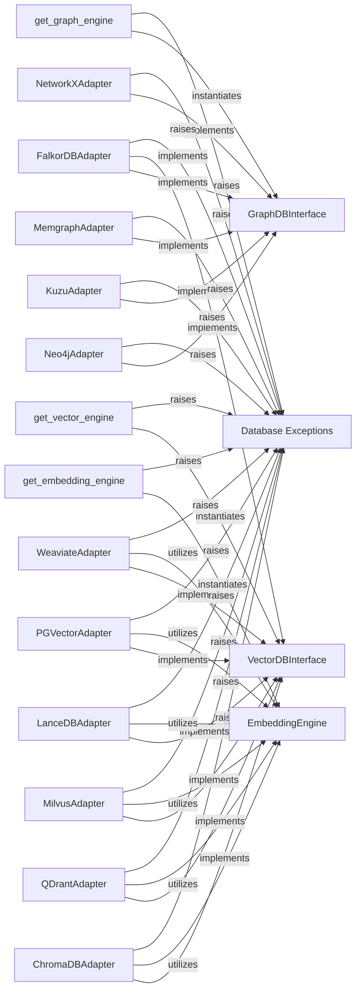

## Details

The Knowledge Base Layer is a critical component within the project's AI Infrastructure, designed to provide a unified and abstracted interface for managing both graph-structured knowledge and high-dimensional vector embeddings. This layer is fundamental for decoupling the core application logic from specific database implementations, ensuring flexibility, scalability, and maintainability.

### GraphDBInterface
This is an abstract base class that defines the contract for all graph database operations. It specifies methods for adding nodes and edges, querying graph data, and managing graph structures, ensuring a consistent API regardless of the underlying graph database technology.

**Related Classes/Methods**:

- `GraphDBInterface` (1:1)

### VectorDBInterface
Similar to GraphDBInterface, this abstract base class defines the standard interface for all vector database operations. It includes methods for storing vector embeddings, performing similarity searches, and managing collections, allowing for interchangeable vector database backends.

**Related Classes/Methods**:

- `VectorDBInterface` (1:1)

### EmbeddingEngine
This abstract base class provides a standardized interface for generating high-dimensional vector embeddings from various data types (e.g., text, images). It allows the system to integrate different embedding models seamlessly, which is crucial for semantic understanding and similarity-based retrieval.

**Related Classes/Methods**:

- <a href="https://github.com/topoteretes/cognee/blob/main/cognee/infrastructure/databases/vector/embeddings/EmbeddingEngine.py#L3-L35" target="_blank" rel="noopener noreferrer">`EmbeddingEngine` (3:35)</a>

### Neo4jAdapter
Concrete implementation of the GraphDBInterface for Neo4j.

**Related Classes/Methods**:

- `Neo4jAdapter` (1:1)

### KuzuAdapter
Concrete implementation of the GraphDBInterface for Kuzu.

**Related Classes/Methods**:

- `KuzuAdapter` (1:1)

### MemgraphAdapter
Concrete implementation of the GraphDBInterface for Memgraph.

**Related Classes/Methods**:

- <a href="https://github.com/topoteretes/cognee/blob/main/cognee/infrastructure/databases/graph/memgraph/memgraph_adapter.py#L20-L1108" target="_blank" rel="noopener noreferrer">`MemgraphAdapter` (20:1108)</a>

### NetworkXAdapter
Concrete implementation of the GraphDBInterface for NetworkX.

**Related Classes/Methods**:

- `NetworkXAdapter` (1:1)

### ChromaDBAdapter
Concrete implementation of the VectorDBInterface for ChromaDB.

**Related Classes/Methods**:

- <a href="https://github.com/topoteretes/cognee/blob/main/cognee/infrastructure/databases/vector/chromadb/ChromaDBAdapter.py#L146-L554" target="_blank" rel="noopener noreferrer">`ChromaDBAdapter` (146:554)</a>

### QDrantAdapter
Concrete implementation of the VectorDBInterface for Qdrant.

**Related Classes/Methods**:

- <a href="https://github.com/topoteretes/cognee/blob/main/cognee/infrastructure/databases/vector/qdrant/QDrantAdapter.py#L108-L513" target="_blank" rel="noopener noreferrer">`QDrantAdapter` (108:513)</a>

### MilvusAdapter
Concrete implementation of the VectorDBInterface for Milvus.

**Related Classes/Methods**:

- <a href="https://github.com/topoteretes/cognee/blob/main/cognee/infrastructure/databases/vector/milvus/MilvusAdapter.py#L31-L482" target="_blank" rel="noopener noreferrer">`MilvusAdapter` (31:482)</a>

### LanceDBAdapter
Concrete implementation of the VectorDBInterface for LanceDB.

**Related Classes/Methods**:

- <a href="https://github.com/topoteretes/cognee/blob/main/cognee/infrastructure/databases/vector/lancedb/LanceDBAdapter.py#L37-L349" target="_blank" rel="noopener noreferrer">`LanceDBAdapter` (37:349)</a>

### PGVectorAdapter
Concrete implementation of the VectorDBInterface for PGVector.

**Related Classes/Methods**:

- <a href="https://github.com/topoteretes/cognee/blob/main/cognee/infrastructure/databases/vector/pgvector/PGVectorAdapter.py#L37-L356" target="_blank" rel="noopener noreferrer">`PGVectorAdapter` (37:356)</a>

### WeaviateAdapter
Concrete implementation of the VectorDBInterface for Weaviate.

**Related Classes/Methods**:

- <a href="https://github.com/topoteretes/cognee/blob/main/cognee/infrastructure/databases/vector/weaviate_db/WeaviateAdapter.py#L32-L498" target="_blank" rel="noopener noreferrer">`WeaviateAdapter` (32:498)</a>

### FalkorDBAdapter
A specialized adapter for FalkorDB, which is a hybrid database capable of managing both graph-structured data and vector embeddings. This adapter provides a unified interface for interacting with FalkorDB's dual capabilities.

**Related Classes/Methods**:

- <a href="https://github.com/topoteretes/cognee/blob/main/cognee/infrastructure/databases/hybrid/falkordb/FalkorDBAdapter.py#L30-L780" target="_blank" rel="noopener noreferrer">`FalkorDBAdapter` (30:780)</a>

### get_graph_engine
Utility function responsible for dynamically instantiating the correct graph database adapter based on the project's configuration.

**Related Classes/Methods**:

- <a href="https://github.com/topoteretes/cognee/blob/main/cognee/infrastructure/databases/graph/get_graph_engine.py#L9-L27" target="_blank" rel="noopener noreferrer">`get_graph_engine` (9:27)</a>

### get_vector_engine
Utility function responsible for dynamically instantiating the correct vector database adapter based on the project's configuration.

**Related Classes/Methods**:

- <a href="https://github.com/topoteretes/cognee/blob/main/cognee/infrastructure/databases/vector/get_vector_engine.py#L4-L6" target="_blank" rel="noopener noreferrer">`get_vector_engine` (4:6)</a>

### get_embedding_engine
Utility function responsible for dynamically instantiating the correct embedding engine adapter based on the project's configuration.

**Related Classes/Methods**:

- <a href="https://github.com/topoteretes/cognee/blob/main/cognee/infrastructure/databases/vector/embeddings/get_embedding_engine.py#L6-L33" target="_blank" rel="noopener noreferrer">`get_embedding_engine` (6:33)</a>

### Database Exceptions
A collection of custom exception classes (e.g., DatabaseNotCreatedError, EntityNotFoundError, CollectionNotFoundError) specifically designed for handling errors within the database layer.

**Related Classes/Methods**:

- `DatabaseNotCreatedError` (1:1)
- `EntityNotFoundError` (1:1)
- `CollectionNotFoundError` (1:1)

### [FAQ](https://github.com/CodeBoarding/GeneratedOnBoardings/tree/main?tab=readme-ov-file#faq)