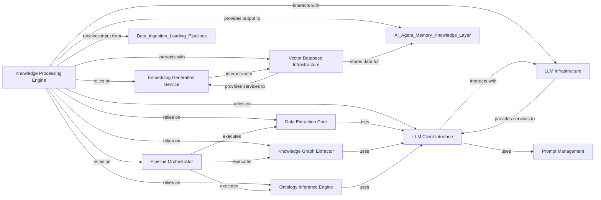

## Details

The `Knowledge Processing Engine` is a pivotal subsystem within the `cognee` project, designed to transform raw data into structured, actionable knowledge. It embodies the project's "AI Infrastructure / Knowledge Graph Platform" nature by orchestrating complex data processing workflows, heavily leveraging AI models for tasks like classification, entity extraction, and knowledge graph generation.

### Knowledge Processing Engine [[Expand]](./Knowledge_Processing_Engine.md)
The overarching component responsible for orchestrating and managing multi-step data processing workflows to transform raw data into structured knowledge. It acts as the central coordinator for all knowledge generation activities.

**Related Classes/Methods**: _None_

### Pipeline Orchestrator
Manages the definition, initiation, and execution of data processing pipelines. It ensures that individual tasks within a pipeline are executed sequentially or in parallel, handling the overall workflow control and task lifecycle.

**Related Classes/Methods**:

- <a href="https://github.com/topoteretes/cognee/blob/main/cognee/modules/pipelines/operations/pipeline.py" target="_blank" rel="noopener noreferrer">`cognee.modules.pipelines.operations.pipeline`</a>
- <a href="https://github.com/topoteretes/cognee/blob/main/cognee/modules/pipelines/operations/run_tasks.py#L78-L146" target="_blank" rel="noopener noreferrer">`cognee.modules.pipelines.operations.run_tasks` (78:146)</a>

### Data Extraction Core
Provides fundamental functionalities for enriching raw data, including generating concise summaries and classifying content into categories, primarily by leveraging Large Language Models.

**Related Classes/Methods**:

- <a href="https://github.com/topoteretes/cognee/blob/main/cognee/modules/data/extraction/extract_summary.py#L15-L22" target="_blank" rel="noopener noreferrer">`cognee.modules.data.extraction.extract_summary` (15:22)</a>
- <a href="https://github.com/topoteretes/cognee/blob/main/cognee/modules/data/extraction/extract_categories.py#L6-L13" target="_blank" rel="noopener noreferrer">`cognee.modules.data.extraction.extract_categories` (6:13)</a>

### Knowledge Graph Extractor
Specializes in identifying and extracting entities and their relationships (triplets) from various data types, forming the foundational elements of the knowledge graph. It heavily relies on LLMs for intelligent extraction.

**Related Classes/Methods**:

- <a href="https://github.com/topoteretes/cognee/blob/main/cognee/modules/data/extraction/knowledge_graph/extract_content_graph.py#L8-L29" target="_blank" rel="noopener noreferrer">`cognee.modules.data.extraction.knowledge_graph.extract_content_graph` (8:29)</a>
- <a href="https://github.com/topoteretes/cognee/blob/main/cognee/tasks/graph/extract_graph_from_data.py#L52-L76" target="_blank" rel="noopener noreferrer">`cognee.tasks.graph.extract_graph_from_data` (52:76)</a>

### Ontology Inference Engine
Responsible for inferring, refining, and ensuring the semantic consistency of the ontological structure of the extracted knowledge, which is vital for a robust and coherent knowledge graph.

**Related Classes/Methods**:

- <a href="https://github.com/topoteretes/cognee/blob/main/cognee/tasks/graph/infer_data_ontology.py#L290-L309" target="_blank" rel="noopener noreferrer">`cognee.tasks.graph.infer_data_ontology` (290:309)</a>

### LLM Client Interface
Acts as a unified adapter layer for interacting with various Large Language Models (LLMs) from different providers (e.g., OpenAI, Gemini, Anthropic, Ollama), abstracting away their specific APIs.

**Related Classes/Methods**:

- <a href="https://github.com/topoteretes/cognee/blob/main/cognee/infrastructure/llm/get_llm_client.py#L29-L122" target="_blank" rel="noopener noreferrer">`cognee.infrastructure.llm.get_llm_client` (29:122)</a>

### Embedding Generation Service
Manages the creation of high-dimensional vector embeddings from data, which are essential for enabling semantic search, similarity comparisons, and efficient storage in vector databases.

**Related Classes/Methods**:

- <a href="https://github.com/topoteretes/cognee/blob/main/cognee/infrastructure/databases/vector/embeddings/get_embedding_engine.py#L6-L33" target="_blank" rel="noopener noreferrer">`cognee.infrastructure.databases.vector.embeddings.get_embedding_engine` (6:33)</a>

### Prompt Management
Handles the templating, rendering, and optimization of prompts used to instruct Large Language Models, ensuring effective and consistent communication with AI models for various processing tasks.

**Related Classes/Methods**:

- <a href="https://github.com/topoteretes/cognee/blob/main/cognee/infrastructure/llm/prompts/render_prompt.py#L4-L41" target="_blank" rel="noopener noreferrer">`cognee.infrastructure.llm.prompts.render_prompt` (4:41)</a>

### LLM Infrastructure
Represents the underlying services and actual Large Language Models (e.g., OpenAI API, Google Generative AI, Ollama) that the system integrates with.

**Related Classes/Methods**:

- <a href="https://github.com/topoteretes/cognee/blob/main/cognee/infrastructure/llm/openai/adapter.py" target="_blank" rel="noopener noreferrer">`cognee.infrastructure.llm.openai.adapter`</a>
- <a href="https://github.com/topoteretes/cognee/blob/main/cognee/infrastructure/llm/gemini/adapter.py" target="_blank" rel="noopener noreferrer">`cognee.infrastructure.llm.gemini.adapter`</a>
- <a href="https://github.com/topoteretes/cognee/blob/main/cognee/infrastructure/llm/ollama/adapter.py" target="_blank" rel="noopener noreferrer">`cognee.infrastructure.llm.ollama.adapter`</a>

### Vector Database Infrastructure
Represents the underlying vector databases (e.g., ChromaDB, LanceDB, Milvus, PGVector, Pinecone, Qdrant, Weaviate) used for storing and retrieving vector embeddings.

**Related Classes/Methods**:

- <a href="https://github.com/topoteretes/cognee/blob/main/cognee/infrastructure/databases/vector/chromadb/ChromaDBAdapter.py#L146-L554" target="_blank" rel="noopener noreferrer">`cognee.infrastructure.databases.vector.chromadb.ChromaDBAdapter.ChromaDBAdapter` (146:554)</a>
- <a href="https://github.com/topoteretes/cognee/blob/main/cognee/infrastructure/databases/vector/lancedb/LanceDBAdapter.py#L37-L349" target="_blank" rel="noopener noreferrer">`cognee.infrastructure.databases.vector.lancedb.LanceDBAdapter.LanceDBAdapter` (37:349)</a>

### [FAQ](https://github.com/CodeBoarding/GeneratedOnBoardings/tree/main?tab=readme-ov-file#faq)