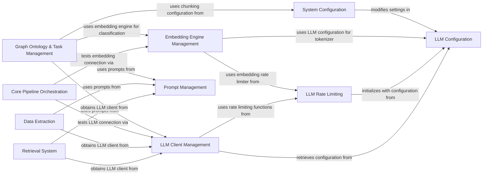

## Component Details

The LLM & Embedding Services subsystem provides a comprehensive and unified interface for all interactions with Large Language Models (LLMs) and embedding models. It handles model configuration, prompt rendering, tokenization, and rate limiting for API calls, ensuring seamless integration with various LLM and embedding providers. The core flow involves dynamic instantiation of LLM clients and embedding engines based on system configuration, applying rate limits to API calls, managing and rendering prompts for LLM interactions, and supporting various downstream tasks such as information retrieval, data extraction, and graph ontology inference. This subsystem acts as a central hub for all AI model-related operations, ensuring efficient and controlled access to external language and embedding services.

### LLM Client Management
This component is responsible for dynamically instantiating and providing the appropriate Large Language Model (LLM) client based on the system's configuration. It acts as a central factory for different LLM providers like OpenAI, Ollama, Anthropic, Gemini, and custom APIs, ensuring that the correct adapter is used for interactions.

**Related Classes/Methods**:

- <a href="https://github.com/topoteretes/cognee/blob/master/cognee/infrastructure/llm/get_llm_client.py#L30-L123" target="_blank" rel="noopener noreferrer">`cognee.infrastructure.llm.get_llm_client.get_llm_client` (30:123)</a>
- <a href="https://github.com/topoteretes/cognee/blob/master/cognee/infrastructure/llm/get_llm_client.py#L11-L27" target="_blank" rel="noopener noreferrer">`cognee.infrastructure.llm.get_llm_client.LLMProvider` (11:27)</a>
- <a href="https://github.com/topoteretes/cognee/blob/master/cognee/infrastructure/llm/openai/adapter.py#L23-L278" target="_blank" rel="noopener noreferrer">`cognee.infrastructure.llm.openai.adapter.OpenAIAdapter` (23:278)</a>
- <a href="https://github.com/topoteretes/cognee/blob/master/cognee/infrastructure/llm/ollama/adapter.py#L16-L174" target="_blank" rel="noopener noreferrer">`cognee.infrastructure.llm.ollama.adapter.OllamaAPIAdapter` (16:174)</a>
- <a href="https://github.com/topoteretes/cognee/blob/master/cognee/infrastructure/llm/anthropic/adapter.py#L11-L96" target="_blank" rel="noopener noreferrer">`cognee.infrastructure.llm.anthropic.adapter.AnthropicAdapter` (11:96)</a>
- <a href="https://github.com/topoteretes/cognee/blob/master/cognee/infrastructure/llm/gemini/adapter.py#L20-L144" target="_blank" rel="noopener noreferrer">`cognee.infrastructure.llm.gemini.adapter.GeminiAdapter` (20:144)</a>
- <a href="https://github.com/topoteretes/cognee/blob/master/cognee/infrastructure/llm/generic_llm_api/adapter.py#L13-L84" target="_blank" rel="noopener noreferrer">`cognee.infrastructure.llm.generic_llm_api.adapter.GenericAPIAdapter` (13:84)</a>

### LLM Configuration
This component manages all configuration settings related to Large Language Models, including the chosen provider, specific model, API keys, and maximum token limits. It provides a centralized way to retrieve and update these settings, ensuring consistent LLM behavior across the system.

**Related Classes/Methods**:

- <a href="https://github.com/topoteretes/cognee/blob/master/cognee/infrastructure/llm/config.py#L155-L169" target="_blank" rel="noopener noreferrer">`cognee.infrastructure.llm.config.get_llm_config` (155:169)</a>
- <a href="https://github.com/topoteretes/cognee/blob/master/cognee/infrastructure/llm/config.py#L8-L151" target="_blank" rel="noopener noreferrer">`cognee.infrastructure.llm.config.LLMConfig` (8:151)</a>
- <a href="https://github.com/topoteretes/cognee/blob/master/cognee/infrastructure/llm/config.py#L55-L122" target="_blank" rel="noopener noreferrer">`cognee.infrastructure.llm.config.LLMConfig:ensure_env_vars_for_ollama` (55:122)</a>

### LLM Rate Limiting
This component is dedicated to enforcing rate limits on calls made to both LLM and embedding APIs. It includes mechanisms for synchronous and asynchronous waiting, retries with backoff, and handling of rate limit errors, ensuring compliance with API usage policies and preventing service disruptions.

**Related Classes/Methods**:

- `cognee.infrastructure.llm.embedding_rate_limiter` (full file reference)
- <a href="https://github.com/topoteretes/cognee/blob/master/cognee/infrastructure/llm/embedding_rate_limiter.py#L39-L207" target="_blank" rel="noopener noreferrer">`cognee.infrastructure.llm.embedding_rate_limiter.EmbeddingRateLimiter` (39:207)</a>
- `cognee.infrastructure.llm.rate_limiter` (full file reference)
- <a href="https://github.com/topoteretes/cognee/blob/master/cognee/infrastructure/llm/rate_limiter.py#L86-L220" target="_blank" rel="noopener noreferrer">`cognee.infrastructure.llm.rate_limiter.llm_rate_limiter` (86:220)</a>
- <a href="https://github.com/topoteretes/cognee/blob/master/cognee/infrastructure/llm/rate_limiter.py#L368-L457" target="_blank" rel="noopener noreferrer">`cognee.infrastructure.llm.rate_limiter:sleep_and_retry_sync` (368:457)</a>
- <a href="https://github.com/topoteretes/cognee/blob/master/cognee/infrastructure/llm/rate_limiter.py#L460-L542" target="_blank" rel="noopener noreferrer">`cognee.infrastructure.llm.rate_limiter:sleep_and_retry_async` (460:542)</a>

### Embedding Engine Management
This component is responsible for providing and managing various text embedding engines, such as LiteLLM, Ollama, and Fastembed. It also handles the selection and initialization of appropriate tokenizers for each engine, facilitating the conversion of text into numerical vector representations for downstream tasks.

**Related Classes/Methods**:

- <a href="https://github.com/topoteretes/cognee/blob/master/cognee/infrastructure/databases/vector/embeddings/get_embedding_engine.py#L7-L34" target="_blank" rel="noopener noreferrer">`cognee.infrastructure.databases.vector.embeddings.get_embedding_engine` (7:34)</a>
- `cognee.infrastructure.databases.vector.embeddings.create_embedding_engine` (full file reference)
- <a href="https://github.com/topoteretes/cognee/blob/master/cognee/infrastructure/databases/vector/embeddings/LiteLLMEmbeddingEngine.py#L23-L183" target="_blank" rel="noopener noreferrer">`cognee.infrastructure.databases.vector.embeddings.LiteLLMEmbeddingEngine.LiteLLMEmbeddingEngine` (23:183)</a>
- <a href="https://github.com/topoteretes/cognee/blob/master/cognee/infrastructure/databases/vector/embeddings/OllamaEmbeddingEngine.py#L20-L137" target="_blank" rel="noopener noreferrer">`cognee.infrastructure.databases.vector.embeddings.OllamaEmbeddingEngine.OllamaEmbeddingEngine` (20:137)</a>
- <a href="https://github.com/topoteretes/cognee/blob/master/cognee/infrastructure/databases/vector/embeddings/FastembedEmbeddingEngine.py#L14-L116" target="_blank" rel="noopener noreferrer">`cognee.infrastructure.databases.vector.embeddings.FastembedEmbeddingEngine.FastembedEmbeddingEngine` (14:116)</a>
- <a href="https://github.com/topoteretes/cognee/blob/master/cognee/infrastructure/llm/tokenizer/TikToken/adapter.py#L7-L119" target="_blank" rel="noopener noreferrer">`cognee.infrastructure.llm.tokenizer.TikToken.adapter.TikTokenTokenizer` (7:119)</a>
- <a href="https://github.com/topoteretes/cognee/blob/master/cognee/infrastructure/llm/tokenizer/Gemini/adapter.py#L6-L80" target="_blank" rel="noopener noreferrer">`cognee.infrastructure.llm.tokenizer.Gemini.adapter.GeminiTokenizer` (6:80)</a>
- <a href="https://github.com/topoteretes/cognee/blob/master/cognee/infrastructure/llm/tokenizer/Mistral/adapter.py#L6-L89" target="_blank" rel="noopener noreferrer">`cognee.infrastructure.llm.tokenizer.Mistral.adapter.MistralTokenizer` (6:89)</a>
- <a href="https://github.com/topoteretes/cognee/blob/master/cognee/infrastructure/llm/tokenizer/HuggingFace/adapter.py#L6-L78" target="_blank" rel="noopener noreferrer">`cognee.infrastructure.llm.tokenizer.HuggingFace.adapter.HuggingFaceTokenizer` (6:78)</a>
- <a href="https://github.com/topoteretes/cognee/blob/master/cognee/infrastructure/databases/vector/embeddings/config.py#L47-L61" target="_blank" rel="noopener noreferrer">`cognee.infrastructure.databases.vector.embeddings.config.get_embedding_config` (47:61)</a>

### Prompt Management
This component centralizes the handling of prompts used for interacting with Large Language Models. It provides functionalities to read predefined query prompts and render dynamic prompts by injecting variables, ensuring consistent and flexible prompt generation across different LLM-driven operations.

**Related Classes/Methods**:

- <a href="https://github.com/topoteretes/cognee/blob/master/cognee/infrastructure/llm/prompts/read_query_prompt.py#L6-L42" target="_blank" rel="noopener noreferrer">`cognee.infrastructure.llm.prompts.read_query_prompt.read_query_prompt` (6:42)</a>
- <a href="https://github.com/topoteretes/cognee/blob/master/cognee/infrastructure/llm/prompts/render_prompt.py#L5-L42" target="_blank" rel="noopener noreferrer">`cognee.infrastructure.llm.prompts.render_prompt:render_prompt` (5:42)</a>

### Retrieval System
This component is responsible for retrieving relevant information from various data sources, including codebases, natural language documents, and knowledge graphs. It leverages LLMs, vector databases, and graph databases to process queries, generate context, and provide comprehensive answers.

**Related Classes/Methods**:

- <a href="https://github.com/topoteretes/cognee/blob/master/cognee/modules/retrieval/code_retriever.py#L13-L148" target="_blank" rel="noopener noreferrer">`cognee.modules.retrieval.code_retriever.CodeRetriever` (13:148)</a>
- <a href="https://github.com/topoteretes/cognee/blob/master/cognee/modules/retrieval/natural_language_retriever.py#L14-L160" target="_blank" rel="noopener noreferrer">`cognee.modules.retrieval.natural_language_retriever.NaturalLanguageRetriever` (14:160)</a>
- <a href="https://github.com/topoteretes/cognee/blob/master/cognee/modules/retrieval/graph_completion_cot_retriever.py#L11-L125" target="_blank" rel="noopener noreferrer">`cognee.modules.retrieval.graph_completion_cot_retriever.GraphCompletionCotRetriever` (11:125)</a>
- <a href="https://github.com/topoteretes/cognee/blob/master/cognee/modules/retrieval/utils/completion.py#L5-L21" target="_blank" rel="noopener noreferrer">`cognee.modules.retrieval.utils.completion:generate_completion` (5:21)</a>
- <a href="https://github.com/topoteretes/cognee/blob/master/cognee/modules/retrieval/utils/completion.py#L24-L36" target="_blank" rel="noopener noreferrer">`cognee.modules.retrieval.utils.completion:summarize_text` (24:36)</a>
- <a href="https://github.com/topoteretes/cognee/blob/master/cognee/modules/retrieval/utils/description_to_codepart_search.py#L27-L143" target="_blank" rel="noopener noreferrer">`cognee.modules.retrieval.utils.description_to_codepart_search:code_description_to_code_part` (27:143)</a>

### Data Extraction
This component focuses on extracting structured and unstructured information from various data types using Large Language Models. It includes functionalities for summarizing text, categorizing content, and extracting knowledge graphs, transforming raw data into actionable insights.

**Related Classes/Methods**:

- <a href="https://github.com/topoteretes/cognee/blob/master/cognee/modules/data/extraction/extract_summary.py#L16-L23" target="_blank" rel="noopener noreferrer">`cognee.modules.data.extraction.extract_summary:extract_summary` (16:23)</a>
- <a href="https://github.com/topoteretes/cognee/blob/master/cognee/modules/data/extraction/extract_categories.py#L7-L14" target="_blank" rel="noopener noreferrer">`cognee.modules.data.extraction.extract_categories:extract_categories` (7:14)</a>
- <a href="https://github.com/topoteretes/cognee/blob/master/cognee/modules/data/extraction/knowledge_graph/extract_content_graph.py#L9-L30" target="_blank" rel="noopener noreferrer">`cognee.modules.data.extraction.knowledge_graph.extract_content_graph:extract_content_graph` (9:30)</a>
- <a href="https://github.com/topoteretes/cognee/blob/master/cognee/modules/data/processing/document_types/AudioDocument.py#L10-L12" target="_blank" rel="noopener noreferrer">`cognee.modules.data.processing.document_types.AudioDocument.AudioDocument:create_transcript` (10:12)</a>
- <a href="https://github.com/topoteretes/cognee/blob/master/cognee/modules/data/processing/document_types/ImageDocument.py#L10-L12" target="_blank" rel="noopener noreferrer">`cognee.modules.data.processing.document_types.ImageDocument.ImageDocument:transcribe_image` (10:12)</a>

### System Configuration
This component provides a unified interface for managing and retrieving all system-wide configuration settings. It consolidates configurations for LLMs, graph databases, vector databases, and relational databases, ensuring that all parts of the system operate with consistent parameters.

**Related Classes/Methods**:

- <a href="https://github.com/topoteretes/cognee/blob/master/cognee/modules/settings/get_current_settings.py#L35-L60" target="_blank" rel="noopener noreferrer">`cognee.modules.settings.get_current_settings:get_current_settings` (35:60)</a>
- <a href="https://github.com/topoteretes/cognee/blob/master/cognee/modules/settings/get_settings.py#L42-L157" target="_blank" rel="noopener noreferrer">`cognee.modules.settings.get_settings:get_settings` (42:157)</a>
- <a href="https://github.com/topoteretes/cognee/blob/master/cognee/modules/settings/save_llm_config.py#L11-L18" target="_blank" rel="noopener noreferrer">`cognee.modules.settings.save_llm_config:save_llm_config` (11:18)</a>
- <a href="https://github.com/topoteretes/cognee/blob/master/cognee/api/v1/config/config.py#L62-L64" target="_blank" rel="noopener noreferrer">`cognee.api.v1.config.config.config:set_llm_provider` (62:64)</a>
- <a href="https://github.com/topoteretes/cognee/blob/master/cognee/api/v1/config/config.py#L67-L69" target="_blank" rel="noopener noreferrer">`cognee.api.v1.config.config.config:set_llm_endpoint` (67:69)</a>
- <a href="https://github.com/topoteretes/cognee/blob/master/cognee/api/v1/config/config.py#L72-L74" target="_blank" rel="noopener noreferrer">`cognee.api.v1.config.config.config:set_llm_model` (72:74)</a>
- <a href="https://github.com/topoteretes/cognee/blob/master/cognee/api/v1/config/config.py#L77-L79" target="_blank" rel="noopener noreferrer">`cognee.api.v1.config.config.config:set_llm_api_key` (77:79)</a>
- <a href="https://github.com/topoteretes/cognee/blob/master/cognee/api/v1/config/config.py#L82-L93" target="_blank" rel="noopener noreferrer">`cognee.api.v1.config.config.config:set_llm_config` (82:93)</a>

### Core Pipeline Orchestration
This component is responsible for orchestrating the main data processing pipeline within the Cognee system. It handles the initialization of databases, tests connections to LLM and embedding services, and manages dataset operations, ensuring a smooth and integrated workflow for data ingestion and processing.

**Related Classes/Methods**:

- <a href="https://github.com/topoteretes/cognee/blob/master/cognee/modules/pipelines/operations/pipeline.py#L30-L103" target="_blank" rel="noopener noreferrer">`cognee.modules.pipelines.operations.pipeline:cognee_pipeline` (30:103)</a>

### Graph Ontology & Task Management
This component manages the inference of data ontologies and various LLM-driven tasks related to graph processing and data classification. It includes functionalities for extracting entities, inferring graph structures, and performing cascade extractions, contributing to the semantic understanding and organization of data.

**Related Classes/Methods**:

- `cognee.tasks.chunk_naive_llm_classifier:chunk_naive_llm_classifier` (full file reference)
- `cognee.tasks.entity_completion.entity_extractors.llm_entity_extractor:extract_entities` (full file reference)
- <a href="https://github.com/topoteretes/cognee/blob/master/cognee/tasks/graph/infer_data_ontology.py#L35-L61" target="_blank" rel="noopener noreferrer">`cognee.tasks.graph.infer_data_ontology:extract_ontology` (35:61)</a>
- <a href="https://github.com/topoteretes/cognee/blob/master/cognee/tasks/graph/infer_data_ontology.py#L174-L288" target="_blank" rel="noopener noreferrer">`cognee.tasks.graph.infer_data_ontology.OntologyEngine:add_graph_ontology` (174:288)</a>
- <a href="https://github.com/topoteretes/cognee/blob/master/cognee/tasks/graph/cascade_extract/utils/extract_content_nodes_and_relationship_names.py#L16-L61" target="_blank" rel="noopener noreferrer">`cognee.tasks.graph.cascade_extract.utils.extract_content_nodes_and_relationship_names:extract_content_nodes_and_relationship_names` (16:61)</a>
- <a href="https://github.com/topoteretes/cognee/blob/master/cognee/tasks/graph/cascade_extract/utils/extract_edge_triplets.py#L8-L60" target="_blank" rel="noopener noreferrer">`cognee.tasks.graph.cascade_extract.utils.extract_edge_triplets` (8:60)</a>
- <a href="https://github.com/topoteretes/cognee/blob/master/cognee/tasks/graph/cascade_extract/utils/extract_nodes.py#L16-L45" target="_blank" rel="noopener noreferrer">`cognee.tasks.graph.cascade_extract.utils.extract_nodes` (16:45)</a>

### [FAQ](https://github.com/CodeBoarding/GeneratedOnBoardings/tree/main?tab=readme-ov-file#faq)