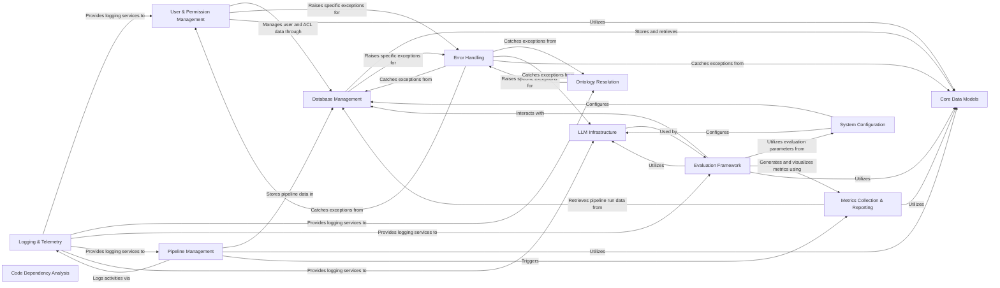

## Component Details

This foundational component handles user accounts, roles, tenants, and permissions, ensuring secure access. It also manages overall system configuration, provides essential core utilities like logging, telemetry, error handling, and data models, and includes specialized modules for code analysis and system evaluation.

### User & Permission Management
This component is responsible for managing user accounts, handling user authentication, and enforcing document-level permissions. It integrates with FastAPI for user management and interacts with the relational database for user and access control list (ACL) data.

**Related Classes/Methods**:

- <a href="https://github.com/topoteretes/cognee/blob/master/cognee/modules/users/get_fastapi_users.py#L11-L16" target="_blank" rel="noopener noreferrer">`cognee.modules.users.get_fastapi_users:get_fastapi_users` (11:16)</a>
- <a href="https://github.com/topoteretes/cognee/blob/master/cognee/modules/users/get_user_manager.py#L14-L46" target="_blank" rel="noopener noreferrer">`cognee.modules.users.get_user_manager.UserManager` (14:46)</a>
- <a href="https://github.com/topoteretes/cognee/blob/master/cognee/modules/users/get_user_manager.py#L49-L50" target="_blank" rel="noopener noreferrer">`cognee.modules.users.get_user_manager:get_user_manager` (49:50)</a>
- <a href="https://github.com/topoteretes/cognee/blob/master/cognee/modules/users/authentication/methods/authenticate_user.py#L8-L22" target="_blank" rel="noopener noreferrer">`cognee.modules.users.authentication.methods.authenticate_user:authenticate_user` (8:22)</a>
- <a href="https://github.com/topoteretes/cognee/blob/master/cognee/modules/users/permissions/methods/check_permission_on_documents.py#L16-L41" target="_blank" rel="noopener noreferrer">`cognee.modules.users.permissions.methods.check_permission_on_documents:check_permission_on_documents` (16:41)</a>
- <a href="https://github.com/topoteretes/cognee/blob/master/cognee/modules/users/methods/get_default_user.py#L12-L37" target="_blank" rel="noopener noreferrer">`cognee.modules.users.methods.get_default_user:get_default_user` (12:37)</a>
- <a href="https://github.com/topoteretes/cognee/blob/master/cognee/modules/users/exceptions/exceptions.py#L41-L48" target="_blank" rel="noopener noreferrer">`cognee.modules.users.exceptions.exceptions.PermissionDeniedError` (41:48)</a>
- <a href="https://github.com/topoteretes/cognee/blob/master/cognee/modules/users/authentication/get_auth_backend.py#L31-L44" target="_blank" rel="noopener noreferrer">`cognee.modules.users.authentication.get_auth_backend:get_auth_backend` (31:44)</a>
- <a href="https://github.com/topoteretes/cognee/blob/master/cognee/modules/users/models/User.py#L12-L39" target="_blank" rel="noopener noreferrer">`cognee.modules.users.models.User.User` (12:39)</a>
- <a href="https://github.com/topoteretes/cognee/blob/master/cognee/modules/users/models/ACL.py#L8-L22" target="_blank" rel="noopener noreferrer">`cognee.modules.users.models.ACL.ACL` (8:22)</a>
- <a href="https://github.com/topoteretes/cognee/blob/master/cognee/modules/users/methods/create_user.py#L13-L62" target="_blank" rel="noopener noreferrer">`cognee.modules.users.methods.create_user` (13:62)</a>
- <a href="https://github.com/topoteretes/cognee/blob/master/cognee/modules/users/get_user_db.py#L16-L17" target="_blank" rel="noopener noreferrer">`cognee.modules.users.get_user_db` (16:17)</a>

### System Configuration
This component centralizes the management of various system-wide configurations, including settings for Large Language Models (LLMs), graph databases, vector databases, and relational databases. It provides a unified interface to retrieve and set these operational parameters.

**Related Classes/Methods**:

- <a href="https://github.com/topoteretes/cognee/blob/master/cognee/base_config.py#L29-L30" target="_blank" rel="noopener noreferrer">`cognee.base_config:get_base_config` (29:30)</a>
- <a href="https://github.com/topoteretes/cognee/blob/master/cognee/base_config.py#L9-L25" target="_blank" rel="noopener noreferrer">`cognee.base_config.BaseConfig` (9:25)</a>
- <a href="https://github.com/topoteretes/cognee/blob/master/cognee/api/v1/config/config.py#L72-L74" target="_blank" rel="noopener noreferrer">`cognee.api.v1.config.config.config:set_llm_model` (72:74)</a>
- <a href="https://github.com/topoteretes/cognee/blob/master/cognee/infrastructure/llm/config.py#L155-L169" target="_blank" rel="noopener noreferrer">`cognee.infrastructure.llm.config.get_llm_config` (155:169)</a>
- <a href="https://github.com/topoteretes/cognee/blob/master/cognee/infrastructure/llm/config.py#L8-L151" target="_blank" rel="noopener noreferrer">`cognee.infrastructure.llm.config.LLMConfig` (8:151)</a>
- <a href="https://github.com/topoteretes/cognee/blob/master/cognee/modules/settings/get_current_settings.py#L35-L60" target="_blank" rel="noopener noreferrer">`cognee.modules.settings.get_current_settings:get_current_settings` (35:60)</a>
- <a href="https://github.com/topoteretes/cognee/blob/master/cognee/infrastructure/databases/graph/config.py#L94-L107" target="_blank" rel="noopener noreferrer">`cognee.infrastructure.databases.graph.config.get_graph_config` (94:107)</a>
- <a href="https://github.com/topoteretes/cognee/blob/master/cognee/infrastructure/databases/vector/config.py#L50-L64" target="_blank" rel="noopener noreferrer">`cognee.infrastructure.databases.vector.config.get_vectordb_config` (50:64)</a>
- <a href="https://github.com/topoteretes/cognee/blob/master/cognee/infrastructure/databases/relational/config.py#L45-L59" target="_blank" rel="noopener noreferrer">`cognee.infrastructure.databases.relational.config.get_relational_config` (45:59)</a>
- <a href="https://github.com/topoteretes/cognee/blob/master/cognee/modules/settings/save_llm_config.py#L11-L18" target="_blank" rel="noopener noreferrer">`cognee.modules.settings.save_llm_config` (11:18)</a>
- <a href="https://github.com/topoteretes/cognee/blob/master/cognee/modules/settings/save_vector_db_config.py#L12-L19" target="_blank" rel="noopener noreferrer">`cognee.modules.settings.save_vector_db_config` (12:19)</a>

### Database Management
This component provides the core infrastructure for interacting with various database types, including relational, graph, and vector databases. It handles the creation of database engines, session management, and initial table setup for the system's persistence layers.

**Related Classes/Methods**:

- <a href="https://github.com/topoteretes/cognee/blob/master/cognee/infrastructure/databases/relational/get_relational_engine.py#L5-L21" target="_blank" rel="noopener noreferrer">`cognee.infrastructure.databases.relational.get_relational_engine:get_relational_engine` (5:21)</a>
- <a href="https://github.com/topoteretes/cognee/blob/master/cognee/infrastructure/databases/relational/sqlalchemy/SqlAlchemyAdapter.py#L39-L48" target="_blank" rel="noopener noreferrer">`cognee.infrastructure.databases.relational.sqlalchemy.SqlAlchemyAdapter.SQLAlchemyAdapter:get_async_session` (39:48)</a>
- <a href="https://github.com/topoteretes/cognee/blob/master/cognee/infrastructure/databases/relational/create_db_and_tables.py#L4-L13" target="_blank" rel="noopener noreferrer">`cognee.infrastructure.databases.relational.create_db_and_tables:create_db_and_tables` (4:13)</a>
- <a href="https://github.com/topoteretes/cognee/blob/master/cognee/infrastructure/databases/vector/pgvector/create_db_and_tables.py#L5-L18" target="_blank" rel="noopener noreferrer">`cognee.infrastructure.databases.vector.pgvector.create_db_and_tables:create_db_and_tables` (5:18)</a>
- <a href="https://github.com/topoteretes/cognee/blob/master/cognee/infrastructure/databases/graph/get_graph_engine.py#L11-L37" target="_blank" rel="noopener noreferrer">`cognee.infrastructure.databases.graph.get_graph_engine:get_graph_engine` (11:37)</a>
- <a href="https://github.com/topoteretes/cognee/blob/master/cognee/modules/engine/operations/setup.py#L9-L17" target="_blank" rel="noopener noreferrer">`cognee.modules.engine.operations.setup:setup` (9:17)</a>
- <a href="https://github.com/topoteretes/cognee/blob/master/cognee/infrastructure/databases/graph/graph_db_interface.py#L127-L380" target="_blank" rel="noopener noreferrer">`cognee.infrastructure.databases.graph.graph_db_interface.GraphDBInterface` (127:380)</a>
- <a href="https://github.com/topoteretes/cognee/blob/master/cognee/infrastructure/databases/vector/vector_db_interface.py#L7-L144" target="_blank" rel="noopener noreferrer">`cognee.infrastructure.databases.vector.vector_db_interface.VectorDBInterface` (7:144)</a>
- <a href="https://github.com/topoteretes/cognee/blob/master/cognee/infrastructure/databases/graph/kuzu/adapter.py#L28-L998" target="_blank" rel="noopener noreferrer">`cognee.infrastructure.databases.graph.kuzu.adapter.KuzuAdapter` (28:998)</a>
- `cognee.infrastructure.databases.graph.memgraph.memgraph_adapter.MemgraphAdapter` (full file reference)
- <a href="https://github.com/topoteretes/cognee/blob/master/cognee/infrastructure/databases/graph/neo4j_driver/adapter.py#L33-L1000" target="_blank" rel="noopener noreferrer">`cognee.infrastructure.databases.graph.neo4j_driver.adapter.Neo4jAdapter` (33:1000)</a>
- `cognee.infrastructure.databases.graph.networkx.adapter.NetworkXAdapter` (full file reference)
- <a href="https://github.com/topoteretes/cognee/blob/master/cognee/infrastructure/databases/vector/chromadb/ChromaDBAdapter.py#L147-L555" target="_blank" rel="noopener noreferrer">`cognee.infrastructure.databases.vector.chromadb.ChromaDBAdapter.ChromaDBAdapter` (147:555)</a>
- <a href="https://github.com/topoteretes/cognee/blob/master/cognee/infrastructure/databases/vector/lancedb/LanceDBAdapter.py#L38-L346" target="_blank" rel="noopener noreferrer">`cognee.infrastructure.databases.vector.lancedb.LanceDBAdapter.LanceDBAdapter` (38:346)</a>
- <a href="https://github.com/topoteretes/cognee/blob/master/cognee/infrastructure/databases/vector/milvus/MilvusAdapter.py#L32-L483" target="_blank" rel="noopener noreferrer">`cognee.infrastructure.databases.vector.milvus.MilvusAdapter.MilvusAdapter` (32:483)</a>
- <a href="https://github.com/topoteretes/cognee/blob/master/cognee/infrastructure/databases/vector/pgvector/PGVectorAdapter.py#L38-L357" target="_blank" rel="noopener noreferrer">`cognee.infrastructure.databases.vector.pgvector.PGVectorAdapter.PGVectorAdapter` (38:357)</a>
- <a href="https://github.com/topoteretes/cognee/blob/master/cognee/infrastructure/databases/vector/qdrant/QDrantAdapter.py#L108-L523" target="_blank" rel="noopener noreferrer">`cognee.infrastructure.databases.vector.qdrant.QDrantAdapter.QDrantAdapter` (108:523)</a>
- <a href="https://github.com/topoteretes/cognee/blob/master/cognee/infrastructure/databases/vector/weaviate_db/WeaviateAdapter.py#L33-L499" target="_blank" rel="noopener noreferrer">`cognee.infrastructure.databases.vector.weaviate_db.WeaviateAdapter.WeaviateAdapter` (33:499)</a>

### Logging & Telemetry
This component provides standardized logging capabilities across the system, ensuring consistent message formatting and output to both console and file. It also includes functionality for sending anonymous telemetry data to monitor system usage and performance.

**Related Classes/Methods**:

- <a href="https://github.com/topoteretes/cognee/blob/master/cognee/shared/logging_utils.py#L148-L169" target="_blank" rel="noopener noreferrer">`cognee.shared.logging_utils:get_logger` (148:169)</a>
- <a href="https://github.com/topoteretes/cognee/blob/master/cognee/shared/logging_utils.py#L204-L351" target="_blank" rel="noopener noreferrer">`cognee.shared.logging_utils.setup_logging` (204:351)</a>
- <a href="https://github.com/topoteretes/cognee/blob/master/cognee/shared/logging_utils.py#L51-L128" target="_blank" rel="noopener noreferrer">`cognee.shared.logging_utils.PlainFileHandler` (51:128)</a>
- <a href="https://github.com/topoteretes/cognee/blob/master/cognee/shared/utils.py#L77-L102" target="_blank" rel="noopener noreferrer">`cognee.shared.utils:send_telemetry` (77:102)</a>
- <a href="https://github.com/topoteretes/cognee/blob/master/cognee/shared/utils.py#L60-L74" target="_blank" rel="noopener noreferrer">`cognee.shared.utils.get_anonymous_id` (60:74)</a>

### Ontology Resolution
This component is responsible for loading, parsing, and querying RDF/XML ontologies. It provides methods to build a lookup dictionary for ontology elements, find closest matches for given names, and extract subgraphs based on specified nodes and relationships.

**Related Classes/Methods**:

- <a href="https://github.com/topoteretes/cognee/blob/master/cognee/modules/ontology/rdf_xml/OntologyResolver.py#L17-L140" target="_blank" rel="noopener noreferrer">`cognee.modules.ontology.rdf_xml.OntologyResolver.OntologyResolver` (17:140)</a>
- <a href="https://github.com/topoteretes/cognee/blob/master/cognee/modules/ontology/rdf_xml/OntologyResolver.py#L18-L38" target="_blank" rel="noopener noreferrer">`cognee.modules.ontology.rdf_xml.OntologyResolver.OntologyResolver:__init__` (18:38)</a>
- <a href="https://github.com/topoteretes/cognee/blob/master/cognee/modules/ontology/rdf_xml/OntologyResolver.py#L40-L59" target="_blank" rel="noopener noreferrer">`cognee.modules.ontology.rdf_xml.OntologyResolver.OntologyResolver.build_lookup` (40:59)</a>
- <a href="https://github.com/topoteretes/cognee/blob/master/cognee/modules/ontology/rdf_xml/OntologyResolver.py#L61-L63" target="_blank" rel="noopener noreferrer">`cognee.modules.ontology.rdf_xml.OntologyResolver.OntologyResolver:refresh_lookup` (61:63)</a>
- <a href="https://github.com/topoteretes/cognee/blob/master/cognee/modules/ontology/rdf_xml/OntologyResolver.py#L65-L78" target="_blank" rel="noopener noreferrer">`cognee.modules.ontology.rdf_xml.OntologyResolver.OntologyResolver:find_closest_match` (65:78)</a>
- <a href="https://github.com/topoteretes/cognee/blob/master/cognee/modules/ontology/rdf_xml/OntologyResolver.py#L80-L140" target="_blank" rel="noopener noreferrer">`cognee.modules.ontology.rdf_xml.OntologyResolver.OntologyResolver:get_subgraph` (80:140)</a>
- <a href="https://github.com/topoteretes/cognee/blob/master/cognee/modules/ontology/exceptions/exceptions.py#L5-L12" target="_blank" rel="noopener noreferrer">`cognee.modules.ontology.exceptions.exceptions.OntologyInitializationError` (5:12)</a>
- <a href="https://github.com/topoteretes/cognee/blob/master/cognee/modules/ontology/exceptions/exceptions.py#L15-L22" target="_blank" rel="noopener noreferrer">`cognee.modules.ontology.exceptions.exceptions.FindClosestMatchError` (15:22)</a>
- <a href="https://github.com/topoteretes/cognee/blob/master/cognee/modules/ontology/exceptions/exceptions.py#L25-L32" target="_blank" rel="noopener noreferrer">`cognee.modules.ontology.exceptions.exceptions.GetSubgraphError` (25:32)</a>

### Evaluation Framework
This comprehensive framework orchestrates the entire evaluation pipeline, from building a corpus and generating answers to calculating and visualizing performance metrics. It integrates various sub-modules to provide a complete assessment of the system's capabilities.

**Related Classes/Methods**:

- <a href="https://github.com/topoteretes/cognee/blob/master/cognee/eval_framework/run_eval.py#L24-L41" target="_blank" rel="noopener noreferrer">`cognee.eval_framework.run_eval:main` (24:41)</a>
- <a href="https://github.com/topoteretes/cognee/blob/master/cognee/eval_framework/corpus_builder/run_corpus_builder.py#L36-L68" target="_blank" rel="noopener noreferrer">`cognee.eval_framework.corpus_builder.run_corpus_builder:run_corpus_builder` (36:68)</a>
- <a href="https://github.com/topoteretes/cognee/blob/master/cognee/eval_framework/answer_generation/run_question_answering_module.py#L37-L69" target="_blank" rel="noopener noreferrer">`cognee.eval_framework.answer_generation.run_question_answering_module:run_question_answering` (37:69)</a>
- <a href="https://github.com/topoteretes/cognee/blob/master/cognee/eval_framework/answer_generation/answer_generation_executor.py#L24-L50" target="_blank" rel="noopener noreferrer">`cognee.eval_framework.answer_generation.answer_generation_executor.AnswerGeneratorExecutor` (24:50)</a>
- <a href="https://github.com/topoteretes/cognee/blob/master/cognee/eval_framework/answer_generation/answer_generation_executor.py#L25-L50" target="_blank" rel="noopener noreferrer">`cognee.eval_framework.answer_generation.answer_generation_executor.AnswerGeneratorExecutor.question_answering_non_parallel` (25:50)</a>
- <a href="https://github.com/topoteretes/cognee/blob/master/cognee/eval_framework/answer_generation/run_question_answering_module.py#L20-L34" target="_blank" rel="noopener noreferrer">`cognee.eval_framework.answer_generation.run_question_answering_module.create_and_insert_answers_table` (20:34)</a>
- <a href="https://github.com/topoteretes/cognee/blob/master/cognee/eval_framework/evaluation/run_evaluation_module.py#L63-L81" target="_blank" rel="noopener noreferrer">`cognee.eval_framework.evaluation.run_evaluation_module:run_evaluation` (63:81)</a>
- <a href="https://github.com/topoteretes/cognee/blob/master/cognee/eval_framework/metrics_dashboard.py#L131-L170" target="_blank" rel="noopener noreferrer">`cognee.eval_framework.metrics_dashboard.create_dashboard` (131:170)</a>
- <a href="https://github.com/topoteretes/cognee/blob/master/cognee/eval_framework/eval_config.py#L6-L71" target="_blank" rel="noopener noreferrer">`cognee.eval_framework.eval_config.EvalConfig` (6:71)</a>
- <a href="https://github.com/topoteretes/cognee/blob/master/cognee/eval_framework/evaluation/deep_eval_adapter.py#L12-L68" target="_blank" rel="noopener noreferrer">`cognee.eval_framework.evaluation.deep_eval_adapter.DeepEvalAdapter` (12:68)</a>
- <a href="https://github.com/topoteretes/cognee/blob/master/cognee/eval_framework/evaluation/direct_llm_eval_adapter.py#L16-L59" target="_blank" rel="noopener noreferrer">`cognee.eval_framework.evaluation.direct_llm_eval_adapter.DirectLLMEvalAdapter` (16:59)</a>

### Core Data Models
Defines the fundamental data structures and models used throughout the system for representing various types of data, including datasets, individual data points, graph relationships, and evaluation-related entities.

**Related Classes/Methods**:

- <a href="https://github.com/topoteretes/cognee/blob/master/cognee/infrastructure/engine/models/DataPoint.py#L20-L255" target="_blank" rel="noopener noreferrer">`cognee.infrastructure.engine.models.DataPoint.DataPoint` (20:255)</a>
- <a href="https://github.com/topoteretes/cognee/blob/master/cognee/modules/data/models/GraphMetrics.py#L10-L28" target="_blank" rel="noopener noreferrer">`cognee.modules.data.models.GraphMetrics.GraphMetrics` (10:28)</a>
- <a href="https://github.com/topoteretes/cognee/blob/master/cognee/modules/data/models/Data.py#L11-L50" target="_blank" rel="noopener noreferrer">`cognee.modules.data.models.Data.Data` (11:50)</a>
- <a href="https://github.com/topoteretes/cognee/blob/master/cognee/modules/data/models/Dataset.py#L10-L38" target="_blank" rel="noopener noreferrer">`cognee.modules.data.models.Dataset.Dataset` (10:38)</a>
- <a href="https://github.com/topoteretes/cognee/blob/master/cognee/modules/data/models/DatasetData.py#L6-L12" target="_blank" rel="noopener noreferrer">`cognee.modules.data.models.DatasetData.DatasetData` (6:12)</a>
- <a href="https://github.com/topoteretes/cognee/blob/master/cognee/modules/data/models/answers_data.py#L8-L15" target="_blank" rel="noopener noreferrer">`cognee.modules.data.models.answers_data.Answers` (8:15)</a>
- <a href="https://github.com/topoteretes/cognee/blob/master/cognee/modules/data/models/graph_relationship_ledger.py#L8-L40" target="_blank" rel="noopener noreferrer">`cognee.modules.data.models.graph_relationship_ledger.GraphRelationshipLedger` (8:40)</a>
- <a href="https://github.com/topoteretes/cognee/blob/master/cognee/modules/data/models/metrics_data.py#L8-L15" target="_blank" rel="noopener noreferrer">`cognee.modules.data.models.metrics_data.Metrics` (8:15)</a>
- <a href="https://github.com/topoteretes/cognee/blob/master/cognee/modules/data/models/questions_data.py#L8-L15" target="_blank" rel="noopener noreferrer">`cognee.modules.data.models.questions_data.Questions` (8:15)</a>
- <a href="https://github.com/topoteretes/cognee/blob/master/cognee/modules/users/models/User.py#L12-L39" target="_blank" rel="noopener noreferrer">`cognee.modules.users.models.User.User` (12:39)</a>
- <a href="https://github.com/topoteretes/cognee/blob/master/cognee/modules/users/models/ACL.py#L8-L22" target="_blank" rel="noopener noreferrer">`cognee.modules.users.models.ACL.ACL` (8:22)</a>
- <a href="https://github.com/topoteretes/cognee/blob/master/cognee/modules/users/models/Permission.py#L8-L16" target="_blank" rel="noopener noreferrer">`cognee.modules.users.models.Permission.Permission` (8:16)</a>
- <a href="https://github.com/topoteretes/cognee/blob/master/cognee/modules/users/models/Role.py#L7-L31" target="_blank" rel="noopener noreferrer">`cognee.modules.users.models.Role.Role` (7:31)</a>
- <a href="https://github.com/topoteretes/cognee/blob/master/cognee/modules/users/models/Tenant.py#L8-L30" target="_blank" rel="noopener noreferrer">`cognee.modules.users.models.Tenant.Tenant` (8:30)</a>
- <a href="https://github.com/topoteretes/cognee/blob/master/cognee/modules/pipelines/models/Pipeline.py#L10-L24" target="_blank" rel="noopener noreferrer">`cognee.modules.pipelines.models.Pipeline` (10:24)</a>
- <a href="https://github.com/topoteretes/cognee/blob/master/cognee/modules/pipelines/models/PipelineRun.py#L15-L27" target="_blank" rel="noopener noreferrer">`cognee.modules.pipelines.models.PipelineRun` (15:27)</a>
- <a href="https://github.com/topoteretes/cognee/blob/master/cognee/modules/pipelines/models/Task.py#L9-L24" target="_blank" rel="noopener noreferrer">`cognee.modules.pipelines.models.Task` (9:24)</a>
- <a href="https://github.com/topoteretes/cognee/blob/master/cognee/modules/pipelines/models/PipelineTask.py#L6-L12" target="_blank" rel="noopener noreferrer">`cognee.modules.pipelines.models.PipelineTask` (6:12)</a>
- <a href="https://github.com/topoteretes/cognee/blob/master/cognee/modules/pipelines/models/TaskRun.py#L7-L18" target="_blank" rel="noopener noreferrer">`cognee.modules.pipelines.models.TaskRun` (7:18)</a>

### Metrics Collection & Reporting
Focuses on the collection, processing, and visualization of system performance and pipeline execution metrics.

**Related Classes/Methods**:

- <a href="https://github.com/topoteretes/cognee/blob/master/cognee/modules/metrics/operations/get_pipeline_run_metrics.py#L25-L60" target="_blank" rel="noopener noreferrer">`cognee.modules.metrics.operations.get_pipeline_run_metrics:get_pipeline_run_metrics` (25:60)</a>
- <a href="https://github.com/topoteretes/cognee/blob/master/cognee/modules/metrics/operations/get_pipeline_run_metrics.py#L10-L22" target="_blank" rel="noopener noreferrer">`cognee.modules.metrics.operations.get_pipeline_run_metrics.fetch_token_count` (10:22)</a>
- <a href="https://github.com/topoteretes/cognee/blob/master/evals/plot_metrics.py#L391-L433" target="_blank" rel="noopener noreferrer">`cognee.evals.plot_metrics:main` (391:433)</a>
- <a href="https://github.com/topoteretes/cognee/blob/master/evals/plot_metrics.py#L50-L174" target="_blank" rel="noopener noreferrer">`cognee.evals.plot_metrics.load_metrics` (50:174)</a>
- <a href="https://github.com/topoteretes/cognee/blob/master/evals/plot_metrics.py#L177-L388" target="_blank" rel="noopener noreferrer">`cognee.evals.plot_metrics.plot_metrics` (177:388)</a>

### Code Dependency Analysis
This component provides utilities for analyzing code repositories, specifically focusing on identifying local file dependencies and generating dependency graphs. It's used for tasks related to understanding the internal structure and relationships within the codebase.

**Related Classes/Methods**:

- <a href="https://github.com/topoteretes/cognee/blob/master/cognee/tasks/repo_processor/get_local_dependencies.py#L32-L58" target="_blank" rel="noopener noreferrer">`cognee.tasks.repo_processor.get_local_dependencies.FileParser:parse_file` (32:58)</a>
- <a href="https://github.com/topoteretes/cognee/blob/master/cognee/tasks/repo_processor/get_local_dependencies.py#L61-L86" target="_blank" rel="noopener noreferrer">`cognee.tasks.repo_processor.get_local_dependencies.get_source_code` (61:86)</a>
- <a href="https://github.com/topoteretes/cognee/blob/master/cognee/tasks/code/get_repo_dependency_graph_checker.py#L7-L31" target="_blank" rel="noopener noreferrer">`cognee.tasks.code.get_repo_dependency_graph_checker:main` (7:31)</a>
- <a href="https://github.com/topoteretes/cognee/blob/master/cognee/tasks/repo_processor/get_repo_file_dependencies.py#L87-L143" target="_blank" rel="noopener noreferrer">`cognee.tasks.repo_processor.get_repo_file_dependencies:get_repo_file_dependencies` (87:143)</a>

### Error Handling
This component defines and manages custom exception types used throughout the Cognee system. It provides a centralized mechanism for raising and handling specific errors, ensuring consistent error reporting and graceful degradation.

**Related Classes/Methods**:

- <a href="https://github.com/topoteretes/cognee/blob/master/cognee/exceptions/exceptions.py#L38-L44" target="_blank" rel="noopener noreferrer">`cognee.exceptions.exceptions.ServiceError:__init__` (38:44)</a>
- <a href="https://github.com/topoteretes/cognee/blob/master/cognee/exceptions/exceptions.py#L10-L32" target="_blank" rel="noopener noreferrer">`cognee.exceptions.exceptions.CogneeApiError:__init__` (10:32)</a>
- <a href="https://github.com/topoteretes/cognee/blob/master/cognee/exceptions/exceptions.py#L67-L68" target="_blank" rel="noopener noreferrer">`cognee.exceptions.exceptions.CriticalError` (67:68)</a>
- <a href="https://github.com/topoteretes/cognee/blob/master/cognee/exceptions/exceptions.py#L57-L64" target="_blank" rel="noopener noreferrer">`cognee.exceptions.exceptions.InvalidAttributeError` (57:64)</a>
- <a href="https://github.com/topoteretes/cognee/blob/master/cognee/exceptions/exceptions.py#L47-L54" target="_blank" rel="noopener noreferrer">`cognee.exceptions.exceptions.InvalidValueError` (47:54)</a>
- <a href="https://github.com/topoteretes/cognee/blob/master/cognee/infrastructure/databases/exceptions/EmbeddingException.py#L5-L20" target="_blank" rel="noopener noreferrer">`cognee.infrastructure.databases.exceptions.EmbeddingException.EmbeddingException` (5:20)</a>
- <a href="https://github.com/topoteretes/cognee/blob/master/cognee/infrastructure/databases/exceptions/exceptions.py#L5-L20" target="_blank" rel="noopener noreferrer">`cognee.infrastructure.databases.exceptions.exceptions.DatabaseNotCreatedError` (5:20)</a>
- <a href="https://github.com/topoteretes/cognee/blob/master/cognee/infrastructure/databases/exceptions/exceptions.py#L52-L66" target="_blank" rel="noopener noreferrer">`cognee.infrastructure.databases.exceptions.exceptions.EntityAlreadyExistsError` (52:66)</a>
- <a href="https://github.com/topoteretes/cognee/blob/master/cognee/infrastructure/databases/exceptions/exceptions.py#L23-L48" target="_blank" rel="noopener noreferrer">`cognee.infrastructure.databases.exceptions.exceptions.EntityNotFoundError` (23:48)</a>
- <a href="https://github.com/topoteretes/cognee/blob/master/cognee/infrastructure/databases/exceptions/exceptions.py#L69-L86" target="_blank" rel="noopener noreferrer">`cognee.infrastructure.databases.exceptions.exceptions.NodesetFilterNotSupportedError` (69:86)</a>
- <a href="https://github.com/topoteretes/cognee/blob/master/cognee/infrastructure/databases/vector/exceptions/exceptions.py#L5-L22" target="_blank" rel="noopener noreferrer">`cognee.infrastructure.databases.vector.exceptions.exceptions.CollectionNotFoundError` (5:22)</a>
- <a href="https://github.com/topoteretes/cognee/blob/master/cognee/modules/data/exceptions/exceptions.py#L15-L22" target="_blank" rel="noopener noreferrer">`cognee.modules.data.exceptions.exceptions.UnauthorizedDataAccessError` (15:22)</a>
- <a href="https://github.com/topoteretes/cognee/blob/master/cognee/modules/data/exceptions/exceptions.py#L5-L12" target="_blank" rel="noopener noreferrer">`cognee.modules.data.exceptions.exceptions.UnstructuredLibraryImportError` (5:12)</a>
- <a href="https://github.com/topoteretes/cognee/blob/master/cognee/modules/ingestion/exceptions/exceptions.py#L5-L12" target="_blank" rel="noopener noreferrer">`cognee.modules.ingestion.exceptions.exceptions.IngestionError` (5:12)</a>
- <a href="https://github.com/topoteretes/cognee/blob/master/cognee/modules/ontology/exceptions/exceptions.py#L15-L22" target="_blank" rel="noopener noreferrer">`cognee.modules.ontology.exceptions.exceptions.FindClosestMatchError` (15:22)</a>
- <a href="https://github.com/topoteretes/cognee/blob/master/cognee/modules/ontology/exceptions/exceptions.py#L25-L32" target="_blank" rel="noopener noreferrer">`cognee.modules.ontology.exceptions.exceptions.GetSubgraphError` (25:32)</a>
- <a href="https://github.com/topoteretes/cognee/blob/master/cognee/modules/ontology/exceptions/exceptions.py#L5-L12" target="_blank" rel="noopener noreferrer">`cognee.modules.ontology.exceptions.exceptions.OntologyInitializationError` (5:12)</a>
- <a href="https://github.com/topoteretes/cognee/blob/master/cognee/modules/retrieval/exceptions/exceptions.py#L15-L22" target="_blank" rel="noopener noreferrer">`cognee.modules.retrieval.exceptions.exceptions.CypherSearchError` (15:22)</a>
- <a href="https://github.com/topoteretes/cognee/blob/master/cognee/modules/retrieval/exceptions/exceptions.py#L25-L26" target="_blank" rel="noopener noreferrer">`cognee.modules.retrieval.exceptions.exceptions.NoDataError` (25:26)</a>
- <a href="https://github.com/topoteretes/cognee/blob/master/cognee/modules/retrieval/exceptions/exceptions.py#L5-L12" target="_blank" rel="noopener noreferrer">`cognee.modules.retrieval.exceptions.exceptions.SearchTypeNotSupported` (5:12)</a>
- <a href="https://github.com/topoteretes/cognee/blob/master/cognee/modules/users/exceptions/exceptions.py#L41-L48" target="_blank" rel="noopener noreferrer">`cognee.modules.users.exceptions.exceptions.PermissionDeniedError` (41:48)</a>
- <a href="https://github.com/topoteretes/cognee/blob/master/cognee/modules/users/exceptions/exceptions.py#L5-L14" target="_blank" rel="noopener noreferrer">`cognee.modules.users.exceptions.exceptions.RoleNotFoundError` (5:14)</a>
- <a href="https://github.com/topoteretes/cognee/blob/master/cognee/modules/users/exceptions/exceptions.py#L17-L26" target="_blank" rel="noopener noreferrer">`cognee.modules.users.exceptions.exceptions.TenantNotFoundError` (17:26)</a>
- <a href="https://github.com/topoteretes/cognee/blob/master/cognee/modules/users/exceptions/exceptions.py#L29-L38" target="_blank" rel="noopener noreferrer">`cognee.modules.users.exceptions.exceptions.UserNotFoundError` (29:38)</a>
- <a href="https://github.com/topoteretes/cognee/blob/master/cognee/shared/exceptions/exceptions.py#L5-L12" target="_blank" rel="noopener noreferrer">`cognee.shared.exceptions.exceptions.IngestionError` (5:12)</a>

### LLM Infrastructure
Manages the integration and interaction with various Large Language Models (LLMs), including configuration, client instantiation, prompt management, rate limiting, and tokenization.

**Related Classes/Methods**:

- `cognee.infrastructure.llm.config` (full file reference)
- <a href="https://github.com/topoteretes/cognee/blob/master/cognee/infrastructure/llm/get_llm_client.py#L30-L123" target="_blank" rel="noopener noreferrer">`cognee.infrastructure.llm.get_llm_client` (30:123)</a>
- <a href="https://github.com/topoteretes/cognee/blob/master/cognee/infrastructure/llm/llm_interface.py#L9-L64" target="_blank" rel="noopener noreferrer">`cognee.infrastructure.llm.llm_interface.LLMInterface` (9:64)</a>
- `cognee.infrastructure.llm.prompts` (full file reference)
- `cognee.infrastructure.llm.rate_limiter` (full file reference)
- `cognee.infrastructure.llm.tokenizer` (full file reference)
- <a href="https://github.com/topoteretes/cognee/blob/master/cognee/infrastructure/llm/anthropic/adapter.py#L11-L96" target="_blank" rel="noopener noreferrer">`cognee.infrastructure.llm.anthropic.adapter.AnthropicAdapter` (11:96)</a>
- <a href="https://github.com/topoteretes/cognee/blob/master/cognee/infrastructure/llm/gemini/adapter.py#L20-L144" target="_blank" rel="noopener noreferrer">`cognee.infrastructure.llm.gemini.adapter.GeminiAdapter` (20:144)</a>
- <a href="https://github.com/topoteretes/cognee/blob/master/cognee/infrastructure/llm/openai/adapter.py#L23-L278" target="_blank" rel="noopener noreferrer">`cognee.infrastructure.llm.openai.adapter.OpenAIAdapter` (23:278)</a>
- <a href="https://github.com/topoteretes/cognee/blob/master/cognee/infrastructure/llm/ollama/adapter.py#L16-L174" target="_blank" rel="noopener noreferrer">`cognee.infrastructure.llm.ollama.adapter.OllamaAPIAdapter` (16:174)</a>
- <a href="https://github.com/topoteretes/cognee/blob/master/cognee/infrastructure/llm/generic_llm_api/adapter.py#L13-L84" target="_blank" rel="noopener noreferrer">`cognee.infrastructure.llm.generic_llm_api.adapter.GenericAPIAdapter` (13:84)</a>
- <a href="https://github.com/topoteretes/cognee/blob/master/cognee/infrastructure/databases/vector/embeddings/get_embedding_engine.py#L7-L34" target="_blank" rel="noopener noreferrer">`cognee.infrastructure.databases.vector.embeddings.get_embedding_engine` (7:34)</a>
- <a href="https://github.com/topoteretes/cognee/blob/master/cognee/infrastructure/databases/vector/embeddings/EmbeddingEngine.py#L4-L36" target="_blank" rel="noopener noreferrer">`cognee.infrastructure.databases.vector.embeddings.EmbeddingEngine.EmbeddingEngine` (4:36)</a>
- <a href="https://github.com/topoteretes/cognee/blob/master/cognee/infrastructure/databases/vector/embeddings/FastembedEmbeddingEngine.py#L14-L116" target="_blank" rel="noopener noreferrer">`cognee.infrastructure.databases.vector.embeddings.FastembedEmbeddingEngine.FastembedEmbeddingEngine` (14:116)</a>
- <a href="https://github.com/topoteretes/cognee/blob/master/cognee/infrastructure/databases/vector/embeddings/LiteLLMEmbeddingEngine.py#L23-L183" target="_blank" rel="noopener noreferrer">`cognee.infrastructure.databases.vector.embeddings.LiteLLMEmbeddingEngine.LiteLLMEmbeddingEngine` (23:183)</a>
- <a href="https://github.com/topoteretes/cognee/blob/master/cognee/infrastructure/databases/vector/embeddings/OllamaEmbeddingEngine.py#L20-L137" target="_blank" rel="noopener noreferrer">`cognee.infrastructure.databases.vector.embeddings.OllamaEmbeddingEngine.OllamaEmbeddingEngine` (20:137)</a>
- <a href="https://github.com/topoteretes/cognee/blob/master/cognee/infrastructure/llm/tokenizer/Gemini/adapter.py#L6-L80" target="_blank" rel="noopener noreferrer">`cognee.infrastructure.llm.tokenizer.Gemini.adapter.GeminiTokenizer` (6:80)</a>
- <a href="https://github.com/topoteretes/cognee/blob/master/cognee/infrastructure/llm/tokenizer/HuggingFace/adapter.py#L6-L78" target="_blank" rel="noopener noreferrer">`cognee.infrastructure.llm.tokenizer.HuggingFace.adapter.HuggingFaceTokenizer` (6:78)</a>
- <a href="https://github.com/topoteretes/cognee/blob/master/cognee/infrastructure/llm/tokenizer/Mistral/adapter.py#L6-L89" target="_blank" rel="noopener noreferrer">`cognee.infrastructure.llm.tokenizer.Mistral.adapter.MistralTokenizer` (6:89)</a>
- <a href="https://github.com/topoteretes/cognee/blob/master/cognee/infrastructure/llm/tokenizer/TikToken/adapter.py#L7-L119" target="_blank" rel="noopener noreferrer">`cognee.infrastructure.llm.tokenizer.TikToken.adapter.TikTokenTokenizer` (7:119)</a>

### Pipeline Management
Manages the definition, execution, and monitoring of data processing pipelines within the system. It handles task orchestration, logging of pipeline runs, and status tracking.

**Related Classes/Methods**:

- `cognee.modules.pipelines.operations.pipeline:pipeline` (full file reference)
- <a href="https://github.com/topoteretes/cognee/blob/master/cognee/modules/pipelines/operations/run_tasks.py#L71-L104" target="_blank" rel="noopener noreferrer">`cognee.modules.pipelines.operations.run_tasks:run_tasks` (71:104)</a>
- <a href="https://github.com/topoteretes/cognee/blob/master/cognee/modules/pipelines/operations/get_pipeline_status.py#L8-L35" target="_blank" rel="noopener noreferrer">`cognee.modules.pipelines.operations.get_pipeline_status:get_pipeline_status` (8:35)</a>
- <a href="https://github.com/topoteretes/cognee/blob/master/cognee/modules/pipelines/operations/log_pipeline_run_initiated.py#L6-L22" target="_blank" rel="noopener noreferrer">`cognee.modules.pipelines.operations.log_pipeline_run_initiated:log_pipeline_run_initiated` (6:22)</a>
- <a href="https://github.com/topoteretes/cognee/blob/master/cognee/modules/pipelines/operations/log_pipeline_run_start.py#L8-L35" target="_blank" rel="noopener noreferrer">`cognee.modules.pipelines.operations.log_pipeline_run_start:log_pipeline_run_start` (8:35)</a>
- <a href="https://github.com/topoteretes/cognee/blob/master/cognee/modules/pipelines/operations/log_pipeline_run_complete.py#L8-L35" target="_blank" rel="noopener noreferrer">`cognee.modules.pipelines.operations.log_pipeline_run_complete:log_pipeline_run_complete` (8:35)</a>
- <a href="https://github.com/topoteretes/cognee/blob/master/cognee/modules/pipelines/operations/log_pipeline_run_error.py#L8-L41" target="_blank" rel="noopener noreferrer">`cognee.modules.pipelines.operations.log_pipeline_run_error:log_pipeline_run_error` (8:41)</a>
- <a href="https://github.com/topoteretes/cognee/blob/master/cognee/modules/pipelines/models/Pipeline.py#L10-L24" target="_blank" rel="noopener noreferrer">`cognee.modules.pipelines.models.Pipeline` (10:24)</a>
- <a href="https://github.com/topoteretes/cognee/blob/master/cognee/modules/pipelines/models/PipelineRun.py#L15-L27" target="_blank" rel="noopener noreferrer">`cognee.modules.pipelines.models.PipelineRun` (15:27)</a>
- <a href="https://github.com/topoteretes/cognee/blob/master/cognee/modules/pipelines/models/Task.py#L9-L24" target="_blank" rel="noopener noreferrer">`cognee.modules.pipelines.models.Task` (9:24)</a>
- <a href="https://github.com/topoteretes/cognee/blob/master/cognee/modules/pipelines/models/PipelineTask.py#L6-L12" target="_blank" rel="noopener noreferrer">`cognee.modules.pipelines.models.PipelineTask` (6:12)</a>
- <a href="https://github.com/topoteretes/cognee/blob/master/cognee/modules/pipelines/models/TaskRun.py#L7-L18" target="_blank" rel="noopener noreferrer">`cognee.modules.pipelines.models.TaskRun` (7:18)</a>

### [FAQ](https://github.com/CodeBoarding/GeneratedOnBoardings/tree/main?tab=readme-ov-file#faq)