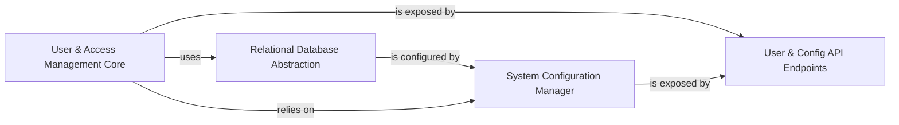

## Details

The System & User Management subsystem is a critical foundation for the entire platform, providing core services for identity, access control, and system-wide configuration. It adheres to a modular and layered architecture, with clear separation between business logic, data persistence, and API exposure.

### User & Access Management Core
This component encapsulates the core business logic for managing user identities, roles, and fine-grained access permissions (ACLs). It handles user creation, retrieval, authentication, and the assignment/revocation of permissions on various platform resources, particularly datasets. It ensures secure and authorized interactions within the system.

**Related Classes/Methods**:

- `cognee/modules/users/methods.py`
- `cognee/modules/users/permissions/methods.py`
- `cognee/modules/users/authentication/methods.py`
- <a href="https://github.com/topoteretes/cognee/blob/main/cognee/modules/users/models/User.py" target="_blank" rel="noopener noreferrer">`cognee/modules/users/models/User.py`</a>
- <a href="https://github.com/topoteretes/cognee/blob/main/cognee/modules/users/models/ACL.py" target="_blank" rel="noopener noreferrer">`cognee/modules/users/models/ACL.py`</a>
- <a href="https://github.com/topoteretes/cognee/blob/main/cognee/modules/users/models/Permission.py" target="_blank" rel="noopener noreferrer">`cognee/modules/users/models/Permission.py`</a>
- <a href="https://github.com/topoteretes/cognee/blob/main/cognee/modules/users/models/Role.py" target="_blank" rel="noopener noreferrer">`cognee/modules/users/models/Role.py`</a>
- <a href="https://github.com/topoteretes/cognee/blob/main/cognee/modules/users/models/Tenant.py" target="_blank" rel="noopener noreferrer">`cognee/modules/users/models/Tenant.py`</a>
- <a href="https://github.com/topoteretes/cognee/blob/main/cognee/modules/users/models/Principal.py" target="_blank" rel="noopener noreferrer">`cognee/modules/users/models/Principal.py`</a>
- <a href="https://github.com/topoteretes/cognee/blob/main/cognee/modules/users/models/UserRole.py" target="_blank" rel="noopener noreferrer">`cognee/modules/users/models/UserRole.py`</a>
- <a href="https://github.com/topoteretes/cognee/blob/main/cognee/modules/users/models/DatasetDatabase.py" target="_blank" rel="noopener noreferrer">`cognee/modules/users/models/DatasetDatabase.py`</a>

### Relational Database Abstraction
This foundational component provides an abstracted interface for interacting with the underlying relational database. It manages database connections, handles schema creation and migrations (via SQLAlchemy and Alembic), and facilitates CRUD operations for all structured metadata, including user accounts, roles, permissions, and system configurations. It acts as the persistent storage layer for the System & User Management data.

**Related Classes/Methods**:

- <a href="https://github.com/topoteretes/cognee/blob/main/cognee/infrastructure/databases/relational/get_relational_engine.py" target="_blank" rel="noopener noreferrer">`cognee/infrastructure/databases/relational/get_relational_engine.py`</a>
- <a href="https://github.com/topoteretes/cognee/blob/main/cognee/infrastructure/databases/relational/sqlalchemy/SqlAlchemyAdapter.py" target="_blank" rel="noopener noreferrer">`cognee/infrastructure/databases/relational/sqlalchemy/SqlAlchemyAdapter.py`</a>
- <a href="https://github.com/topoteretes/cognee/blob/main/cognee/infrastructure/databases/relational/ModelBase.py" target="_blank" rel="noopener noreferrer">`cognee/infrastructure/databases/relational/ModelBase.py`</a>
- <a href="https://github.com/topoteretes/cognee/blob/main/cognee/infrastructure/databases/relational/create_db_and_tables.py" target="_blank" rel="noopener noreferrer">`cognee/infrastructure/databases/relational/create_db_and_tables.py`</a>

### System Configuration Manager
This component offers a centralized mechanism for managing and retrieving system-wide configurations. It provides access to settings related to various infrastructure components, such as LLM providers, different database types (graph, vector, relational), data chunking strategies, and system directories. It ensures that the platform can be dynamically configured without code changes.

**Related Classes/Methods**:

- <a href="https://github.com/topoteretes/cognee/blob/main/cognee/modules/settings/get_current_settings.py" target="_blank" rel="noopener noreferrer">`cognee/modules/settings/get_current_settings.py`</a>
- <a href="https://github.com/topoteretes/cognee/blob/main/cognee/infrastructure/databases/relational/config.py" target="_blank" rel="noopener noreferrer">`cognee/infrastructure/databases/relational/config.py`</a>

### User & Config API Endpoints
This component represents the API layer that exposes the functionalities of the User & Access Management Core and System Configuration Manager to external clients, such as a frontend user interface or other microservices. It defines the RESTful endpoints for user authentication, user management operations, and retrieving/updating system configurations.

**Related Classes/Methods**:

- `cognee/api/v1/users/routers.py`
- <a href="https://github.com/topoteretes/cognee/blob/main/cognee/api/v1/config/config.py" target="_blank" rel="noopener noreferrer">`cognee/api/v1/config/config.py`</a>

### [FAQ](https://github.com/CodeBoarding/GeneratedOnBoardings/tree/main?tab=readme-ov-file#faq)