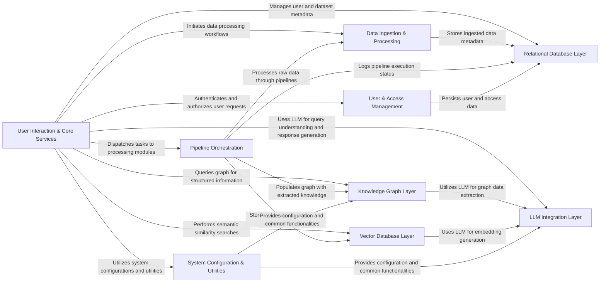

## Component Details

This graph represents the high-level architecture of the Cognee system, focusing on the interactions between its main components. The system provides a user interface and API endpoints for core functionalities, orchestrates data processing pipelines, and leverages various database layers (knowledge graph, vector, relational) and an LLM integration layer for intelligent data handling. User and access management ensures secure operations, while a centralized configuration system provides essential utilities.

### User Interaction & Core Services
Provides the external interface for the Cognee system, including the graphical user interface (GUI) and various REST API endpoints for core functionalities like adding, cognifying, searching, pruning, and visualizing data. It also implements various algorithms and techniques for retrieving relevant information based on user queries, including graph-based, code-based, and natural language retrieval methods.

**Related Classes/Methods**:

- <a href="https://github.com/topoteretes/cognee/blob/master/cognee-gui.py#L35-L140" target="_blank" rel="noopener noreferrer">`cognee.cognee-gui.FileSearchApp` (35:140)</a>
- `cognee.api.client` (full file reference)
- <a href="https://github.com/topoteretes/cognee/blob/master/cognee/api/v1/add/routers/get_add_router.py#L17-L63" target="_blank" rel="noopener noreferrer">`cognee.api.v1.add.routers.get_add_router` (17:63)</a>
- <a href="https://github.com/topoteretes/cognee/blob/master/cognee/api/v1/search/routers/get_search_router.py#L19-L54" target="_blank" rel="noopener noreferrer">`cognee.api.v1.search.routers.get_search_router` (19:54)</a>
- `cognee.api.v1.visualize.start_visualization_server` (full file reference)
- <a href="https://github.com/topoteretes/cognee/blob/master/cognee/modules/search/methods/search.py#L29-L63" target="_blank" rel="noopener noreferrer">`cognee.modules.search.methods.search` (29:63)</a>
- <a href="https://github.com/topoteretes/cognee/blob/master/cognee/modules/retrieval/code_retriever.py#L13-L148" target="_blank" rel="noopener noreferrer">`cognee.modules.retrieval.code_retriever.CodeRetriever` (13:148)</a>
- <a href="https://github.com/topoteretes/cognee/blob/master/cognee/modules/retrieval/graph_completion_retriever.py#L13-L185" target="_blank" rel="noopener noreferrer">`cognee.modules.retrieval.graph_completion_retriever.GraphCompletionRetriever` (13:185)</a>
- <a href="https://github.com/topoteretes/cognee/blob/master/cognee/modules/retrieval/utils/brute_force_triplet_search.py#L82-L105" target="_blank" rel="noopener noreferrer">`cognee.modules.retrieval.utils.brute_force_triplet_search.brute_force_triplet_search` (82:105)</a>
- <a href="https://github.com/topoteretes/cognee/blob/master/cognee/api/v1/cognify/cognify.py#L27-L39" target="_blank" rel="noopener noreferrer">`cognee.api.v1.cognify.cognify` (27:39)</a>
- <a href="https://github.com/topoteretes/cognee/blob/master/cognee/api/v1/delete/delete.py#L26-L70" target="_blank" rel="noopener noreferrer">`cognee.api.v1.delete.delete` (26:70)</a>
- <a href="https://github.com/topoteretes/cognee/blob/master/cognee/api/v1/prune/prune.py#L4-L11" target="_blank" rel="noopener noreferrer">`cognee.api.v1.prune.prune` (4:11)</a>
- `cognee.api.v1.users.routers` (full file reference)
- `cognee.modules.retrieval.natural_language_retriever` (full file reference)
- `cognee.modules.retrieval.chunks_retriever` (full file reference)

### Data Ingestion & Processing
Responsible for receiving raw data, classifying its type (text, binary, S3), and preparing it for further processing. It handles initial data identification and saving to temporary storage.

**Related Classes/Methods**:

- <a href="https://github.com/topoteretes/cognee/blob/master/cognee/modules/ingestion/classify.py#L9-L22" target="_blank" rel="noopener noreferrer">`cognee.modules.ingestion.classify` (9:22)</a>
- <a href="https://github.com/topoteretes/cognee/blob/master/cognee/modules/ingestion/identify.py#L7-L11" target="_blank" rel="noopener noreferrer">`cognee.modules.ingestion.identify` (7:11)</a>
- <a href="https://github.com/topoteretes/cognee/blob/master/cognee/modules/ingestion/save_data_to_file.py#L9-L29" target="_blank" rel="noopener noreferrer">`cognee.modules.ingestion.save_data_to_file` (9:29)</a>
- `cognee.modules.data.processing.document_types` (full file reference)

### Pipeline Orchestration
Manages the execution of multi-step data processing workflows. It manages the lifecycle of pipeline runs, logs their status, and dispatches tasks to various processing modules.

**Related Classes/Methods**:

- `cognee.modules.pipelines.operations.pipeline` (full file reference)
- <a href="https://github.com/topoteretes/cognee/blob/master/cognee/modules/pipelines/operations/run_tasks.py#L71-L104" target="_blank" rel="noopener noreferrer">`cognee.modules.pipelines.operations.run_tasks` (71:104)</a>

### Knowledge Graph Layer
Manages the creation, storage, and retrieval of knowledge graphs. It interacts with the underlying graph database to represent relationships and entities extracted from data.

**Related Classes/Methods**:

- <a href="https://github.com/topoteretes/cognee/blob/master/cognee/infrastructure/databases/graph/get_graph_engine.py#L11-L37" target="_blank" rel="noopener noreferrer">`cognee.infrastructure.databases.graph.get_graph_engine` (11:37)</a>
- `cognee.infrastructure.databases.graph.graph_db_interface` (full file reference)
- <a href="https://github.com/topoteretes/cognee/blob/master/cognee/modules/data/extraction/knowledge_graph/extract_content_graph.py#L9-L30" target="_blank" rel="noopener noreferrer">`cognee.modules.data.extraction.knowledge_graph.extract_content_graph` (9:30)</a>

### Vector Database Layer
Handles the generation of vector embeddings for data and facilitates similarity search operations. It interfaces with various vector database implementations to store and query these embeddings.

**Related Classes/Methods**:

- <a href="https://github.com/topoteretes/cognee/blob/master/cognee/infrastructure/databases/vector/get_vector_engine.py#L5-L14" target="_blank" rel="noopener noreferrer">`cognee.infrastructure.databases.vector.get_vector_engine` (5:14)</a>
- <a href="https://github.com/topoteretes/cognee/blob/master/cognee/infrastructure/databases/vector/embeddings/get_embedding_engine.py#L7-L34" target="_blank" rel="noopener noreferrer">`cognee.infrastructure.databases.vector.embeddings.get_embedding_engine` (7:34)</a>

### Relational Database Layer
Manages structured data, including user accounts, dataset metadata, and pipeline execution logs. It provides a persistent storage layer for system configurations and operational data.

**Related Classes/Methods**:

- <a href="https://github.com/topoteretes/cognee/blob/master/cognee/infrastructure/databases/relational/get_relational_engine.py#L5-L21" target="_blank" rel="noopener noreferrer">`cognee.infrastructure.databases.relational.get_relational_engine` (5:21)</a>
- `cognee.modules.data.methods` (full file reference)
- `cognee.modules.users.methods` (full file reference)

### LLM Integration Layer
Provides a standardized interface for interacting with various Large Language Models. It handles prompt engineering, model selection, and manages API calls to LLM providers.

**Related Classes/Methods**:

- <a href="https://github.com/topoteretes/cognee/blob/master/cognee/infrastructure/llm/get_llm_client.py#L30-L123" target="_blank" rel="noopener noreferrer">`cognee.infrastructure.llm.get_llm_client` (30:123)</a>
- `cognee.infrastructure.llm.prompts` (full file reference)
- `cognee.infrastructure.llm.rate_limiter` (full file reference)

### User & Access Management
Handles user authentication, authorization, and management of user-related data. It ensures secure access control and provides methods for user authentication and authorization.

**Related Classes/Methods**:

- `cognee.modules.users.methods` (full file reference)
- `cognee.modules.users.models` (full file reference)
- <a href="https://github.com/topoteretes/cognee/blob/master/cognee/modules/users/get_fastapi_users.py#L11-L16" target="_blank" rel="noopener noreferrer">`cognee.modules.users.get_fastapi_users` (11:16)</a>

### System Configuration & Utilities
Centralized management of system-wide settings, including database configurations, LLM parameters, and file storage paths. It also provides common utility functions used across different modules.

**Related Classes/Methods**:

- <a href="https://github.com/topoteretes/cognee/blob/master/cognee/api/v1/config/config.py#L15-L194" target="_blank" rel="noopener noreferrer">`cognee.api.v1.config.config` (15:194)</a>
- <a href="https://github.com/topoteretes/cognee/blob/master/cognee/modules/settings/get_current_settings.py#L35-L60" target="_blank" rel="noopener noreferrer">`cognee.modules.settings.get_current_settings` (35:60)</a>
- `cognee.shared.utils` (full file reference)
- `cognee.exceptions` (full file reference)

### [FAQ](https://github.com/CodeBoarding/GeneratedOnBoardings/tree/main?tab=readme-ov-file#faq)