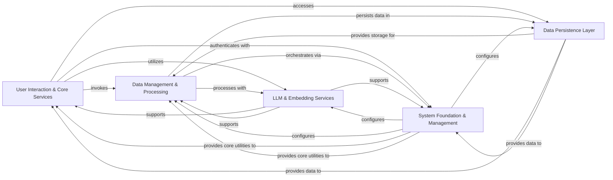

## Component Details

The Cognee system is designed to manage and process diverse data, transforming it into a structured knowledge base for efficient retrieval and analysis. Its main flow involves ingesting raw data, processing it through various pipelines (including chunking, summarization, and knowledge graph extraction), storing it in specialized databases, and providing an API and GUI for user interaction, search, and visualization. The system also incorporates robust LLM integration, user management, and an evaluation framework to ensure performance and security.

### User Interaction & Core Services
Provides the external interface for the Cognee system, including the graphical user interface (GUI) and various REST API endpoints for core functionalities like adding, cognifying, searching, pruning, and visualizing data. It also handles various strategies for retrieving relevant information from the knowledge base.

**Related Classes/Methods**:

- <a href="https://github.com/topoteretes/cognee/blob/master/cognee-gui.py#L35-L140" target="_blank" rel="noopener noreferrer">`cognee.cognee-gui.FileSearchApp` (35:140)</a>
- `cognee.api.client` (full file reference)
- <a href="https://github.com/topoteretes/cognee/blob/master/cognee/api/v1/add/routers/get_add_router.py#L17-L63" target="_blank" rel="noopener noreferrer">`cognee.api.v1.add.routers.get_add_router` (17:63)</a>
- <a href="https://github.com/topoteretes/cognee/blob/master/cognee/api/v1/search/routers/get_search_router.py#L19-L54" target="_blank" rel="noopener noreferrer">`cognee.api.v1.search.routers.get_search_router` (19:54)</a>
- `cognee.api.v1.visualize.start_visualization_server` (full file reference)
- <a href="https://github.com/topoteretes/cognee/blob/master/cognee/modules/search/methods/search.py#L29-L63" target="_blank" rel="noopener noreferrer">`cognee.modules.search.methods.search` (29:63)</a>
- <a href="https://github.com/topoteretes/cognee/blob/master/cognee/modules/retrieval/code_retriever.py#L13-L148" target="_blank" rel="noopener noreferrer">`cognee.modules.retrieval.code_retriever.CodeRetriever` (13:148)</a>
- <a href="https://github.com/topoteretes/cognee/blob/master/cognee/modules/retrieval/graph_completion_retriever.py#L13-L185" target="_blank" rel="noopener noreferrer">`cognee.modules.retrieval.graph_completion_retriever.GraphCompletionRetriever` (13:185)</a>
- <a href="https://github.com/topoteretes/cognee/blob/master/cognee/modules/retrieval/utils/brute_force_triplet_search.py#L82-L105" target="_blank" rel="noopener noreferrer">`cognee.modules.retrieval.utils.brute_force_triplet_search.brute_force_triplet_search` (82:105)</a>

### Data Management & Processing
Manages the entire lifecycle of data, from ingestion, classification, chunking, and general extraction to the creation, manipulation, and management of the knowledge graph. It orchestrates data processing pipelines, ensuring efficient and reliable data flow.

**Related Classes/Methods**:

- <a href="https://github.com/topoteretes/cognee/blob/master/cognee/api/v1/add/add.py#L9-L19" target="_blank" rel="noopener noreferrer">`cognee.api.v1.add.add` (9:19)</a>
- <a href="https://github.com/topoteretes/cognee/blob/master/cognee/api/v1/cognify/cognify.py#L27-L39" target="_blank" rel="noopener noreferrer">`cognee.api.v1.cognify.cognify` (27:39)</a>
- <a href="https://github.com/topoteretes/cognee/blob/master/cognee/api/v1/prune/prune.py#L4-L11" target="_blank" rel="noopener noreferrer">`cognee.api.v1.prune.prune` (4:11)</a>
- <a href="https://github.com/topoteretes/cognee/blob/master/cognee/api/v1/delete/delete.py#L26-L70" target="_blank" rel="noopener noreferrer">`cognee.api.v1.delete.delete` (26:70)</a>
- <a href="https://github.com/topoteretes/cognee/blob/master/cognee/modules/ingestion/classify.py#L9-L22" target="_blank" rel="noopener noreferrer">`cognee.modules.ingestion.classify` (9:22)</a>
- <a href="https://github.com/topoteretes/cognee/blob/master/cognee/tasks/ingestion/ingest_data.py#L20-L192" target="_blank" rel="noopener noreferrer">`cognee.tasks.ingestion.ingest_data` (20:192)</a>
- <a href="https://github.com/topoteretes/cognee/blob/master/cognee/modules/data/methods/create_dataset.py#L11-L33" target="_blank" rel="noopener noreferrer">`cognee.modules.data.methods.create_dataset` (11:33)</a>
- <a href="https://github.com/topoteretes/cognee/blob/master/cognee/infrastructure/data/chunking/DefaultChunkEngine.py#L11-L204" target="_blank" rel="noopener noreferrer">`cognee.infrastructure.data.chunking.DefaultChunkEngine.DefaultChunkEngine` (11:204)</a>
- <a href="https://github.com/topoteretes/cognee/blob/master/cognee/tasks/chunks/chunk_by_sentence.py#L32-L101" target="_blank" rel="noopener noreferrer">`cognee.tasks.chunks.chunk_by_sentence` (32:101)</a>
- <a href="https://github.com/topoteretes/cognee/blob/master/cognee/modules/data/extraction/extract_summary.py#L16-L23" target="_blank" rel="noopener noreferrer">`cognee.modules.data.extraction.extract_summary.extract_summary` (16:23)</a>
- <a href="https://github.com/topoteretes/cognee/blob/master/cognee/tasks/summarization/summarize_text.py#L11-L57" target="_blank" rel="noopener noreferrer">`cognee.tasks.summarization.summarize_text.summarize_text` (11:57)</a>
- <a href="https://github.com/topoteretes/cognee/blob/master/cognee/tasks/storage/index_data_points.py#L10-L49" target="_blank" rel="noopener noreferrer">`cognee.tasks.storage.index_data_points.index_data_points` (10:49)</a>
- <a href="https://github.com/topoteretes/cognee/blob/master/cognee/tasks/documents/classify_documents.py#L91-L127" target="_blank" rel="noopener noreferrer">`cognee.tasks.documents.classify_documents.classify_documents` (91:127)</a>
- <a href="https://github.com/topoteretes/cognee/blob/master/cognee/modules/data/extraction/knowledge_graph/extract_content_graph.py#L9-L30" target="_blank" rel="noopener noreferrer">`cognee.modules.data.extraction.knowledge_graph.extract_content_graph` (9:30)</a>
- <a href="https://github.com/topoteretes/cognee/blob/master/cognee/tasks/graph/extract_graph_from_data_v2.py#L17-L48" target="_blank" rel="noopener noreferrer">`cognee.tasks.graph.extract_graph_from_data_v2.extract_graph_from_data` (17:48)</a>
- <a href="https://github.com/topoteretes/cognee/blob/master/cognee/tasks/graph/infer_data_ontology.py#L291-L310" target="_blank" rel="noopener noreferrer">`cognee.tasks.graph.infer_data_ontology.infer_data_ontology` (291:310)</a>
- <a href="https://github.com/topoteretes/cognee/blob/master/cognee/modules/graph/utils/convert_node_to_data_point.py#L4-L7" target="_blank" rel="noopener noreferrer">`cognee.modules.graph.utils.convert_node_to_data_point.convert_node_to_data_point` (4:7)</a>
- <a href="https://github.com/topoteretes/cognee/blob/master/cognee/modules/graph/cognee_graph/CogneeGraph.py#L14-L178" target="_blank" rel="noopener noreferrer">`cognee.modules.graph.cognee_graph.CogneeGraph.CogneeGraph` (14:178)</a>
- <a href="https://github.com/topoteretes/cognee/blob/master/cognee/modules/pipelines/operations/pipeline.py#L30-L103" target="_blank" rel="noopener noreferrer">`cognee.modules.pipelines.operations.pipeline.cognee_pipeline` (30:103)</a>
- <a href="https://github.com/topoteretes/cognee/blob/master/cognee/modules/pipelines/operations/run_tasks.py#L71-L104" target="_blank" rel="noopener noreferrer">`cognee.modules.pipelines.operations.run_tasks.run_tasks` (71:104)</a>
- <a href="https://github.com/topoteretes/cognee/blob/master/cognee/modules/pipelines/tasks/task.py#L5-L97" target="_blank" rel="noopener noreferrer">`cognee.modules.pipelines.tasks.task.Task` (5:97)</a>

### LLM & Embedding Services
Provides a comprehensive and unified interface for all interactions with Large Language Models (LLMs). It handles model configuration, prompt rendering, tokenization, rate limiting for API calls, and the generation of vector embeddings from text, integrating with various LLM and embedding models.

**Related Classes/Methods**:

- <a href="https://github.com/topoteretes/cognee/blob/master/cognee/infrastructure/llm/get_llm_client.py#L30-L123" target="_blank" rel="noopener noreferrer">`cognee.infrastructure.llm.get_llm_client` (30:123)</a>
- <a href="https://github.com/topoteretes/cognee/blob/master/cognee/infrastructure/llm/llm_interface.py#L9-L64" target="_blank" rel="noopener noreferrer">`cognee.infrastructure.llm.llm_interface.LLMInterface` (9:64)</a>
- <a href="https://github.com/topoteretes/cognee/blob/master/cognee/infrastructure/llm/rate_limiter.py#L86-L220" target="_blank" rel="noopener noreferrer">`cognee.infrastructure.llm.rate_limiter.llm_rate_limiter` (86:220)</a>
- <a href="https://github.com/topoteretes/cognee/blob/master/cognee/infrastructure/llm/anthropic/adapter.py#L11-L96" target="_blank" rel="noopener noreferrer">`cognee.infrastructure.llm.anthropic.adapter.AnthropicAdapter` (11:96)</a>
- <a href="https://github.com/topoteretes/cognee/blob/master/cognee/infrastructure/llm/prompts/render_prompt.py#L5-L42" target="_blank" rel="noopener noreferrer">`cognee.infrastructure.llm.prompts.render_prompt` (5:42)</a>
- <a href="https://github.com/topoteretes/cognee/blob/master/cognee/infrastructure/llm/tokenizer/TikToken/adapter.py#L7-L119" target="_blank" rel="noopener noreferrer">`cognee.infrastructure.llm.tokenizer.TikToken.adapter.TikTokenTokenizer` (7:119)</a>
- <a href="https://github.com/topoteretes/cognee/blob/master/cognee/infrastructure/databases/vector/embeddings/get_embedding_engine.py#L7-L34" target="_blank" rel="noopener noreferrer">`cognee.infrastructure.databases.vector.embeddings.get_embedding_engine` (7:34)</a>

### Data Persistence Layer
Provides a unified abstraction layer for interacting with various database systems, including graph, vector, and relational databases. It offers a consistent interface for database operations, allowing the rest of the system to interact with different database technologies seamlessly.

**Related Classes/Methods**:

- <a href="https://github.com/topoteretes/cognee/blob/master/cognee/infrastructure/databases/graph/get_graph_engine.py#L11-L37" target="_blank" rel="noopener noreferrer">`cognee.infrastructure.databases.graph.get_graph_engine` (11:37)</a>
- <a href="https://github.com/topoteretes/cognee/blob/master/cognee/infrastructure/databases/graph/neo4j_driver/adapter.py#L33-L1000" target="_blank" rel="noopener noreferrer">`cognee.infrastructure.databases.graph.neo4j_driver.adapter.Neo4jAdapter` (33:1000)</a>
- <a href="https://github.com/topoteretes/cognee/blob/master/cognee/infrastructure/databases/vector/get_vector_engine.py#L5-L14" target="_blank" rel="noopener noreferrer">`cognee.infrastructure.databases.vector.get_vector_engine` (5:14)</a>
- <a href="https://github.com/topoteretes/cognee/blob/master/cognee/infrastructure/databases/vector/chromadb/ChromaDBAdapter.py#L147-L555" target="_blank" rel="noopener noreferrer">`cognee.infrastructure.databases.vector.chromadb.ChromaDBAdapter.ChromaDBAdapter` (147:555)</a>
- <a href="https://github.com/topoteretes/cognee/blob/master/cognee/infrastructure/databases/relational/create_relational_engine.py#L6-L46" target="_blank" rel="noopener noreferrer">`cognee.infrastructure.databases.relational.create_relational_engine` (6:46)</a>
- <a href="https://github.com/topoteretes/cognee/blob/master/cognee/infrastructure/databases/relational/sqlalchemy/SqlAlchemyAdapter.py#L22-L593" target="_blank" rel="noopener noreferrer">`cognee.infrastructure.databases.relational.sqlalchemy.SqlAlchemyAdapter.SQLAlchemyAdapter` (22:593)</a>

### System Foundation & Management
This foundational component handles user accounts, roles, tenants, and permissions, ensuring secure access. It also manages overall system configuration, provides essential core utilities like logging, telemetry, error handling, and data models, and includes specialized modules for code analysis and system evaluation.

**Related Classes/Methods**:

- <a href="https://github.com/topoteretes/cognee/blob/master/cognee/modules/users/get_fastapi_users.py#L11-L16" target="_blank" rel="noopener noreferrer">`cognee.modules.users.get_fastapi_users` (11:16)</a>
- <a href="https://github.com/topoteretes/cognee/blob/master/cognee/modules/users/get_user_manager.py#L14-L46" target="_blank" rel="noopener noreferrer">`cognee.modules.users.get_user_manager.UserManager` (14:46)</a>
- <a href="https://github.com/topoteretes/cognee/blob/master/cognee/modules/users/authentication/methods/authenticate_user.py#L8-L22" target="_blank" rel="noopener noreferrer">`cognee.modules.users.authentication.methods.authenticate_user` (8:22)</a>
- <a href="https://github.com/topoteretes/cognee/blob/master/cognee/modules/users/permissions/methods/check_permission_on_documents.py#L16-L41" target="_blank" rel="noopener noreferrer">`cognee.modules.users.permissions.methods.check_permission_on_documents` (16:41)</a>
- <a href="https://github.com/topoteretes/cognee/blob/master/cognee/base_config.py#L29-L30" target="_blank" rel="noopener noreferrer">`cognee.base_config.get_base_config` (29:30)</a>
- <a href="https://github.com/topoteretes/cognee/blob/master/cognee/api/v1/config/config.py#L72-L74" target="_blank" rel="noopener noreferrer">`cognee.api.v1.config.config.config.set_llm_model` (72:74)</a>
- <a href="https://github.com/topoteretes/cognee/blob/master/cognee/modules/settings/get_current_settings.py#L35-L60" target="_blank" rel="noopener noreferrer">`cognee.modules.settings.get_current_settings` (35:60)</a>
- <a href="https://github.com/topoteretes/cognee/blob/master/cognee/exceptions/exceptions.py#L35-L44" target="_blank" rel="noopener noreferrer">`cognee.exceptions.exceptions.ServiceError` (35:44)</a>
- <a href="https://github.com/topoteretes/cognee/blob/master/cognee/shared/logging_utils.py#L148-L169" target="_blank" rel="noopener noreferrer">`cognee.shared.logging_utils.get_logger` (148:169)</a>
- <a href="https://github.com/topoteretes/cognee/blob/master/cognee/shared/utils.py#L77-L102" target="_blank" rel="noopener noreferrer">`cognee.shared.utils.send_telemetry` (77:102)</a>
- <a href="https://github.com/topoteretes/cognee/blob/master/cognee/modules/metrics/operations/get_pipeline_run_metrics.py#L25-L60" target="_blank" rel="noopener noreferrer">`cognee.modules.metrics.operations.get_pipeline_run_metrics.get_pipeline_run_metrics` (25:60)</a>
- <a href="https://github.com/topoteretes/cognee/blob/master/cognee/modules/engine/operations/setup.py#L9-L17" target="_blank" rel="noopener noreferrer">`cognee.modules.engine.operations.setup.setup` (9:17)</a>
- <a href="https://github.com/topoteretes/cognee/blob/master/cognee/infrastructure/engine/models/DataPoint.py#L20-L255" target="_blank" rel="noopener noreferrer">`cognee.infrastructure.engine.models.DataPoint.DataPoint` (20:255)</a>
- <a href="https://github.com/topoteretes/cognee/blob/master/cognee/tasks/repo_processor/get_local_dependencies.py#L21-L58" target="_blank" rel="noopener noreferrer">`cognee.tasks.repo_processor.get_local_dependencies.FileParser` (21:58)</a>
- <a href="https://github.com/topoteretes/cognee/blob/master/cognee/tasks/code/get_repo_dependency_graph_checker.py#L7-L31" target="_blank" rel="noopener noreferrer">`cognee.tasks.code.get_repo_dependency_graph_checker.main` (7:31)</a>
- <a href="https://github.com/topoteretes/cognee/blob/master/cognee/modules/ontology/rdf_xml/OntologyResolver.py#L17-L140" target="_blank" rel="noopener noreferrer">`cognee.modules.ontology.rdf_xml.OntologyResolver.OntologyResolver` (17:140)</a>
- <a href="https://github.com/topoteretes/cognee/blob/master/cognee/eval_framework/run_eval.py#L24-L41" target="_blank" rel="noopener noreferrer">`cognee.cognee.eval_framework.run_eval.main` (24:41)</a>
- <a href="https://github.com/topoteretes/cognee/blob/master/cognee/eval_framework/answer_generation/run_question_answering_module.py#L37-L69" target="_blank" rel="noopener noreferrer">`cognee.cognee.eval_framework.answer_generation.run_question_answering_module.run_question_answering` (37:69)</a>
- <a href="https://github.com/topoteretes/cognee/blob/master/evals/plot_metrics.py#L391-L433" target="_blank" rel="noopener noreferrer">`cognee.evals.plot_metrics.main` (391:433)</a>

### [FAQ](https://github.com/CodeBoarding/GeneratedOnBoardings/tree/main?tab=readme-ov-file#faq)