```mermaid
graph LR
    API_Gateway["API Gateway"]
    Data_Ingestion_Storage["Data Ingestion & Storage"]
    Knowledge_Processing_Engine["Knowledge Processing Engine"]
    Knowledge_Base_Layer["Knowledge Base Layer"]
    Information_Retrieval_Query["Information Retrieval & Query"]
    System_User_Management["System & User Management"]
    API_Gateway -- "initiates" --> Data_Ingestion_Storage
    API_Gateway -- "initiates" --> Knowledge_Processing_Engine
    API_Gateway -- "queries" --> Information_Retrieval_Query
    API_Gateway -- "authenticates via" --> System_User_Management
    Data_Ingestion_Storage -- "feeds data to" --> Knowledge_Processing_Engine
    Data_Ingestion_Storage -- "stores metadata in" --> System_User_Management
    Knowledge_Processing_Engine -- "populates" --> Knowledge_Base_Layer
    Knowledge_Processing_Engine -- "utilizes" --> System_User_Management
    Information_Retrieval_Query -- "queries" --> Knowledge_Base_Layer
    Information_Retrieval_Query -- "utilizes" --> Knowledge_Processing_Engine
    Information_Retrieval_Query -- "enforces permissions via" --> System_User_Management
    System_User_Management -- "authenticates/authorizes" --> API_Gateway
    System_User_Management -- "manages metadata for" --> Data_Ingestion_Storage
    System_User_Management -- "provides configuration to" --> Knowledge_Processing_Engine
    System_User_Management -- "manages permissions for" --> Information_Retrieval_Query
    click Data_Ingestion_Storage href "https://github.com/CodeBoarding/GeneratedOnBoardings/blob/main/cognee/Data_Ingestion_Storage.md" "Details"
    click Knowledge_Processing_Engine href "https://github.com/CodeBoarding/GeneratedOnBoardings/blob/main/cognee/Knowledge_Processing_Engine.md" "Details"
    click Knowledge_Base_Layer href "https://github.com/CodeBoarding/GeneratedOnBoardings/blob/main/cognee/Knowledge_Base_Layer.md" "Details"
    click Information_Retrieval_Query href "https://github.com/CodeBoarding/GeneratedOnBoardings/blob/main/cognee/Information_Retrieval_Query.md" "Details"
    click System_User_Management href "https://github.com/CodeBoarding/GeneratedOnBoardings/blob/main/cognee/System_User_Management.md" "Details"
```

## Details

The `cognee` project, an AI Infrastructure / Knowledge Graph Platform, exhibits a modular and layered architecture designed for scalability and extensibility. The core data flow revolves around ingesting raw data, transforming it into structured knowledge, storing it in a unified knowledge base, and enabling intelligent retrieval through an API.

### API Gateway
The primary external interface for the Cognee platform. It handles all incoming requests, including data ingestion, knowledge graph operations, search queries, and system configuration. It acts as the entry point for both external applications and the frontend GUI.

**Related Classes/Methods**:

- <a href="https://github.com/topoteretes/cognee/blob/main/cognee/api/v1/add/routers/get_add_router.py#L16-L58" target="_blank" rel="noopener noreferrer">`cognee.api.v1.add.routers.get_add_router` (16:58)</a>
- <a href="https://github.com/topoteretes/cognee/blob/main/cognee/api/v1/cognify/routers/get_cognify_router.py#L38-L122" target="_blank" rel="noopener noreferrer">`cognee.api.v1.cognify.routers.get_cognify_router` (38:122)</a>
- <a href="https://github.com/topoteretes/cognee/blob/main/cognee/api/v1/search/routers/get_search_router.py#L23-L62" target="_blank" rel="noopener noreferrer">`cognee.api.v1.search.routers.get_search_router` (23:62)</a>
- <a href="https://github.com/topoteretes/cognee/blob/main/cognee/api/v1/delete/routers/get_delete_router.py#L13-L76" target="_blank" rel="noopener noreferrer">`cognee.api.v1.delete.routers.get_delete_router` (13:76)</a>
- <a href="https://github.com/topoteretes/cognee/blob/main/cognee/api/v1/prune/prune.py#L3-L10" target="_blank" rel="noopener noreferrer">`cognee.api.v1.prune.prune` (3:10)</a>
- <a href="https://github.com/topoteretes/cognee/blob/main/cognee/api/v1/visualize/visualize.py#L1-L1" target="_blank" rel="noopener noreferrer">`cognee.api.v1.visualize.visualize` (1:1)</a>
- <a href="https://github.com/topoteretes/cognee/blob/main/cognee/api/v1/datasets/routers/get_datasets_router.py#L70-L244" target="_blank" rel="noopener noreferrer">`cognee.api.v1.datasets.routers.get_datasets_router` (70:244)</a>
- <a href="https://github.com/topoteretes/cognee/blob/main/cognee/api/v1/users/routers/get_users_router.py#L4-L5" target="_blank" rel="noopener noreferrer">`cognee.api.v1.users.routers.get_users_router` (4:5)</a>
- <a href="https://github.com/topoteretes/cognee/blob/main/cognee/api/v1/responses/routers/get_responses_router.py#L1-L1" target="_blank" rel="noopener noreferrer">`cognee.api.v1.responses.routers.get_responses_router` (1:1)</a>

### Data Ingestion & Storage [[Expand]](./Data_Ingestion_Storage.md)
Manages the entire lifecycle of raw data within the system. This includes receiving data, classifying it, storing it physically (e.g., in a file system), and managing dataset definitions. It acts as the initial staging area for all incoming information.

**Related Classes/Methods**:

- <a href="https://github.com/topoteretes/cognee/blob/main/cognee/modules/data/methods/create_dataset.py#L9-L31" target="_blank" rel="noopener noreferrer">`cognee.modules.data.methods.create_dataset` (9:31)</a>
- <a href="https://github.com/topoteretes/cognee/blob/main/cognee/modules/data/methods/get_data.py#L7-L27" target="_blank" rel="noopener noreferrer">`cognee.modules.data.methods.get_data` (7:27)</a>
- <a href="https://github.com/topoteretes/cognee/blob/main/cognee/modules/data/deletion/prune_data.py#L4-L7" target="_blank" rel="noopener noreferrer">`cognee.modules.data.deletion.prune_data` (4:7)</a>
- `cognee.modules.ingestion.ingest_data` (1:1)
- <a href="https://github.com/topoteretes/cognee/blob/main/cognee/modules/ingestion/classify.py#L15-L39" target="_blank" rel="noopener noreferrer">`cognee.modules.ingestion.classify` (15:39)</a>
- <a href="https://github.com/topoteretes/cognee/blob/main/cognee/infrastructure/files/add_file_to_storage.py#L6-L21" target="_blank" rel="noopener noreferrer">`cognee.infrastructure.files.add_file_to_storage` (6:21)</a>
- <a href="https://github.com/topoteretes/cognee/blob/main/cognee/infrastructure/files/remove_file_from_storage.py#L5-L22" target="_blank" rel="noopener noreferrer">`cognee.infrastructure.files.remove_file_from_storage` (5:22)</a>
- <a href="https://github.com/topoteretes/cognee/blob/main/cognee/infrastructure/files/storage/LocalStorage.py#L6-L152" target="_blank" rel="noopener noreferrer">`cognee.infrastructure.files.storage.LocalStorage` (6:152)</a>

### Knowledge Processing Engine [[Expand]](./Knowledge_Processing_Engine.md)
Orchestrates complex, multi-step data processing workflows to transform raw data into structured knowledge. This includes tasks like classification, entity extraction, knowledge graph triplet generation, and embedding creation, heavily leveraging integrated AI models (LLMs and embedding models).

**Related Classes/Methods**:

- <a href="https://github.com/topoteretes/cognee/blob/main/cognee/modules/pipelines/operations/pipeline.py#L1-L1" target="_blank" rel="noopener noreferrer">`cognee.modules.pipelines.operations.pipeline` (1:1)</a>
- <a href="https://github.com/topoteretes/cognee/blob/main/cognee/modules/pipelines/operations/run_tasks.py#L78-L146" target="_blank" rel="noopener noreferrer">`cognee.modules.pipelines.operations.run_tasks` (78:146)</a>
- <a href="https://github.com/topoteretes/cognee/blob/main/cognee/modules/pipelines/tasks/task.py#L1-L1" target="_blank" rel="noopener noreferrer">`cognee.modules.pipelines.tasks.task` (1:1)</a>
- <a href="https://github.com/topoteretes/cognee/blob/main/cognee/modules/data/extraction/extract_summary.py#L15-L22" target="_blank" rel="noopener noreferrer">`cognee.modules.data.extraction.extract_summary` (15:22)</a>
- <a href="https://github.com/topoteretes/cognee/blob/main/cognee/modules/data/extraction/extract_categories.py#L6-L13" target="_blank" rel="noopener noreferrer">`cognee.modules.data.extraction.extract_categories` (6:13)</a>
- <a href="https://github.com/topoteretes/cognee/blob/main/cognee/modules/data/extraction/knowledge_graph/extract_content_graph.py#L8-L29" target="_blank" rel="noopener noreferrer">`cognee.modules.data.extraction.knowledge_graph.extract_content_graph` (8:29)</a>
- <a href="https://github.com/topoteretes/cognee/blob/main/cognee/tasks/graph/extract_graph_from_data.py#L52-L76" target="_blank" rel="noopener noreferrer">`cognee.tasks.graph.extract_graph_from_data` (52:76)</a>
- <a href="https://github.com/topoteretes/cognee/blob/main/cognee/tasks/graph/infer_data_ontology.py#L290-L309" target="_blank" rel="noopener noreferrer">`cognee.tasks.graph.infer_data_ontology` (290:309)</a>
- <a href="https://github.com/topoteretes/cognee/blob/main/cognee/infrastructure/llm/get_llm_client.py#L29-L122" target="_blank" rel="noopener noreferrer">`cognee.infrastructure.llm.get_llm_client` (29:122)</a>
- <a href="https://github.com/topoteretes/cognee/blob/main/cognee/infrastructure/llm/openai/adapter.py#L1-L1" target="_blank" rel="noopener noreferrer">`cognee.infrastructure.llm.openai.adapter` (1:1)</a>
- <a href="https://github.com/topoteretes/cognee/blob/main/cognee/infrastructure/llm/embedding_rate_limiter.py#L1-L1" target="_blank" rel="noopener noreferrer">`cognee.infrastructure.llm.embedding_rate_limiter` (1:1)</a>
- <a href="https://github.com/topoteretes/cognee/blob/main/cognee/infrastructure/databases/vector/embeddings/get_embedding_engine.py#L6-L33" target="_blank" rel="noopener noreferrer">`cognee.infrastructure.databases.vector.embeddings.get_embedding_engine` (6:33)</a>
- <a href="https://github.com/topoteretes/cognee/blob/main/cognee/infrastructure/llm/prompts/render_prompt.py#L4-L41" target="_blank" rel="noopener noreferrer">`cognee.infrastructure.llm.prompts.render_prompt` (4:41)</a>

### Knowledge Base Layer [[Expand]](./Knowledge_Base_Layer.md)
Provides a unified abstraction layer for storing and querying both graph-structured knowledge and high-dimensional vector embeddings. It supports various underlying graph and vector database technologies, decoupling the core logic from specific database implementations.

**Related Classes/Methods**:

- <a href="https://github.com/topoteretes/cognee/blob/main/cognee/infrastructure/databases/graph/get_graph_engine.py#L9-L27" target="_blank" rel="noopener noreferrer">`cognee.infrastructure.databases.graph.get_graph_engine` (9:27)</a>
- <a href="https://github.com/topoteretes/cognee/blob/main/cognee/infrastructure/databases/graph/neo4j_driver/adapter.py#L1-L1" target="_blank" rel="noopener noreferrer">`cognee.infrastructure.databases.graph.neo4j_driver.adapter` (1:1)</a>
- <a href="https://github.com/topoteretes/cognee/blob/main/cognee/infrastructure/databases/graph/kuzu/adapter.py#L1-L1" target="_blank" rel="noopener noreferrer">`cognee.infrastructure.databases.graph.kuzu.adapter` (1:1)</a>
- <a href="https://github.com/topoteretes/cognee/blob/main/cognee/infrastructure/databases/hybrid/falkordb/FalkorDBAdapter.py#L30-L780" target="_blank" rel="noopener noreferrer">`cognee.infrastructure.databases.hybrid.falkordb.FalkorDBAdapter` (30:780)</a>
- <a href="https://github.com/topoteretes/cognee/blob/main/cognee/infrastructure/databases/vector/get_vector_engine.py#L4-L6" target="_blank" rel="noopener noreferrer">`cognee.infrastructure.databases.vector.get_vector_engine` (4:6)</a>
- <a href="https://github.com/topoteretes/cognee/blob/main/cognee/infrastructure/databases/vector/chromadb/ChromaDBAdapter.py#L146-L554" target="_blank" rel="noopener noreferrer">`cognee.infrastructure.databases.vector.chromadb.ChromaDBAdapter` (146:554)</a>
- <a href="https://github.com/topoteretes/cognee/blob/main/cognee/infrastructure/databases/vector/qdrant/QDrantAdapter.py#L108-L513" target="_blank" rel="noopener noreferrer">`cognee.infrastructure.databases.vector.qdrant.QDrantAdapter` (108:513)</a>
- <a href="https://github.com/topoteretes/cognee/blob/main/cognee/infrastructure/databases/vector/milvus/MilvusAdapter.py#L31-L482" target="_blank" rel="noopener noreferrer">`cognee.infrastructure.databases.vector.milvus.MilvusAdapter` (31:482)</a>
- <a href="https://github.com/topoteretes/cognee/blob/main/cognee/infrastructure/databases/vector/lancedb/LanceDBAdapter.py#L37-L349" target="_blank" rel="noopener noreferrer">`cognee.infrastructure.databases.vector.lancedb.LanceDBAdapter` (37:349)</a>
- <a href="https://github.com/topoteretes/cognee/blob/main/cognee/infrastructure/databases/vector/pgvector/PGVectorAdapter.py#L37-L356" target="_blank" rel="noopener noreferrer">`cognee.infrastructure.databases.vector.pgvector.PGVectorAdapter` (37:356)</a>
- <a href="https://github.com/topoteretes/cognee/blob/main/cognee/infrastructure/databases/vector/weaviate_db/WeaviateAdapter.py#L32-L498" target="_blank" rel="noopener noreferrer">`cognee.infrastructure.databases.vector.weaviate_db.WeaviateAdapter` (32:498)</a>

### Information Retrieval & Query [[Expand]](./Information_Retrieval_Query.md)
Implements various strategies to retrieve relevant information from the Knowledge Base based on user queries. It supports different retrieval types (summaries, insights, chunks, code, natural language) and leverages the AI capabilities of the Knowledge Processing Engine for enhanced understanding and response generation.

**Related Classes/Methods**:

- <a href="https://github.com/topoteretes/cognee/blob/main/cognee/modules/search/methods/search.py#L32-L83" target="_blank" rel="noopener noreferrer">`cognee.modules.search.methods.search` (32:83)</a>
- <a href="https://github.com/topoteretes/cognee/blob/main/cognee/modules/retrieval/summaries_retriever.py#L1-L1" target="_blank" rel="noopener noreferrer">`cognee.modules.retrieval.summaries_retriever` (1:1)</a>
- <a href="https://github.com/topoteretes/cognee/blob/main/cognee/modules/retrieval/graph_completion_retriever.py#L1-L1" target="_blank" rel="noopener noreferrer">`cognee.modules.retrieval.graph_completion_retriever` (1:1)</a>
- <a href="https://github.com/topoteretes/cognee/blob/main/cognee/modules/retrieval/code_retriever.py#L1-L1" target="_blank" rel="noopener noreferrer">`cognee.modules.retrieval.code_retriever` (1:1)</a>
- <a href="https://github.com/topoteretes/cognee/blob/main/cognee/modules/retrieval/natural_language_retriever.py#L1-L1" target="_blank" rel="noopener noreferrer">`cognee.modules.retrieval.natural_language_retriever` (1:1)</a>

### System & User Management [[Expand]](./System_User_Management.md)
Provides foundational services for the entire platform, including managing user accounts, roles, and fine-grained access permissions. It also handles system-wide configurations and acts as the central relational database for metadata, user data, and pipeline statuses.

**Related Classes/Methods**:

- <a href="https://github.com/topoteretes/cognee/blob/main/cognee/modules/users/methods/create_user.py#L12-L61" target="_blank" rel="noopener noreferrer">`cognee.modules.users.methods.create_user` (12:61)</a>
- <a href="https://github.com/topoteretes/cognee/blob/main/cognee/modules/users/methods/get_default_user.py#L12-L38" target="_blank" rel="noopener noreferrer">`cognee.modules.users.methods.get_default_user` (12:38)</a>
- <a href="https://github.com/topoteretes/cognee/blob/main/cognee/modules/users/permissions/methods/give_permission_on_dataset.py#L8-L45" target="_blank" rel="noopener noreferrer">`cognee.modules.users.permissions.methods.give_permission_on_dataset` (8:45)</a>
- <a href="https://github.com/topoteretes/cognee/blob/main/cognee/modules/users/authentication/methods/authenticate_user.py#L7-L21" target="_blank" rel="noopener noreferrer">`cognee.modules.users.authentication.methods.authenticate_user` (7:21)</a>
- <a href="https://github.com/topoteretes/cognee/blob/main/cognee/infrastructure/databases/relational/get_relational_engine.py#L4-L20" target="_blank" rel="noopener noreferrer">`cognee.infrastructure.databases.relational.get_relational_engine` (4:20)</a>
- <a href="https://github.com/topoteretes/cognee/blob/main/cognee/infrastructure/databases/relational/sqlalchemy/SqlAlchemyAdapter.py#L1-L1" target="_blank" rel="noopener noreferrer">`cognee.infrastructure.databases.relational.sqlalchemy.SqlAlchemyAdapter` (1:1)</a>
- <a href="https://github.com/topoteretes/cognee/blob/main/cognee/modules/settings/get_current_settings.py#L34-L59" target="_blank" rel="noopener noreferrer">`cognee.modules.settings.get_current_settings` (34:59)</a>
- <a href="https://github.com/topoteretes/cognee/blob/main/cognee/api/v1/config/config.py#L14-L194" target="_blank" rel="noopener noreferrer">`cognee.api.v1.config.config` (14:194)</a>

### [FAQ](https://github.com/CodeBoarding/GeneratedOnBoardings/tree/main?tab=readme-ov-file#faq)