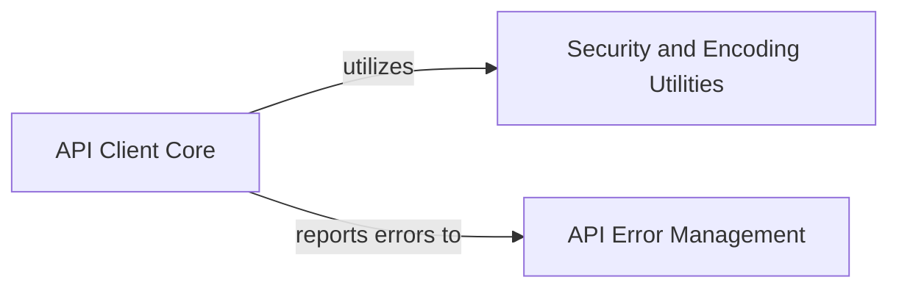

## Component Details

This graph illustrates the core components of the Coinbase API client. The central `API Client Core` handles all fundamental HTTP interactions, session management, and URI construction. It relies on `Security and Encoding Utilities` for secure URI validation and parameter encoding, and it interacts with `API Error Management` to process and raise specific API-related exceptions based on responses from the Coinbase API.

### API Client Core
Encapsulates the fundamental logic for interacting with the Coinbase API, handling HTTP requests (GET, POST, PUT, DELETE), session management, URI construction, and initial response processing. It serves as the base for all specific API endpoint interactions.

**Related Classes/Methods**:

- <a href="https://github.com/coinbase/coinbase-python/blob/master/coinbase/wallet/client.py#L73-L85" target="_blank" rel="noopener noreferrer">`coinbase.wallet.client.Client:__init__` (73:85)</a>
- <a href="https://github.com/coinbase/coinbase-python/blob/master/coinbase/wallet/client.py#L87-L97" target="_blank" rel="noopener noreferrer">`coinbase.wallet.client.Client._build_session` (87:97)</a>
- <a href="https://github.com/coinbase/coinbase-python/blob/master/coinbase/wallet/client.py#L99-L101" target="_blank" rel="noopener noreferrer">`coinbase.wallet.client.Client._create_api_uri` (99:101)</a>
- <a href="https://github.com/coinbase/coinbase-python/blob/master/coinbase/wallet/client.py#L103-L119" target="_blank" rel="noopener noreferrer">`coinbase.wallet.client.Client._request` (103:119)</a>
- <a href="https://github.com/coinbase/coinbase-python/blob/master/coinbase/wallet/client.py#L121-L129" target="_blank" rel="noopener noreferrer">`coinbase.wallet.client.Client._handle_response` (121:129)</a>
- <a href="https://github.com/coinbase/coinbase-python/blob/master/coinbase/wallet/client.py#L131-L167" target="_blank" rel="noopener noreferrer">`coinbase.wallet.client.Client._get` (131:167)</a>
- <a href="https://github.com/coinbase/coinbase-python/blob/master/coinbase/wallet/client.py#L169-L170" target="_blank" rel="noopener noreferrer">`coinbase.wallet.client.Client._post` (169:170)</a>
- <a href="https://github.com/coinbase/coinbase-python/blob/master/coinbase/wallet/client.py#L172-L173" target="_blank" rel="noopener noreferrer">`coinbase.wallet.client.Client._put` (172:173)</a>
- <a href="https://github.com/coinbase/coinbase-python/blob/master/coinbase/wallet/client.py#L175-L176" target="_blank" rel="noopener noreferrer">`coinbase.wallet.client.Client._delete` (175:176)</a>
- `coinbase.wallet.client.Client.VERIFY_SSL` (full file reference)
- `coinbase.wallet.client.Client.BASE_API_URI` (full file reference)
- `coinbase.wallet.client.Client.API_VERSION` (full file reference)

### Security and Encoding Utilities
This component provides essential utility functions for ensuring the security of API URIs and for properly encoding parameters before they are sent in API requests.

**Related Classes/Methods**:

- <a href="https://github.com/coinbase/coinbase-python/blob/master/coinbase/wallet/util.py#L37-L46" target="_blank" rel="noopener noreferrer">`coinbase.wallet.util.check_uri_security` (37:46)</a>
- <a href="https://github.com/coinbase/coinbase-python/blob/master/coinbase/wallet/util.py#L31-L34" target="_blank" rel="noopener noreferrer">`coinbase.wallet.util.encode_params` (31:34)</a>

### API Error Management
This component is responsible for constructing and raising specific API error exceptions based on the HTTP response status code and error details received from the Coinbase API.

**Related Classes/Methods**:

- <a href="https://github.com/coinbase/coinbase-python/blob/master/coinbase/wallet/error.py#L96-L118" target="_blank" rel="noopener noreferrer">`coinbase.wallet.error.build_api_error` (96:118)</a>
- <a href="https://github.com/coinbase/coinbase-python/blob/master/coinbase/wallet/error.py#L17-L29" target="_blank" rel="noopener noreferrer">`coinbase.wallet.error.APIError` (17:29)</a>

### [FAQ](https://github.com/CodeBoarding/GeneratedOnBoardings/tree/main?tab=readme-ov-file#faq)