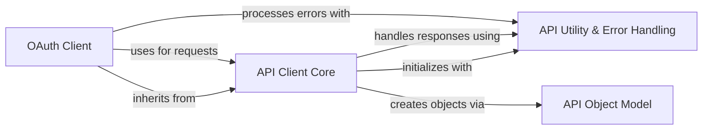

## Component Details

This architecture describes the core components of the Coinbase Wallet API client. It outlines how the client handles API requests, manages authentication (including OAuth), processes responses, and provides utility functions for data handling and robust error management.

### API Client Core
This component provides the fundamental functionalities for interacting with the Coinbase API. It handles session management, request creation, response handling, and error processing. It serves as the base for specific API clients.

**Related Classes/Methods**:

- <a href="https://github.com/coinbase/coinbase-python/blob/master/coinbase/wallet/client.py#L73-L85" target="_blank" rel="noopener noreferrer">`coinbase.wallet.client.Client:__init__` (73:85)</a>
- <a href="https://github.com/coinbase/coinbase-python/blob/master/coinbase/wallet/client.py#L87-L97" target="_blank" rel="noopener noreferrer">`coinbase.wallet.client.Client._build_session` (87:97)</a>
- <a href="https://github.com/coinbase/coinbase-python/blob/master/coinbase/wallet/client.py#L99-L101" target="_blank" rel="noopener noreferrer">`coinbase.wallet.client.Client._create_api_uri` (99:101)</a>
- <a href="https://github.com/coinbase/coinbase-python/blob/master/coinbase/wallet/client.py#L103-L119" target="_blank" rel="noopener noreferrer">`coinbase.wallet.client.Client._request` (103:119)</a>
- <a href="https://github.com/coinbase/coinbase-python/blob/master/coinbase/wallet/client.py#L121-L129" target="_blank" rel="noopener noreferrer">`coinbase.wallet.client.Client._handle_response` (121:129)</a>
- <a href="https://github.com/coinbase/coinbase-python/blob/master/coinbase/wallet/client.py#L178-L203" target="_blank" rel="noopener noreferrer">`coinbase.wallet.client.Client._make_api_object` (178:203)</a>
- <a href="https://github.com/coinbase/coinbase-python/blob/master/coinbase/wallet/client.py#L131-L167" target="_blank" rel="noopener noreferrer">`coinbase.wallet.client.Client._get` (131:167)</a>
- <a href="https://github.com/coinbase/coinbase-python/blob/master/coinbase/wallet/client.py#L169-L170" target="_blank" rel="noopener noreferrer">`coinbase.wallet.client.Client._post` (169:170)</a>
- <a href="https://github.com/coinbase/coinbase-python/blob/master/coinbase/wallet/client.py#L172-L173" target="_blank" rel="noopener noreferrer">`coinbase.wallet.client.Client._put` (172:173)</a>
- <a href="https://github.com/coinbase/coinbase-python/blob/master/coinbase/wallet/client.py#L175-L176" target="_blank" rel="noopener noreferrer">`coinbase.wallet.client.Client._delete` (175:176)</a>

### OAuth Client
This component extends the core API client to handle OAuth2 authentication. It manages access and refresh tokens, providing methods for token revocation and refreshing, ensuring secure and continuous API access for OAuth-based applications.

**Related Classes/Methods**:

- <a href="https://github.com/coinbase/coinbase-python/blob/master/coinbase/wallet/client.py#L636-L651" target="_blank" rel="noopener noreferrer">`coinbase.wallet.client.OAuthClient:__init__` (636:651)</a>
- <a href="https://github.com/coinbase/coinbase-python/blob/master/coinbase/wallet/client.py#L658-L676" target="_blank" rel="noopener noreferrer">`coinbase.wallet.client.OAuthClient:refresh` (658:676)</a>
- <a href="https://github.com/coinbase/coinbase-python/blob/master/coinbase/wallet/client.py#L653-L656" target="_blank" rel="noopener noreferrer">`coinbase.wallet.client.OAuthClient:revoke` (653:656)</a>

### API Utility & Error Handling
Provides a collection of helper functions that support the API client's operations, such as ensuring URI security, encoding parameters for requests, cleaning up request parameters, and managing the creation and propagation of specific API error types.

**Related Classes/Methods**:

- <a href="https://github.com/coinbase/coinbase-python/blob/master/coinbase/wallet/util.py#L37-L46" target="_blank" rel="noopener noreferrer">`coinbase.wallet.util.check_uri_security` (37:46)</a>
- <a href="https://github.com/coinbase/coinbase-python/blob/master/coinbase/wallet/util.py#L31-L34" target="_blank" rel="noopener noreferrer">`coinbase.wallet.util.encode_params` (31:34)</a>
- <a href="https://github.com/coinbase/coinbase-python/blob/master/coinbase/wallet/util.py#L14-L28" target="_blank" rel="noopener noreferrer">`coinbase.wallet.util.clean_params` (14:28)</a>
- <a href="https://github.com/coinbase/coinbase-python/blob/master/coinbase/wallet/error.py#L96-L118" target="_blank" rel="noopener noreferrer">`coinbase.wallet.error.build_api_error` (96:118)</a>
- <a href="https://github.com/coinbase/coinbase-python/blob/master/coinbase/wallet/error.py#L17-L29" target="_blank" rel="noopener noreferrer">`coinbase.wallet.error.APIError` (17:29)</a>

### API Object Model
This component defines the structure for API objects and provides a factory function to create new API objects from raw response data. It ensures that API responses are consistently mapped to structured Python objects, facilitating easier data access and manipulation.

**Related Classes/Methods**:

- <a href="https://github.com/coinbase/coinbase-python/blob/master/coinbase/wallet/model.py#L13-L31" target="_blank" rel="noopener noreferrer">`coinbase.wallet.model.new_api_object` (13:31)</a>
- <a href="https://github.com/coinbase/coinbase-python/blob/master/coinbase/wallet/model.py#L34-L137" target="_blank" rel="noopener noreferrer">`coinbase.wallet.model.APIObject` (34:137)</a>

### [FAQ](https://github.com/CodeBoarding/GeneratedOnBoardings/tree/main?tab=readme-ov-file#faq)