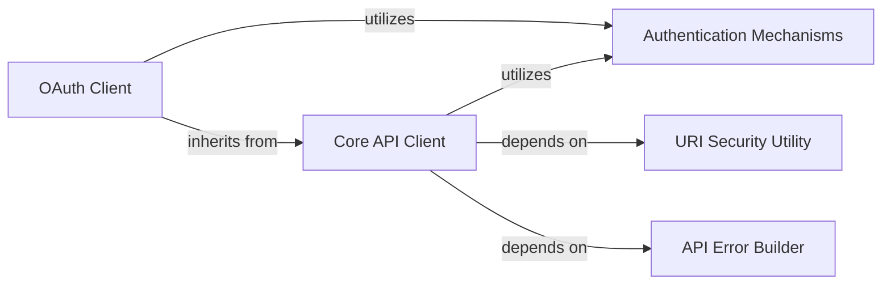

## Component Details

This graph illustrates the structure and interactions within the Coinbase API client's authentication and core client components. The primary flow involves clients (Core API Client and OAuth Client) utilizing different authentication mechanisms (HMACAuth and OAuth2Auth) to make secure API requests. The Core API Client handles general API interactions, including request building, execution, and response processing, while the OAuth Client extends this functionality to manage OAuth2-specific operations like token refreshing and revocation. Both clients rely on utility components for URI security and API error handling to ensure robust and secure communication with the Coinbase API.

### Authentication Mechanisms
Provides concrete implementations for different authentication schemes, including HMAC-based signing and OAuth2 token management.

**Related Classes/Methods**:

- <a href="https://github.com/coinbase/coinbase-python/blob/master/coinbase/wallet/auth.py#L15-L38" target="_blank" rel="noopener noreferrer">`coinbase.wallet.auth.HMACAuth` (15:38)</a>
- <a href="https://github.com/coinbase/coinbase-python/blob/master/coinbase/wallet/auth.py#L41-L52" target="_blank" rel="noopener noreferrer">`coinbase.wallet.auth.OAuth2Auth` (41:52)</a>

### OAuth Client
Manages OAuth 2.0 specific operations such as initializing with tokens, revoking access, and refreshing expired tokens. It extends the core API client functionality and utilizes OAuth2 authentication.

**Related Classes/Methods**:

- <a href="https://github.com/coinbase/coinbase-python/blob/master/coinbase/wallet/client.py#L636-L651" target="_blank" rel="noopener noreferrer">`coinbase.wallet.client.OAuthClient:__init__` (636:651)</a>
- <a href="https://github.com/coinbase/coinbase-python/blob/master/coinbase/wallet/client.py#L653-L656" target="_blank" rel="noopener noreferrer">`coinbase.wallet.client.OAuthClient:revoke` (653:656)</a>
- <a href="https://github.com/coinbase/coinbase-python/blob/master/coinbase/wallet/client.py#L658-L676" target="_blank" rel="noopener noreferrer">`coinbase.wallet.client.OAuthClient:refresh` (658:676)</a>

### Core API Client
The foundational client for interacting with the Coinbase API, responsible for HTTP session management, request construction, execution of various HTTP methods, and raw response processing.

**Related Classes/Methods**:

- <a href="https://github.com/coinbase/coinbase-python/blob/master/coinbase/wallet/client.py#L87-L97" target="_blank" rel="noopener noreferrer">`coinbase.wallet.client.Client._build_session` (87:97)</a>
- <a href="https://github.com/coinbase/coinbase-python/blob/master/coinbase/wallet/client.py#L169-L170" target="_blank" rel="noopener noreferrer">`coinbase.wallet.client.Client._post` (169:170)</a>
- <a href="https://github.com/coinbase/coinbase-python/blob/master/coinbase/wallet/client.py#L121-L129" target="_blank" rel="noopener noreferrer">`coinbase.wallet.client.Client._handle_response` (121:129)</a>

### URI Security Utility
Ensures the security of URIs by validating that API requests use the HTTPS scheme, preventing insecure communication.

**Related Classes/Methods**:

- <a href="https://github.com/coinbase/coinbase-python/blob/master/coinbase/wallet/util.py#L37-L46" target="_blank" rel="noopener noreferrer">`coinbase.wallet.util.check_uri_security` (37:46)</a>

### API Error Builder
Parses API responses to construct appropriate error objects based on HTTP status codes and error details from the Coinbase API, standardizing error handling.

**Related Classes/Methods**:

- <a href="https://github.com/coinbase/coinbase-python/blob/master/coinbase/wallet/error.py#L96-L118" target="_blank" rel="noopener noreferrer">`coinbase.wallet.error.build_api_error` (96:118)</a>

### [FAQ](https://github.com/CodeBoarding/GeneratedOnBoardings/tree/main?tab=readme-ov-file#faq)