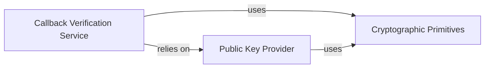

## Component Details

This subsystem is responsible for verifying the authenticity of callbacks received from Coinbase. The main flow involves a verification service that utilizes a public key provider to obtain the necessary cryptographic key and then employs cryptographic primitives to perform signature validation on the incoming callback data.

### Callback Verification Service
Provides functionality to verify the authenticity of callbacks received from Coinbase by checking signatures against a public key.

**Related Classes/Methods**:

- <a href="https://github.com/coinbase/coinbase-python/blob/master/coinbase/wallet/client.py#L618-L625" target="_blank" rel="noopener noreferrer">`coinbase.wallet.client.Client:verify_callback` (618:625)</a>

### Public Key Provider
Manages the loading, caching, and provision of the Coinbase callback public key from a file, ensuring it's available for verification.

**Related Classes/Methods**:

- <a href="https://github.com/coinbase/coinbase-python/blob/master/coinbase/wallet/client.py#L628-L632" target="_blank" rel="noopener noreferrer">`coinbase.wallet.client.Client.callback_public_key` (628:632)</a>
- <a href="https://github.com/coinbase/coinbase-python/blob/master/coinbase/wallet/client.py#L49-L50" target="_blank" rel="noopener noreferrer">`coinbase.wallet.client.COINBASE_CALLBACK_PUBLIC_KEY_PATH` (49:50)</a>

### Cryptographic Primitives
Provides fundamental cryptographic operations such as hashing (SHA256) and signature verification (PKCS1_v1_5) using RSA.

**Related Classes/Methods**:

- `Crypto.Hash.SHA256` (full file reference)
- `Crypto.PublicKey.RSA` (full file reference)
- `Crypto.Signature.PKCS1_v1_5` (full file reference)

### [FAQ](https://github.com/CodeBoarding/GeneratedOnBoardings/tree/main?tab=readme-ov-file#faq)