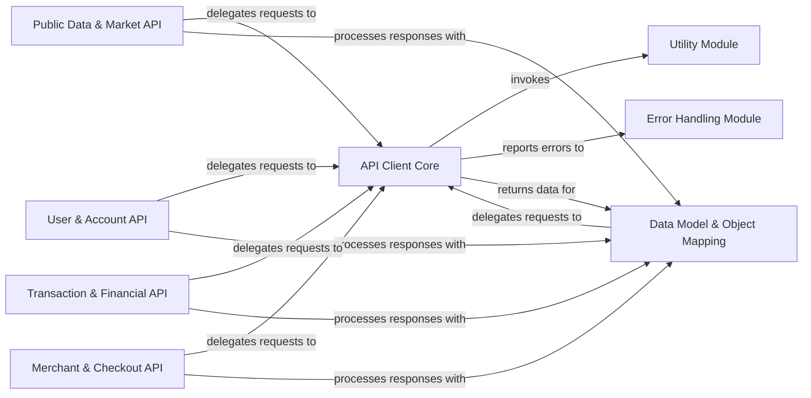

## Component Details

This architecture overview describes the key components of the Coinbase Wallet Python library, focusing on how it interacts with the Coinbase API. The core functionality revolves around the API Client Core, which handles all HTTP communications. Data Model & Object Mapping is crucial for transforming raw API responses into structured Python objects, enabling type-safe data consumption and object-oriented interaction with API resources. Various API-specific components (Public Data & Market, User & Account, Transaction & Financial, Merchant & Checkout) delegate their requests to the API Client Core and process responses using the Data Model & Object Mapping component. Utility and Error Handling modules provide supporting functionalities for request preparation and error management.

### API Client Core
This component handles the fundamental aspects of making HTTP requests to the Coinbase API, including request preparation, execution, and initial response handling. It provides the basic HTTP verbs (GET, POST, PUT, DELETE) for interacting with the API.

**Related Classes/Methods**:

- <a href="https://github.com/coinbase/coinbase-python/blob/master/coinbase/wallet/client.py#L103-L119" target="_blank" rel="noopener noreferrer">`coinbase-python.coinbase.wallet.client.Client:_request` (103:119)</a>
- <a href="https://github.com/coinbase/coinbase-python/blob/master/coinbase/wallet/client.py#L99-L101" target="_blank" rel="noopener noreferrer">`coinbase-python.coinbase.wallet.client.Client:_create_api_uri` (99:101)</a>
- <a href="https://github.com/coinbase/coinbase-python/blob/master/coinbase/wallet/client.py#L121-L129" target="_blank" rel="noopener noreferrer">`coinbase-python.coinbase.wallet.client.Client:_handle_response` (121:129)</a>
- <a href="https://github.com/coinbase/coinbase-python/blob/master/coinbase/wallet/client.py#L131-L167" target="_blank" rel="noopener noreferrer">`coinbase-python.coinbase.wallet.client.Client:_get` (131:167)</a>
- <a href="https://github.com/coinbase/coinbase-python/blob/master/coinbase/wallet/client.py#L169-L170" target="_blank" rel="noopener noreferrer">`coinbase-python.coinbase.wallet.client.Client:_post` (169:170)</a>
- <a href="https://github.com/coinbase/coinbase-python/blob/master/coinbase/wallet/client.py#L172-L173" target="_blank" rel="noopener noreferrer">`coinbase-python.coinbase.wallet.client.Client:_put` (172:173)</a>
- <a href="https://github.com/coinbase/coinbase-python/blob/master/coinbase/wallet/client.py#L175-L176" target="_blank" rel="noopener noreferrer">`coinbase-python.coinbase.wallet.client.Client:_delete` (175:176)</a>

### Data Model & Object Mapping
This component defines the structured Python objects (APIObject and its subclasses) that represent data from the Coinbase API. It is also responsible for the dynamic transformation of raw JSON responses into these structured objects, enabling type-safe and organized consumption of API data. Furthermore, these model objects encapsulate methods for interacting with the API, allowing for object-oriented manipulation of resources.

**Related Classes/Methods**:

- <a href="https://github.com/coinbase/coinbase-python/blob/master/coinbase/wallet/client.py#L178-L203" target="_blank" rel="noopener noreferrer">`coinbase.wallet.client.Client._make_api_object` (178:203)</a>
- <a href="https://github.com/coinbase/coinbase-python/blob/master/coinbase/wallet/model.py#L34-L137" target="_blank" rel="noopener noreferrer">`coinbase.wallet.model.APIObject` (34:137)</a>
- <a href="https://github.com/coinbase/coinbase-python/blob/master/coinbase/wallet/model.py#L13-L31" target="_blank" rel="noopener noreferrer">`coinbase.wallet.model.new_api_object` (13:31)</a>
- <a href="https://github.com/coinbase/coinbase-python/blob/master/coinbase/wallet/model.py#L140-L281" target="_blank" rel="noopener noreferrer">`coinbase.wallet.model.Account` (140:281)</a>
- <a href="https://github.com/coinbase/coinbase-python/blob/master/coinbase/wallet/model.py#L288-L289" target="_blank" rel="noopener noreferrer">`coinbase.wallet.model.Address` (288:289)</a>
- <a href="https://github.com/coinbase/coinbase-python/blob/master/coinbase/wallet/model.py#L359-L360" target="_blank" rel="noopener noreferrer">`coinbase.wallet.model.Buy` (359:360)</a>
- <a href="https://github.com/coinbase/coinbase-python/blob/master/coinbase/wallet/model.py#L292-L299" target="_blank" rel="noopener noreferrer">`coinbase.wallet.model.Checkout` (292:299)</a>
- <a href="https://github.com/coinbase/coinbase-python/blob/master/coinbase/wallet/model.py#L379-L384" target="_blank" rel="noopener noreferrer">`coinbase.wallet.model.CurrentUser` (379:384)</a>
- <a href="https://github.com/coinbase/coinbase-python/blob/master/coinbase/wallet/model.py#L367-L368" target="_blank" rel="noopener noreferrer">`coinbase.wallet.model.Deposit` (367:368)</a>
- <a href="https://github.com/coinbase/coinbase-python/blob/master/coinbase/wallet/model.py#L302-L303" target="_blank" rel="noopener noreferrer">`coinbase.wallet.model.Merchant` (302:303)</a>
- <a href="https://github.com/coinbase/coinbase-python/blob/master/coinbase/wallet/model.py#L284-L285" target="_blank" rel="noopener noreferrer">`coinbase.wallet.model.Notification` (284:285)</a>
- <a href="https://github.com/coinbase/coinbase-python/blob/master/coinbase/wallet/model.py#L326-L327" target="_blank" rel="noopener noreferrer">`coinbase.wallet.model.PaymentMethod` (326:327)</a>
- <a href="https://github.com/coinbase/coinbase-python/blob/master/coinbase/wallet/model.py#L319-L323" target="_blank" rel="noopener noreferrer">`coinbase.wallet.model.Order` (319:323)</a>
- <a href="https://github.com/coinbase/coinbase-python/blob/master/coinbase/wallet/model.py#L363-L364" target="_blank" rel="noopener noreferrer">`coinbase.wallet.model.Sell` (363:364)</a>
- <a href="https://github.com/coinbase/coinbase-python/blob/master/coinbase/wallet/model.py#L330-L344" target="_blank" rel="noopener noreferrer">`coinbase.wallet.model.Transaction` (330:344)</a>
- <a href="https://github.com/coinbase/coinbase-python/blob/master/coinbase/wallet/model.py#L347-L348" target="_blank" rel="noopener noreferrer">`coinbase.wallet.model.Report` (347:348)</a>
- <a href="https://github.com/coinbase/coinbase-python/blob/master/coinbase/wallet/model.py#L375-L376" target="_blank" rel="noopener noreferrer">`coinbase.wallet.model.User` (375:376)</a>
- <a href="https://github.com/coinbase/coinbase-python/blob/master/coinbase/wallet/model.py#L371-L372" target="_blank" rel="noopener noreferrer">`coinbase.wallet.model.Withdrawal` (371:372)</a>
- <a href="https://github.com/coinbase/coinbase-python/blob/master/coinbase/wallet/model.py#L306-L316" target="_blank" rel="noopener noreferrer">`coinbase.wallet.model.Money` (306:316)</a>
- <a href="https://github.com/coinbase/coinbase-python/blob/master/coinbase/wallet/model.py#L351-L356" target="_blank" rel="noopener noreferrer">`coinbase.wallet.model.Transfer` (351:356)</a>

### Public Data & Market API
This component provides methods for retrieving public data and market-related information from the Coinbase API, such as currencies, exchange rates, spot prices, and historical prices.

**Related Classes/Methods**:

- <a href="https://github.com/coinbase/coinbase-python/blob/master/coinbase/wallet/client.py#L207-L210" target="_blank" rel="noopener noreferrer">`coinbase-python.coinbase.wallet.client.Client:get_currencies` (207:210)</a>
- <a href="https://github.com/coinbase/coinbase-python/blob/master/coinbase/wallet/client.py#L212-L215" target="_blank" rel="noopener noreferrer">`coinbase-python.coinbase.wallet.client.Client:get_exchange_rates` (212:215)</a>
- <a href="https://github.com/coinbase/coinbase-python/blob/master/coinbase/wallet/client.py#L217-L221" target="_blank" rel="noopener noreferrer">`coinbase-python.coinbase.wallet.client.Client:get_buy_price` (217:221)</a>
- <a href="https://github.com/coinbase/coinbase-python/blob/master/coinbase/wallet/client.py#L223-L227" target="_blank" rel="noopener noreferrer">`coinbase-python.coinbase.wallet.client.Client:get_sell_price` (223:227)</a>
- <a href="https://github.com/coinbase/coinbase-python/blob/master/coinbase/wallet/client.py#L229-L233" target="_blank" rel="noopener noreferrer">`coinbase-python.coinbase.wallet.client.Client:get_spot_price` (229:233)</a>
- <a href="https://github.com/coinbase/coinbase-python/blob/master/coinbase/wallet/client.py#L235-L242" target="_blank" rel="noopener noreferrer">`coinbase-python.coinbase.wallet.client.Client:get_historic_prices` (235:242)</a>
- <a href="https://github.com/coinbase/coinbase-python/blob/master/coinbase/wallet/client.py#L244-L247" target="_blank" rel="noopener noreferrer">`coinbase-python.coinbase.wallet.client.Client:get_time` (244:247)</a>

### User & Account API
This component handles operations related to user profiles, authentication information, and cryptocurrency accounts, including fetching, creating, updating, and deleting accounts.

**Related Classes/Methods**:

- <a href="https://github.com/coinbase/coinbase-python/blob/master/coinbase/wallet/client.py#L251-L254" target="_blank" rel="noopener noreferrer">`coinbase-python.coinbase.wallet.client.Client:get_user` (251:254)</a>
- <a href="https://github.com/coinbase/coinbase-python/blob/master/coinbase/wallet/client.py#L256-L259" target="_blank" rel="noopener noreferrer">`coinbase-python.coinbase.wallet.client.Client:get_current_user` (256:259)</a>
- <a href="https://github.com/coinbase/coinbase-python/blob/master/coinbase/wallet/client.py#L261-L264" target="_blank" rel="noopener noreferrer">`coinbase-python.coinbase.wallet.client.Client:get_auth_info` (261:264)</a>
- <a href="https://github.com/coinbase/coinbase-python/blob/master/coinbase/wallet/client.py#L266-L269" target="_blank" rel="noopener noreferrer">`coinbase-python.coinbase.wallet.client.Client:update_current_user` (266:269)</a>
- <a href="https://github.com/coinbase/coinbase-python/blob/master/coinbase/wallet/client.py#L273-L276" target="_blank" rel="noopener noreferrer">`coinbase-python.coinbase.wallet.client.Client:get_accounts` (273:276)</a>
- <a href="https://github.com/coinbase/coinbase-python/blob/master/coinbase/wallet/client.py#L278-L281" target="_blank" rel="noopener noreferrer">`coinbase-python.coinbase.wallet.client.Client:get_account` (278:281)</a>
- <a href="https://github.com/coinbase/coinbase-python/blob/master/coinbase/wallet/client.py#L283-L285" target="_blank" rel="noopener noreferrer">`coinbase-python.coinbase.wallet.client.Client:get_primary_account` (283:285)</a>
- <a href="https://github.com/coinbase/coinbase-python/blob/master/coinbase/wallet/client.py#L287-L290" target="_blank" rel="noopener noreferrer">`coinbase-python.coinbase.wallet.client.Client:create_account` (287:290)</a>
- <a href="https://github.com/coinbase/coinbase-python/blob/master/coinbase/wallet/client.py#L292-L295" target="_blank" rel="noopener noreferrer">`coinbase-python.coinbase.wallet.client.Client:set_primary_account` (292:295)</a>
- <a href="https://github.com/coinbase/coinbase-python/blob/master/coinbase/wallet/client.py#L297-L300" target="_blank" rel="noopener noreferrer">`coinbase-python.coinbase.wallet.client.Client:update_account` (297:300)</a>
- <a href="https://github.com/coinbase/coinbase-python/blob/master/coinbase/wallet/client.py#L302-L305" target="_blank" rel="noopener noreferrer">`coinbase-python.coinbase.wallet.client.Client:delete_account` (302:305)</a>

### Transaction & Financial API
This component deals with various financial transactions, including sending, transferring, requesting money, managing buys, sells, deposits, and withdrawals. It also includes functionalities for notifications, addresses, and reports.

**Related Classes/Methods**:

- <a href="https://github.com/coinbase/coinbase-python/blob/master/coinbase/wallet/client.py#L309-L312" target="_blank" rel="noopener noreferrer">`coinbase-python.coinbase.wallet.client.Client:get_notifications` (309:312)</a>
- <a href="https://github.com/coinbase/coinbase-python/blob/master/coinbase/wallet/client.py#L314-L317" target="_blank" rel="noopener noreferrer">`coinbase-python.coinbase.wallet.client.Client:get_notification` (314:317)</a>
- <a href="https://github.com/coinbase/coinbase-python/blob/master/coinbase/wallet/client.py#L321-L324" target="_blank" rel="noopener noreferrer">`coinbase-python.coinbase.wallet.client.Client:get_addresses` (321:324)</a>
- <a href="https://github.com/coinbase/coinbase-python/blob/master/coinbase/wallet/client.py#L326-L329" target="_blank" rel="noopener noreferrer">`coinbase-python.coinbase.wallet.client.Client:get_address` (326:329)</a>
- <a href="https://github.com/coinbase/coinbase-python/blob/master/coinbase/wallet/client.py#L331-L341" target="_blank" rel="noopener noreferrer">`coinbase-python.coinbase.wallet.client.Client:get_address_transactions` (331:341)</a>
- <a href="https://github.com/coinbase/coinbase-python/blob/master/coinbase/wallet/client.py#L343-L346" target="_blank" rel="noopener noreferrer">`coinbase-python.coinbase.wallet.client.Client:create_address` (343:346)</a>
- <a href="https://github.com/coinbase/coinbase-python/blob/master/coinbase/wallet/client.py#L350-L353" target="_blank" rel="noopener noreferrer">`coinbase-python.coinbase.wallet.client.Client:get_transactions` (350:353)</a>
- <a href="https://github.com/coinbase/coinbase-python/blob/master/coinbase/wallet/client.py#L355-L359" target="_blank" rel="noopener noreferrer">`coinbase-python.coinbase.wallet.client.Client:get_transaction` (355:359)</a>
- <a href="https://github.com/coinbase/coinbase-python/blob/master/coinbase/wallet/client.py#L361-L368" target="_blank" rel="noopener noreferrer">`coinbase-python.coinbase.wallet.client.Client:send_money` (361:368)</a>
- <a href="https://github.com/coinbase/coinbase-python/blob/master/coinbase/wallet/client.py#L370-L377" target="_blank" rel="noopener noreferrer">`coinbase-python.coinbase.wallet.client.Client:transfer_money` (370:377)</a>
- <a href="https://github.com/coinbase/coinbase-python/blob/master/coinbase/wallet/client.py#L379-L386" target="_blank" rel="noopener noreferrer">`coinbase-python.coinbase.wallet.client.Client:request_money` (379:386)</a>
- <a href="https://github.com/coinbase/coinbase-python/blob/master/coinbase/wallet/client.py#L388-L393" target="_blank" rel="noopener noreferrer">`coinbase-python.coinbase.wallet.client.Client:complete_request` (388:393)</a>
- <a href="https://github.com/coinbase/coinbase-python/blob/master/coinbase/wallet/client.py#L395-L400" target="_blank" rel="noopener noreferrer">`coinbase-python.coinbase.wallet.client.Client:resend_request` (395:400)</a>
- <a href="https://github.com/coinbase/coinbase-python/blob/master/coinbase/wallet/client.py#L402-L407" target="_blank" rel="noopener noreferrer">`coinbase-python.coinbase.wallet.client.Client:cancel_request` (402:407)</a>
- <a href="https://github.com/coinbase/coinbase-python/blob/master/coinbase/wallet/client.py#L411-L414" target="_blank" rel="noopener noreferrer">`coinbase-python.coinbase.wallet.client.Client:get_reports` (411:414)</a>
- <a href="https://github.com/coinbase/coinbase-python/blob/master/coinbase/wallet/client.py#L416-L419" target="_blank" rel="noopener noreferrer">`coinbase-python.coinbase.wallet.client.Client:get_report` (416:419)</a>
- <a href="https://github.com/coinbase/coinbase-python/blob/master/coinbase/wallet/client.py#L421-L426" target="_blank" rel="noopener noreferrer">`coinbase-python.coinbase.wallet.client.Client:create_report` (421:426)</a>
- <a href="https://github.com/coinbase/coinbase-python/blob/master/coinbase/wallet/client.py#L430-L433" target="_blank" rel="noopener noreferrer">`coinbase-python.coinbase.wallet.client.Client:get_buys` (430:433)</a>
- <a href="https://github.com/coinbase/coinbase-python/blob/master/coinbase/wallet/client.py#L435-L438" target="_blank" rel="noopener noreferrer">`coinbase-python.coinbase.wallet.client.Client:get_buy` (435:438)</a>
- <a href="https://github.com/coinbase/coinbase-python/blob/master/coinbase/wallet/client.py#L440-L448" target="_blank" rel="noopener noreferrer">`coinbase-python.coinbase.wallet.client.Client:buy` (440:448)</a>
- <a href="https://github.com/coinbase/coinbase-python/blob/master/coinbase/wallet/client.py#L450-L454" target="_blank" rel="noopener noreferrer">`coinbase-python.coinbase.wallet.client.Client:commit_buy` (450:454)</a>
- <a href="https://github.com/coinbase/coinbase-python/blob/master/coinbase/wallet/client.py#L458-L461" target="_blank" rel="noopener noreferrer">`coinbase-python.coinbase.wallet.client.Client:get_sells` (458:461)</a>
- <a href="https://github.com/coinbase/coinbase-python/blob/master/coinbase/wallet/client.py#L463-L467" target="_blank" rel="noopener noreferrer">`coinbase-python.coinbase.wallet.client.Client:get_sell` (463:467)</a>
- <a href="https://github.com/coinbase/coinbase-python/blob/master/coinbase/wallet/client.py#L469-L477" target="_blank" rel="noopener noreferrer">`coinbase-python.coinbase.wallet.client.Client:sell` (469:477)</a>
- <a href="https://github.com/coinbase/coinbase-python/blob/master/coinbase/wallet/client.py#L479-L483" target="_blank" rel="noopener noreferrer">`coinbase-python.coinbase.wallet.client.Client:commit_sell` (479:483)</a>
- <a href="https://github.com/coinbase/coinbase-python/blob/master/coinbase/wallet/client.py#L487-L490" target="_blank" rel="noopener noreferrer">`coinbase-python.coinbase.wallet.client.Client:get_deposits` (487:490)</a>
- <a href="https://github.com/coinbase/coinbase-python/blob/master/coinbase/wallet/client.py#L492-L496" target="_blank" rel="noopener noreferrer">`coinbase-python.coinbase.wallet.client.Client:get_deposit` (492:496)</a>
- <a href="https://github.com/coinbase/coinbase-python/blob/master/coinbase/wallet/client.py#L498-L504" target="_blank" rel="noopener noreferrer">`coinbase-python.coinbase.wallet.client.Client:deposit` (498:504)</a>
- <a href="https://github.com/coinbase/coinbase-python/blob/master/coinbase/wallet/client.py#L506-L511" target="_blank" rel="noopener noreferrer">`coinbase-python.coinbase.wallet.client.Client:commit_deposit` (506:511)</a>
- <a href="https://github.com/coinbase/coinbase-python/blob/master/coinbase/wallet/client.py#L515-L518" target="_blank" rel="noopener noreferrer">`coinbase-python.coinbase.wallet.client.Client:get_withdrawals` (515:518)</a>
- <a href="https://github.com/coinbase/coinbase-python/blob/master/coinbase/wallet/client.py#L520-L524" target="_blank" rel="noopener noreferrer">`coinbase-python.coinbase.wallet.client.Client:get_withdrawal` (520:524)</a>
- <a href="https://github.com/coinbase/coinbase-python/blob/master/coinbase/wallet/client.py#L526-L532" target="_blank" rel="noopener noreferrer">`coinbase-python.coinbase.wallet.client.Client:withdraw` (526:532)</a>
- <a href="https://github.com/coinbase/coinbase-python/blob/master/coinbase/wallet/client.py#L534-L539" target="_blank" rel="noopener noreferrer">`coinbase-python.coinbase.wallet.client.Client:commit_withdrawal` (534:539)</a>

### Merchant & Checkout API
This component handles operations related to payment methods, merchant information, orders, and checkouts, facilitating e-commerce functionalities within the Coinbase ecosystem.

**Related Classes/Methods**:

- <a href="https://github.com/coinbase/coinbase-python/blob/master/coinbase/wallet/client.py#L543-L546" target="_blank" rel="noopener noreferrer">`coinbase-python.coinbase.wallet.client.Client:get_payment_methods` (543:546)</a>
- <a href="https://github.com/coinbase/coinbase-python/blob/master/coinbase/wallet/client.py#L548-L551" target="_blank" rel="noopener noreferrer">`coinbase-python.coinbase.wallet.client.Client:get_payment_method` (548:551)</a>
- <a href="https://github.com/coinbase/coinbase-python/blob/master/coinbase/wallet/client.py#L555-L558" target="_blank" rel="noopener noreferrer">`coinbase-python.coinbase.wallet.client.Client:get_merchant` (555:558)</a>
- <a href="https://github.com/coinbase/coinbase-python/blob/master/coinbase/wallet/client.py#L562-L565" target="_blank" rel="noopener noreferrer">`coinbase-python.coinbase.wallet.client.Client:get_orders` (562:565)</a>
- <a href="https://github.com/coinbase/coinbase-python/blob/master/coinbase/wallet/client.py#L567-L570" target="_blank" rel="noopener noreferrer">`coinbase-python.coinbase.wallet.client.Client:get_order` (567:570)</a>
- <a href="https://github.com/coinbase/coinbase-python/blob/master/coinbase/wallet/client.py#L572-L578" target="_blank" rel="noopener noreferrer">`coinbase-python.coinbase.wallet.client.Client:create_order` (572:578)</a>
- <a href="https://github.com/coinbase/coinbase-python/blob/master/coinbase/wallet/client.py#L580-L586" target="_blank" rel="noopener noreferrer">`coinbase-python.coinbase.wallet.client.Client:refund_order` (580:586)</a>
- <a href="https://github.com/coinbase/coinbase-python/blob/master/coinbase/wallet/client.py#L590-L593" target="_blank" rel="noopener noreferrer">`coinbase-python.coinbase.wallet.client.Client:get_checkouts` (590:593)</a>
- <a href="https://github.com/coinbase/coinbase-python/blob/master/coinbase/wallet/client.py#L595-L598" target="_blank" rel="noopener noreferrer">`coinbase-python.coinbase.wallet.client.Client:get_checkout` (595:598)</a>
- <a href="https://github.com/coinbase/coinbase-python/blob/master/coinbase/wallet/client.py#L600-L606" target="_blank" rel="noopener noreferrer">`coinbase-python.coinbase.wallet.client.Client:create_checkout` (600:606)</a>
- <a href="https://github.com/coinbase/coinbase-python/blob/master/coinbase/wallet/client.py#L608-L611" target="_blank" rel="noopener noreferrer">`coinbase-python.coinbase.wallet.client.Client:get_checkout_orders` (608:611)</a>
- <a href="https://github.com/coinbase/coinbase-python/blob/master/coinbase/wallet/client.py#L613-L616" target="_blank" rel="noopener noreferrer">`coinbase-python.coinbase.wallet.client.Client:create_checkout_order` (613:616)</a>

### Utility Module
This component provides general utility functions used across the Coinbase Wallet library, such as encoding parameters for API requests, ensuring proper data formatting before transmission.

**Related Classes/Methods**:

- <a href="https://github.com/coinbase/coinbase-python/blob/master/coinbase/wallet/util.py#L31-L34" target="_blank" rel="noopener noreferrer">`coinbase.wallet.util.encode_params` (31:34)</a>

### Error Handling Module
This component is responsible for building and handling API-related errors, providing a structured way to manage exceptions returned from the Coinbase API and present them to the user or calling application.

**Related Classes/Methods**:

- <a href="https://github.com/coinbase/coinbase-python/blob/master/coinbase/wallet/error.py#L96-L118" target="_blank" rel="noopener noreferrer">`coinbase.wallet.error.build_api_error` (96:118)</a>

### [FAQ](https://github.com/CodeBoarding/GeneratedOnBoardings/tree/main?tab=readme-ov-file#faq)