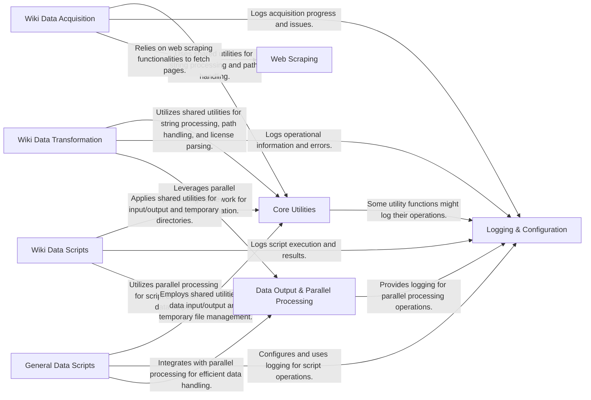

## Component Details

This graph illustrates the architecture of the common-pile project, focusing on its core components and their interactions. The main flow involves data acquisition (e.g., Wiki Data Acquisition, Web Scraping), followed by transformation (Wiki Data Transformation) and various scripting operations (Wiki Data Scripts, General Data Scripts). Throughout these processes, foundational services like Logging & Configuration, Core Utilities, and Data Output & Parallel Processing provide essential support, ensuring efficient and standardized data handling.

### Logging & Configuration
This component is responsible for setting up and providing logging functionalities across the common-pile project, including configuring loggers, formatters (like JSON), and handlers (stream, file).

**Related Classes/Methods**:

- <a href="https://github.com/r-three/common-pile/blob/master/common_pile/logs.py#L72-L73" target="_blank" rel="noopener noreferrer">`common_pile.logs.get_logger` (72:73)</a>
- <a href="https://github.com/r-three/common-pile/blob/master/common_pile/logs.py#L51-L69" target="_blank" rel="noopener noreferrer">`common_pile.logs.configure_logging` (51:69)</a>
- <a href="https://github.com/r-three/common-pile/blob/master/common_pile/logs.py#L22-L30" target="_blank" rel="noopener noreferrer">`common_pile.logs.get_json_formatter` (22:30)</a>
- <a href="https://github.com/r-three/common-pile/blob/master/common_pile/logs.py#L33-L35" target="_blank" rel="noopener noreferrer">`common_pile.logs.get_stream_handler` (33:35)</a>

### Core Utilities
This component provides a collection of general-purpose utility functions, including string manipulation (prefix/suffix removal), handling Dolma input/output paths, managing temporary directories, parsing permissive licenses, and iterating through XML structures.

**Related Classes/Methods**:

- <a href="https://github.com/r-three/common-pile/blob/master/common_pile/utils.py#L20-L25" target="_blank" rel="noopener noreferrer">`common_pile.utils.removesuffix` (20:25)</a>
- <a href="https://github.com/r-three/common-pile/blob/master/common_pile/utils.py#L12-L16" target="_blank" rel="noopener noreferrer">`common_pile.utils.removeprefix` (12:16)</a>
- <a href="https://github.com/r-three/common-pile/blob/master/common_pile/utils.py#L28-L43" target="_blank" rel="noopener noreferrer">`common_pile.utils.dolma_input` (28:43)</a>
- <a href="https://github.com/r-three/common-pile/blob/master/common_pile/utils.py#L46-L50" target="_blank" rel="noopener noreferrer">`common_pile.utils.dolma_output` (46:50)</a>
- <a href="https://github.com/r-three/common-pile/blob/master/common_pile/utils.py#L54-L59" target="_blank" rel="noopener noreferrer">`common_pile.utils.maybe_temp_dir` (54:59)</a>
- <a href="https://github.com/r-three/common-pile/blob/master/common_pile/licenses.py#L14-L93" target="_blank" rel="noopener noreferrer">`common_pile.licenses.PermissiveLicenses` (14:93)</a>
- <a href="https://github.com/r-three/common-pile/blob/master/common_pile/licenses.py#L60-L93" target="_blank" rel="noopener noreferrer">`common_pile.licenses.PermissiveLicenses.from_string` (60:93)</a>
- <a href="https://github.com/r-three/common-pile/blob/master/common_pile/xml.py#L10-L34" target="_blank" rel="noopener noreferrer">`common_pile.xml.iterate_xml` (10:34)</a>

### Data Output & Parallel Processing
This component handles the standardized output of data into the Dolma format and provides a robust framework for processing data in parallel across multiple shards, including logging specific to the parallel processing.

**Related Classes/Methods**:

- <a href="https://github.com/r-three/common-pile/blob/master/common_pile/write.py#L36-L66" target="_blank" rel="noopener noreferrer">`common_pile.write.to_dolma` (36:66)</a>
- <a href="https://github.com/r-three/common-pile/blob/master/common_pile/write.py#L102-L103" target="_blank" rel="noopener noreferrer">`common_pile.write.ShardParallelProcessor.get_logger` (102:103)</a>
- <a href="https://github.com/r-three/common-pile/blob/master/common_pile/write.py#L106-L180" target="_blank" rel="noopener noreferrer">`common_pile.write.ShardParallelProcessor.process_single` (106:180)</a>

### Web Scraping
This component provides core functionalities for fetching web pages, which is utilized by various data acquisition processes within the common-pile project.

**Related Classes/Methods**:

- <a href="https://github.com/r-three/common-pile/blob/master/common_pile/scrape.py#L19-L37" target="_blank" rel="noopener noreferrer">`common_pile.scrape.get_page` (19:37)</a>

### Wiki Data Acquisition
This component is dedicated to the discovery, listing, downloading, and initial processing of raw wiki data from various online sources, including Fandom and Internet Archive, and managing associated metadata.

**Related Classes/Methods**:

- `common_pile.sources.wiki.scrape.get_namespaces` (full file reference)
- `common_pile.sources.wiki.scrape.list_pages` (full file reference)
- `common_pile.sources.wiki.scrape.list_wikis` (full file reference)
- `common_pile.sources.wiki.scrape.export_pages` (full file reference)
- `common_pile.sources.wiki.scrape.utils` (full file reference)
- `common_pile.sources.wiki.archive.download_archive` (full file reference)
- `common_pile.sources.wiki.archive.get_metadata` (full file reference)
- `common_pile.sources.wiki.archive.utils` (full file reference)

### Wiki Data Transformation
This component focuses on converting and preprocessing raw wiki data into the structured Dolma format, handling tasks like parsing wikitext and formatting archived content.

**Related Classes/Methods**:

- `common_pile.sources.wiki.to_dolma` (full file reference)
- `common_pile.sources.wiki.preprocess` (full file reference)
- `common_pile.sources.wiki.archive.to_dolma` (full file reference)

### Wiki Data Scripts
This component contains specialized scripts for post-acquisition processing and filtering of wiki-specific data, such as identifying lyrics or transcripts, updating author information, and removing HTML.

**Related Classes/Methods**:

- `common_pile.sources.wiki.scripts.find_lyrics` (full file reference)
- `common_pile.sources.wiki.scripts.update_authors` (full file reference)
- `common_pile.sources.wiki.scripts.remove_html` (full file reference)
- `common_pile.sources.wiki.scripts.filter_transcripts` (full file reference)
- `common_pile.sources.wiki.scripts.filter_lyrics` (full file reference)
- `common_pile.sources.wiki.scripts.find_transcripts` (full file reference)

### General Data Scripts
This component provides a suite of general-purpose scripts for common data manipulation tasks across the common-pile project, including calculating statistics, removing specific features or null values, combining Dolma files, and comparing datasets.

**Related Classes/Methods**:

- `common_pile.scripts.stats` (full file reference)
- `common_pile.scripts.remove_features` (full file reference)
- `common_pile.scripts.remove_none` (full file reference)
- `common_pile.scripts.combine_dolma` (full file reference)
- `common_pile.scripts.id_to_shard` (full file reference)
- `common_pile.scripts.compare_data` (full file reference)
- `common_pile.scripts.remove_html` (full file reference)

### [FAQ](https://github.com/CodeBoarding/GeneratedOnBoardings/tree/main?tab=readme-ov-file#faq)