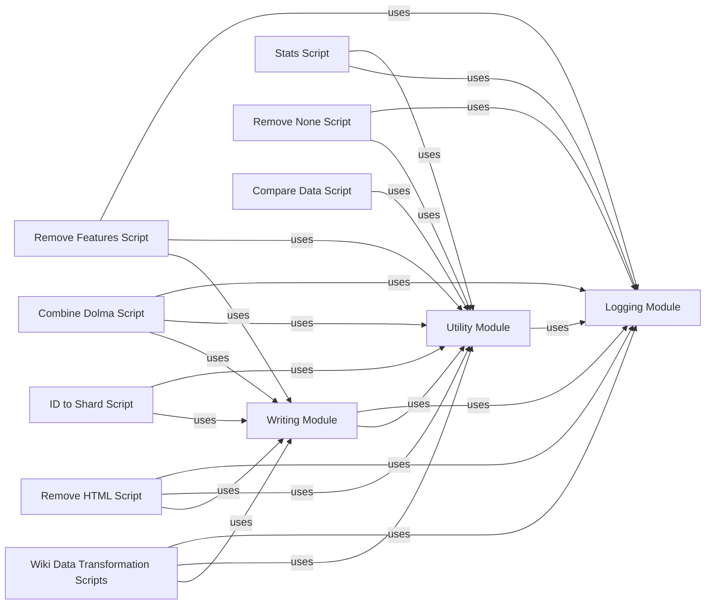

## Component Details

This graph illustrates the structure and interactions within the data analysis and transformation subsystem of the Dolma project. It encompasses core utility modules for logging, file handling, and data writing, alongside various specialized scripts for tasks such as calculating statistics, removing specific features or HTML content, combining data files, mapping IDs to shards, and comparing datasets. Additionally, it includes scripts specifically tailored for processing Wiki-sourced Dolma data, focusing on content identification and author updates. The system leverages parallel processing for efficient data manipulation across shards, with all scripts relying on shared logging and utility functionalities, and many utilizing the common writing framework to output processed Dolma data.

### Logging Module
This component provides shared logging functionalities for the common-pile project. It allows for configuration of logging levels, formatters (e.g., JSON), and handlers (e.g., stream, file). It ensures consistent logging across different parts of the system.

**Related Classes/Methods**:

- <a href="https://github.com/r-three/common-pile/blob/master/common_pile/logs.py#L72-L73" target="_blank" rel="noopener noreferrer">`common_pile.logs.get_logger` (72:73)</a>
- <a href="https://github.com/r-three/common-pile/blob/master/common_pile/logs.py#L51-L69" target="_blank" rel="noopener noreferrer">`common_pile.logs.configure_logging` (51:69)</a>

### Utility Module
This component offers shared utility functions, primarily for handling input and output paths in the Dolma format and managing temporary directories. It simplifies common file system operations for data processing workflows.

**Related Classes/Methods**:

- <a href="https://github.com/r-three/common-pile/blob/master/common_pile/utils.py#L28-L43" target="_blank" rel="noopener noreferrer">`common_pile.utils.dolma_input` (28:43)</a>
- <a href="https://github.com/r-three/common-pile/blob/master/common_pile/utils.py#L46-L50" target="_blank" rel="noopener noreferrer">`common_pile.utils.dolma_output` (46:50)</a>
- <a href="https://github.com/r-three/common-pile/blob/master/common_pile/utils.py#L54-L59" target="_blank" rel="noopener noreferrer">`common_pile.utils.maybe_temp_dir` (54:59)</a>

### Writing Module
This component is responsible for writing data, specifically in the Dolma format, and provides a parallel processing framework for shard-based operations. It handles serialization, shard creation, and progress reporting during data writing.

**Related Classes/Methods**:

- <a href="https://github.com/r-three/common-pile/blob/master/common_pile/write.py#L36-L66" target="_blank" rel="noopener noreferrer">`common_pile.write.to_dolma` (36:66)</a>
- <a href="https://github.com/r-three/common-pile/blob/master/common_pile/write.py#L83-L180" target="_blank" rel="noopener noreferrer">`common_pile.write.ShardParallelProcessor` (83:180)</a>
- <a href="https://github.com/r-three/common-pile/blob/master/common_pile/write.py#L22-L24" target="_blank" rel="noopener noreferrer">`common_pile.write.shard_name` (22:24)</a>

### Stats Script
This script is designed to calculate size statistics of data. It utilizes parallel processing to efficiently compute statistics across multiple data shards.

**Related Classes/Methods**:

- <a href="https://github.com/r-three/common-pile/blob/master/common_pile/scripts/stats.py#L20-L116" target="_blank" rel="noopener noreferrer">`common_pile.scripts.stats.SizeStatsParallel` (20:116)</a>
- <a href="https://github.com/r-three/common-pile/blob/master/common_pile/scripts/stats.py#L119-L148" target="_blank" rel="noopener noreferrer">`common_pile.scripts.stats.main` (119:148)</a>

### Remove Features Script
This script facilitates the removal of specific features from data. It employs a parallel processing approach to handle data efficiently.

**Related Classes/Methods**:

- <a href="https://github.com/r-three/common-pile/blob/master/common_pile/scripts/remove_features.py#L52-L58" target="_blank" rel="noopener noreferrer">`common_pile.scripts.remove_features.RemoveFeaturesParallel` (52:58)</a>
- <a href="https://github.com/r-three/common-pile/blob/master/common_pile/scripts/remove_features.py#L61-L82" target="_blank" rel="noopener noreferrer">`common_pile.scripts.remove_features.main` (61:82)</a>

### Remove None Script
This script is responsible for removing null or None values from data. It leverages parallel processing to perform this operation across data shards.

**Related Classes/Methods**:

- <a href="https://github.com/r-three/common-pile/blob/master/common_pile/scripts/remove_none.py#L20-L95" target="_blank" rel="noopener noreferrer">`common_pile.scripts.remove_none.RemoveNoneParallel` (20:95)</a>
- <a href="https://github.com/r-three/common-pile/blob/master/common_pile/scripts/remove_none.py#L98-L126" target="_blank" rel="noopener noreferrer">`common_pile.scripts.remove_none.main` (98:126)</a>

### Combine Dolma Script
This script provides functionality to combine multiple Dolma formatted files into a single output. It includes methods for reading and writing shard files and combining data with shard information.

**Related Classes/Methods**:

- <a href="https://github.com/r-three/common-pile/blob/master/common_pile/scripts/combine_dolma.py#L57-L188" target="_blank" rel="noopener noreferrer">`common_pile.scripts.combine_dolma.combine_dolma_files` (57:188)</a>
- <a href="https://github.com/r-three/common-pile/blob/master/common_pile/scripts/combine_dolma.py#L191-L248" target="_blank" rel="noopener noreferrer">`common_pile.scripts.combine_dolma.combine_dolma_with_shard_info` (191:248)</a>
- <a href="https://github.com/r-three/common-pile/blob/master/common_pile/scripts/combine_dolma.py#L251-L255" target="_blank" rel="noopener noreferrer">`common_pile.scripts.combine_dolma.read_shard_file` (251:255)</a>
- <a href="https://github.com/r-three/common-pile/blob/master/common_pile/scripts/combine_dolma.py#L258-L262" target="_blank" rel="noopener noreferrer">`common_pile.scripts.combine_dolma.write_shard_file` (258:262)</a>
- <a href="https://github.com/r-three/common-pile/blob/master/common_pile/scripts/combine_dolma.py#L265-L300" target="_blank" rel="noopener noreferrer">`common_pile.scripts.combine_dolma.main` (265:300)</a>

### ID to Shard Script
This script is used to map unique identifiers to their corresponding data shards. It likely plays a role in organizing and accessing data within the Dolma format.

**Related Classes/Methods**:

- <a href="https://github.com/r-three/common-pile/blob/master/common_pile/scripts/id_to_shard.py#L16-L19" target="_blank" rel="noopener noreferrer">`common_pile.scripts.id_to_shard.IdToShardParallel` (16:19)</a>
- <a href="https://github.com/r-three/common-pile/blob/master/common_pile/scripts/id_to_shard.py#L22-L55" target="_blank" rel="noopener noreferrer">`common_pile.scripts.id_to_shard.main` (22:55)</a>

### Compare Data Script
This script is designed for comparing data, potentially for verification or analysis purposes. It includes functionality to load data for comparison.

**Related Classes/Methods**:

- <a href="https://github.com/r-three/common-pile/blob/master/common_pile/scripts/compare_data.py#L23-L91" target="_blank" rel="noopener noreferrer">`common_pile.scripts.compare_data.load_data` (23:91)</a>
- `common_pile.scripts.compare_data.Index` (full file reference)

### Remove HTML Script
This script focuses on removing HTML content from data. It provides different parallel processing implementations for this task, including regex-based and BeautifulSoup-based approaches.

**Related Classes/Methods**:

- <a href="https://github.com/r-three/common-pile/blob/master/common_pile/scripts/remove_html.py#L68-L91" target="_blank" rel="noopener noreferrer">`common_pile.scripts.remove_html.RegexRemoveHTMLParallel` (68:91)</a>
- <a href="https://github.com/r-three/common-pile/blob/master/common_pile/scripts/remove_html.py#L94-L125" target="_blank" rel="noopener noreferrer">`common_pile.scripts.remove_html.BS4RemoveHTMLParallel` (94:125)</a>
- <a href="https://github.com/r-three/common-pile/blob/master/common_pile/scripts/remove_html.py#L128-L136" target="_blank" rel="noopener noreferrer">`common_pile.scripts.remove_html.main` (128:136)</a>

### Wiki Data Transformation Scripts
This component contains specialized scripts for analyzing and transforming Dolma-formatted data originating from Wiki sources. This includes identifying and filtering specific content patterns like lyrics and transcripts, and updating author information.

**Related Classes/Methods**:

- `common_pile.sources.wiki.scripts.find_lyrics` (full file reference)
- `common_pile.sources.wiki.scripts.filter_lyrics` (full file reference)
- `common_pile.sources.wiki.scripts.find_transcripts` (full file reference)
- `common_pile.sources.wiki.scripts.filter_transcripts` (full file reference)
- `common_pile.sources.wiki.scripts.update_authors` (full file reference)

### [FAQ](https://github.com/CodeBoarding/GeneratedOnBoardings/tree/main?tab=readme-ov-file#faq)