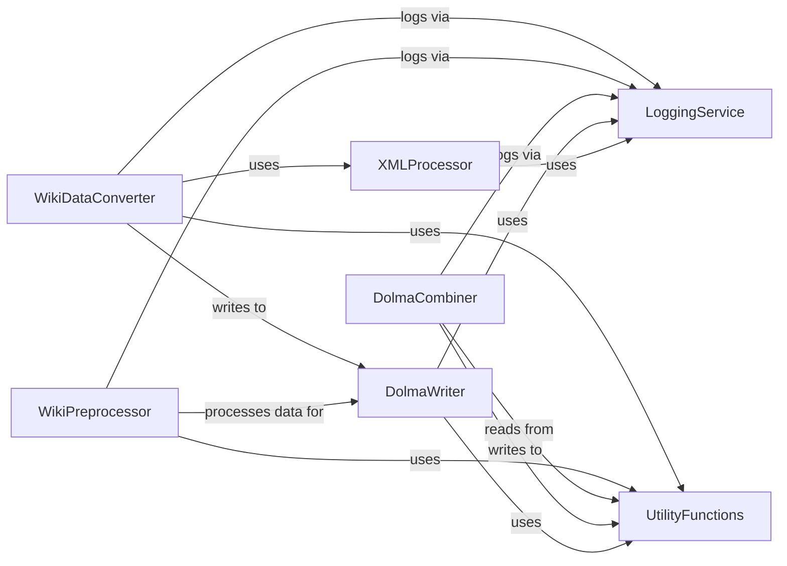

## Component Details

This subsystem is responsible for the end-to-end management of data in the Dolma format. It encompasses functionalities for parsing various input formats like XML, preprocessing data, efficiently writing sharded Dolma files, and combining existing Dolma files. It relies on shared utility functions for path handling and a centralized logging service for operational insights.

### DolmaWriter
This component is responsible for writing data into the Dolma format. It handles sharding, parallel processing, and logging during the writing process. It interacts with utility functions for output paths and logging.

**Related Classes/Methods**:

- <a href="https://github.com/r-three/common-pile/blob/master/common_pile/write.py#L1-L170" target="_blank" rel="noopener noreferrer">`common_pile.write` (1:170)</a>
- <a href="https://github.com/r-three/common-pile/blob/master/common_pile/write.py#L36-L66" target="_blank" rel="noopener noreferrer">`common_pile.write:to_dolma` (36:66)</a>
- <a href="https://github.com/r-three/common-pile/blob/master/common_pile/write.py#L106-L180" target="_blank" rel="noopener noreferrer">`common_pile.write.ShardParallelProcessor:process_single` (106:180)</a>
- <a href="https://github.com/r-three/common-pile/blob/master/common_pile/write.py#L102-L103" target="_blank" rel="noopener noreferrer">`common_pile.write.ShardParallelProcessor.get_logger` (102:103)</a>
- <a href="https://github.com/r-three/common-pile/blob/master/common_pile/write.py#L69-L74" target="_blank" rel="noopener noreferrer">`common_pile.write.smart_open_exists` (69:74)</a>
- <a href="https://github.com/r-three/common-pile/blob/master/common_pile/write.py#L87-L94" target="_blank" rel="noopener noreferrer">`common_pile.write.ShardParallelProcessor.increment_progressbar` (87:94)</a>
- <a href="https://github.com/r-three/common-pile/blob/master/common_pile/write.py#L77-L80" target="_blank" rel="noopener noreferrer">`common_pile.write.create_shadow` (77:80)</a>
- <a href="https://github.com/r-three/common-pile/blob/master/common_pile/write.py#L98-L99" target="_blank" rel="noopener noreferrer">`common_pile.write.ShardParallelProcessor.process_example` (98:99)</a>
- <a href="https://github.com/r-three/common-pile/blob/master/common_pile/write.py#L22-L24" target="_blank" rel="noopener noreferrer">`common_pile.write.shard_name` (22:24)</a>

### XMLProcessor
This component handles the iteration and processing of XML files. It provides functionalities to read and parse XML data, often used as an input source for conversion processes.

**Related Classes/Methods**:

- <a href="https://github.com/r-three/common-pile/blob/master/common_pile/xml.py#L1-L34" target="_blank" rel="noopener noreferrer">`common_pile.xml` (1:34)</a>
- <a href="https://github.com/r-three/common-pile/blob/master/common_pile/xml.py#L10-L34" target="_blank" rel="noopener noreferrer">`common_pile.xml:iterate_xml` (10:34)</a>
- <a href="https://github.com/r-three/common-pile/blob/master/common_pile/xml.py#L37-L40" target="_blank" rel="noopener noreferrer">`common_pile.xml:iterate_xmls` (37:40)</a>

### WikiDataConverter
This component is specifically designed to convert Wikipedia data into the Dolma format. It orchestrates the XML processing and the Dolma writing, acting as a high-level entry point for Wikipedia data ingestion.

**Related Classes/Methods**:

- `common_pile.sources.wiki.to_dolma:main` (full file reference)
- `common_pile.sources.wiki.archive.to_dolma:convert_wiki` (full file reference)

### WikiPreprocessor
This component focuses on preprocessing Wikipedia data before it's converted to Dolma. It utilizes parallel processing for efficiency and interacts with Dolma input/output utilities.

**Related Classes/Methods**:

- `common_pile.sources.wiki.preprocess.WTFWikipediaParallel:process_example` (full file reference)
- `common_pile.sources.wiki.preprocess:main` (full file reference)
- `common_pile.sources.wiki.preprocess.WTFWikipediaParallel` (full file reference)

### DolmaCombiner
This component is responsible for combining multiple Dolma files, potentially with shard information. It handles reading and writing Dolma files and manages logging for the combination process.

**Related Classes/Methods**:

- <a href="https://github.com/r-three/common-pile/blob/master/common_pile/scripts/combine_dolma.py#L57-L188" target="_blank" rel="noopener noreferrer">`common_pile.scripts.combine_dolma:combine_dolma_files` (57:188)</a>
- <a href="https://github.com/r-three/common-pile/blob/master/common_pile/scripts/combine_dolma.py#L191-L248" target="_blank" rel="noopener noreferrer">`common_pile.scripts.combine_dolma:combine_dolma_with_shard_info` (191:248)</a>
- <a href="https://github.com/r-three/common-pile/blob/master/common_pile/scripts/combine_dolma.py#L265-L300" target="_blank" rel="noopener noreferrer">`common_pile.scripts.combine_dolma:main` (265:300)</a>
- <a href="https://github.com/r-three/common-pile/blob/master/common_pile/scripts/combine_dolma.py#L52-L54" target="_blank" rel="noopener noreferrer">`common_pile.scripts.combine_dolma.read_dolma_file` (52:54)</a>
- <a href="https://github.com/r-three/common-pile/blob/master/common_pile/scripts/combine_dolma.py#L258-L262" target="_blank" rel="noopener noreferrer">`common_pile.scripts.combine_dolma.write_shard_file` (258:262)</a>
- <a href="https://github.com/r-three/common-pile/blob/master/common_pile/scripts/combine_dolma.py#L251-L255" target="_blank" rel="noopener noreferrer">`common_pile.scripts.combine_dolma.read_shard_file` (251:255)</a>

### UtilityFunctions
This component provides general utility functions used across the common-pile subsystem, including handling Dolma input/output paths and temporary directories.

**Related Classes/Methods**:

- <a href="https://github.com/r-three/common-pile/blob/master/common_pile/utils.py#L46-L50" target="_blank" rel="noopener noreferrer">`common_pile.utils.dolma_output` (46:50)</a>
- <a href="https://github.com/r-three/common-pile/blob/master/common_pile/utils.py#L54-L59" target="_blank" rel="noopener noreferrer">`common_pile.utils.maybe_temp_dir` (54:59)</a>
- <a href="https://github.com/r-three/common-pile/blob/master/common_pile/utils.py#L28-L43" target="_blank" rel="noopener noreferrer">`common_pile.utils.dolma_input` (28:43)</a>

### LoggingService
This component provides logging functionalities for the entire common-pile subsystem, allowing different parts of the system to log messages and events.

**Related Classes/Methods**:

- <a href="https://github.com/r-three/common-pile/blob/master/common_pile/logs.py#L72-L73" target="_blank" rel="noopener noreferrer">`common_pile.logs.get_logger` (72:73)</a>
- <a href="https://github.com/r-three/common-pile/blob/master/common_pile/logs.py#L51-L69" target="_blank" rel="noopener noreferrer">`common_pile.logs.configure_logging` (51:69)</a>

### [FAQ](https://github.com/CodeBoarding/GeneratedOnBoardings/tree/main?tab=readme-ov-file#faq)