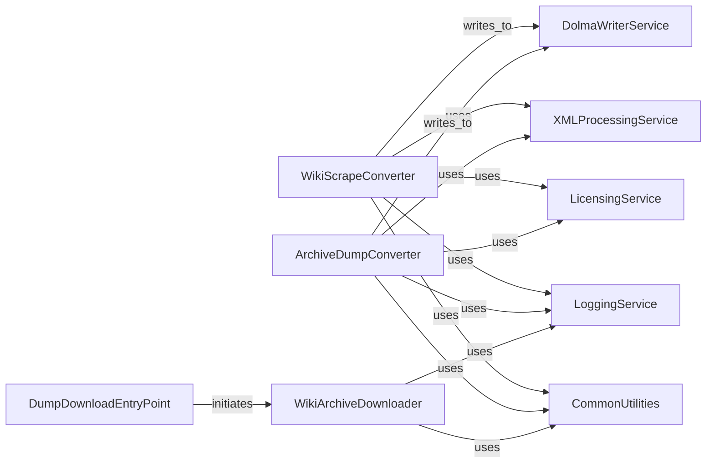

## Component Details

This subsystem is responsible for the end-to-end process of acquiring wiki data from various sources, including Wikimedia, Fandom, and Internet Archive, and then transforming these raw wiki data formats, primarily XML dumps, into the standardized Dolma format. It encompasses downloading, parsing, and converting the data while handling different historical formats and ensuring proper licensing and logging.

### WikiScrapeConverter
This component is responsible for taking raw XML exports from MediaWiki scrapes and transforming them into the standardized Dolma format. It handles parsing page content, metadata, and author information, and then writes the structured data.

**Related Classes/Methods**:

- `common_pile.sources.wiki.to_dolma` (1:130)
- `common_pile.sources.wiki.to_dolma:main` (full file reference)
- `common_pile.sources.wiki.to_dolma:format_dolma` (full file reference)
- `common_pile.sources.wiki.to_dolma:get_wiki_name` (full file reference)
- `common_pile.sources.wiki.to_dolma:make_wiki_url` (full file reference)

### ArchiveDumpConverter
This component processes wiki dumps that might come in different historical formats (e.g., old-style page directories or new-style XML history files). It extracts content, authors, and timestamps, and prepares the data for Dolma output.

**Related Classes/Methods**:

- `common_pile.sources.wiki.archive.to_dolma` (full file reference)
- `common_pile.sources.wiki.archive.to_dolma:main` (full file reference)
- `common_pile.sources.wiki.archive.to_dolma:convert_wiki` (full file reference)
- `common_pile.sources.wiki.archive.to_dolma:format_old` (full file reference)
- `common_pile.sources.wiki.archive.to_dolma:format_xml` (full file reference)

### WikiArchiveDownloader
This component orchestrates the retrieval of wiki data from different platforms such as the Internet Archive, Fandom, and Wikimedia. It handles the download and initial extraction of the archive files.

**Related Classes/Methods**:

- `common_pile.sources.wiki.archive.download_archive` (full file reference)
- `common_pile.sources.wiki.archive.download_archive:main` (full file reference)
- `common_pile.sources.wiki.archive.download_archive:process_wiki` (full file reference)
- `common_pile.sources.wiki.archive.download_archive:download_and_extract` (full file reference)
- `common_pile.sources.wiki.archive.download_archive:download_ia` (full file reference)
- `common_pile.sources.wiki.archive.download_archive:download_fandom` (full file reference)
- `common_pile.sources.wiki.archive.download_archive:scrape_wiki` (full file reference)

### CommonUtilities
This component encapsulates common helper functions used across the common-pile project, including operations related to file system paths, logging messages, and standardizing output directories for Dolma.

**Related Classes/Methods**:

- <a href="https://github.com/r-three/common-pile/blob/master/common_pile/utils.py#L20-L25" target="_blank" rel="noopener noreferrer">`common_pile.utils.removesuffix` (20:25)</a>
- <a href="https://github.com/r-three/common-pile/blob/master/common_pile/utils.py#L46-L50" target="_blank" rel="noopener noreferrer">`common_pile.utils.dolma_output` (46:50)</a>
- `common_pile.utils.wiki_to_dir` (full file reference)
- `common_pile.utils.check_wikimedia` (full file reference)

### LoggingService
This component provides centralized logging functionality for the system, allowing different parts of the application to record events and debug information.

**Related Classes/Methods**:

- <a href="https://github.com/r-three/common-pile/blob/master/common_pile/logs.py#L72-L73" target="_blank" rel="noopener noreferrer">`common_pile.logs.get_logger` (72:73)</a>

### LicensingService
This component is responsible for interpreting and handling license information, specifically converting license strings into a standardized PermissiveLicenses enumeration.

**Related Classes/Methods**:

- <a href="https://github.com/r-three/common-pile/blob/master/common_pile/licenses.py#L60-L93" target="_blank" rel="noopener noreferrer">`common_pile.licenses.PermissiveLicenses.from_string` (60:93)</a>

### XMLProcessingService
This component offers a generic mechanism to traverse and extract specific tags from XML files, which is crucial for processing MediaWiki and other XML-based wiki dumps.

**Related Classes/Methods**:

- <a href="https://github.com/r-three/common-pile/blob/master/common_pile/xml.py#L37-L40" target="_blank" rel="noopener noreferrer">`common_pile.xml.iterate_xmls` (37:40)</a>

### DolmaWriterService
This component is dedicated to serializing and writing the structured wiki data into the Dolma format, typically involving sharding and compression for efficient storage.

**Related Classes/Methods**:

- <a href="https://github.com/r-three/common-pile/blob/master/common_pile/write.py#L36-L66" target="_blank" rel="noopener noreferrer">`common_pile.write.to_dolma` (36:66)</a>

### DumpDownloadEntryPoint
This component serves as the main entry point for initiating wiki dump downloads, specifically handling the initial download and extraction of dump files from sources like Wikimedia.

**Related Classes/Methods**:

- `common_pile.sources.wiki.dump.download` (full file reference)
- `common_pile.sources.wiki.dump.download:main` (full file reference)
- `common_pile.sources.wiki.dump.download.wikimedia_url` (full file reference)

### [FAQ](https://github.com/CodeBoarding/GeneratedOnBoardings/tree/main?tab=readme-ov-file#faq)