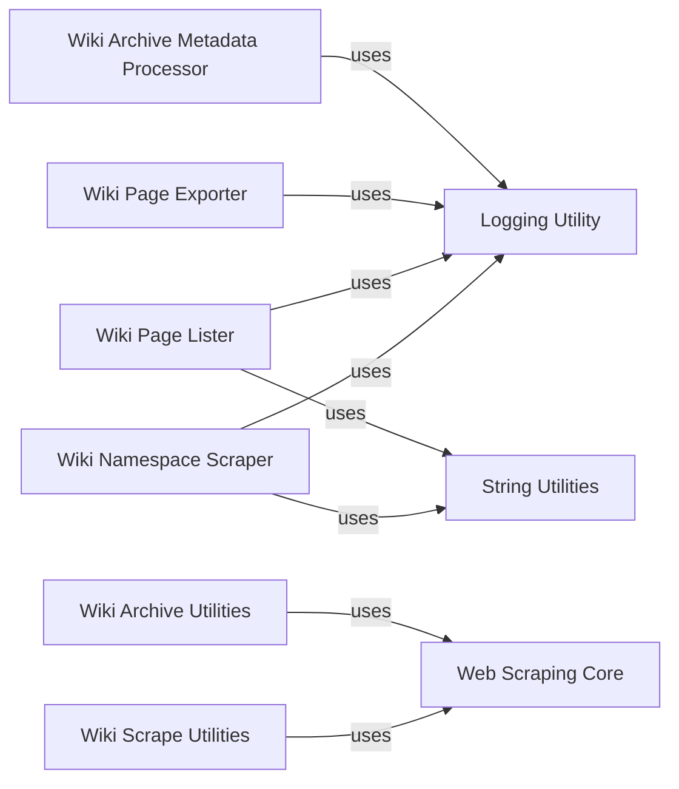

## Component Details

This component provides functionalities for programmatically interacting with wiki sites to scrape information such as namespaces, page lists, and specific page content. It also includes utilities for managing and retrieving metadata related to wiki archives.

### Logging Utility
This component provides shared logging setup for the Common Pile project, allowing other components to obtain and configure loggers for outputting messages.

**Related Classes/Methods**:

- <a href="https://github.com/r-three/common-pile/blob/master/common_pile/logs.py#L72-L73" target="_blank" rel="noopener noreferrer">`common_pile.logs.get_logger` (72:73)</a>

### String Utilities
This component offers shared string processing utilities, specifically functions to remove prefixes and suffixes from strings, which are useful for data cleaning and manipulation.

**Related Classes/Methods**:

- <a href="https://github.com/r-three/common-pile/blob/master/common_pile/utils.py#L20-L25" target="_blank" rel="noopener noreferrer">`common_pile.utils.removesuffix` (20:25)</a>
- <a href="https://github.com/r-three/common-pile/blob/master/common_pile/utils.py#L12-L16" target="_blank" rel="noopener noreferrer">`common_pile.utils.removeprefix` (12:16)</a>

### Web Scraping Core
This component encapsulates the core functionality for making HTTP GET requests to web pages with retry mechanisms and a custom user-agent, ensuring robust data retrieval.

**Related Classes/Methods**:

- <a href="https://github.com/r-three/common-pile/blob/master/common_pile/scrape.py#L19-L37" target="_blank" rel="noopener noreferrer">`common_pile.scrape.get_page` (19:37)</a>

### Wiki Namespace Scraper
This component is responsible for scraping and identifying namespaces from Wiki sources, utilizing string utilities for data processing.

**Related Classes/Methods**:

- <a href="https://github.com/r-three/common-pile/blob/master/sources/wiki/scrape/get_namespaces.py#L1-L56" target="_blank" rel="noopener noreferrer">`common_pile.sources.wiki.scrape.get_namespaces` (1:56)</a>

### Wiki Page Lister
This component handles the enumeration and listing of pages within specific Wiki namespaces, employing logging and string manipulation utilities.

**Related Classes/Methods**:

- `common_pile.sources.wiki.scrape.list_pages` (full file reference)

### Wiki Page Exporter
This component focuses on exporting pages from Wiki sources, leveraging logging for operational insights.

**Related Classes/Methods**:

- `common_pile.sources.wiki.scrape.export_pages` (full file reference)

### Wiki Scrape Utilities
This component provides general utility functions for Wiki scraping, including retrieving individual pages and enumerating page titles, interacting with the core scraping functionality.

**Related Classes/Methods**:

- `common_pile.sources.wiki.scrape.utils` (full file reference)

### Wiki Archive Metadata Processor
This component is responsible for retrieving and merging metadata from Wiki archives, utilizing logging for tracking progress and issues.

**Related Classes/Methods**:

- `common_pile.sources.wiki.archive.get_metadata` (full file reference)

### Wiki Archive Utilities
This component offers utility functions for interacting with Wiki archives, such as checking archive availability, parsing versions, and finding download links and historical data.

**Related Classes/Methods**:

- `common_pile.sources.wiki.archive.utils` (full file reference)

### [FAQ](https://github.com/CodeBoarding/GeneratedOnBoardings/tree/main?tab=readme-ov-file#faq)