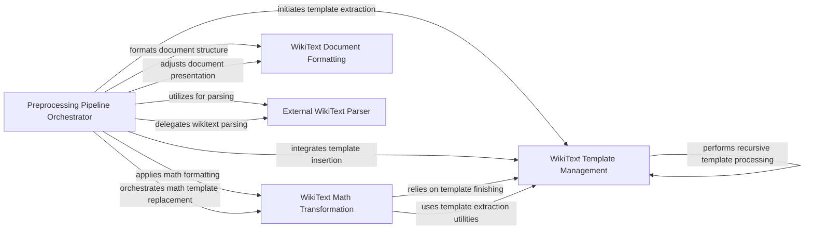

## Component Details

This component focuses on cleaning, normalizing, and enriching wikitext content. It handles complex wikitext syntax, extracts and replaces templates, fixes mathematical expressions, and performs general text formatting to prepare the data for analysis or downstream tasks.

### WikiText Template Management
This component is responsible for the core operations related to handling templates within wikitext. It includes functionalities for extracting templates, removing their brackets, replacing them with specified markers or content, and managing the completion of template scopes, including special handling for mustache-style templates. It also supports inserting processed templates back into the text.

**Related Classes/Methods**:

- `common_pile.sources.wiki.wiki:extract_templates` (full file reference)
- `common_pile.sources.wiki.wiki:remove_template_brackets` (full file reference)
- `common_pile.sources.wiki.wiki:replace_template` (full file reference)
- `common_pile.sources.wiki.wiki:finish_template` (full file reference)
- `common_pile.sources.wiki.wiki:finish_mustache_template` (full file reference)
- `common_pile.sources.wiki.wiki:insert_templates` (full file reference)

### WikiText Math Transformation
This component specializes in converting mathematical expressions from wikitext into a more standardized format, typically LaTeX. It encompasses a wide array of functions for replacing various math-related templates and tags, such as fractions, primes, overlines, and specific mathematical symbols, ensuring proper rendering of complex equations.

**Related Classes/Methods**:

- `common_pile.sources.wiki.wiki:fix_math` (full file reference)
- `common_pile.sources.wiki.wiki:replace_sub` (full file reference)
- `common_pile.sources.wiki.wiki:replace_sup` (full file reference)
- `common_pile.sources.wiki.wiki:replace_radical` (full file reference)
- `common_pile.sources.wiki.wiki:replace_prime` (full file reference)
- `common_pile.sources.wiki.wiki:replace_fraction` (full file reference)
- `common_pile.sources.wiki.wiki:replace_overline` (full file reference)
- `common_pile.sources.wiki.wiki:replace_overbar` (full file reference)
- `common_pile.sources.wiki.wiki:replace_overarc` (full file reference)
- `common_pile.sources.wiki.wiki:replace_mathcal` (full file reference)
- `common_pile.sources.wiki.wiki:replace_mathbb` (full file reference)
- `common_pile.sources.wiki.wiki:replace_strong` (full file reference)
- `common_pile.sources.wiki.wiki:replace_ceil` (full file reference)
- `common_pile.sources.wiki.wiki:replace_floor` (full file reference)
- `common_pile.sources.wiki.wiki:replace_norm` (full file reference)
- `common_pile.sources.wiki.wiki:replace_open_closed` (full file reference)
- `common_pile.sources.wiki.wiki:replace_open_open` (full file reference)
- `common_pile.sources.wiki.wiki:replace_closed_closed` (full file reference)
- `common_pile.sources.wiki.wiki:replace_closed_open` (full file reference)
- `common_pile.sources.wiki.wiki:replace_bra` (full file reference)
- `common_pile.sources.wiki.wiki:replace_ket` (full file reference)
- `common_pile.sources.wiki.wiki:replace_brace` (full file reference)
- `common_pile.sources.wiki.wiki:replace_angle_bracket` (full file reference)
- `common_pile.sources.wiki.wiki:replace_abs` (full file reference)
- `common_pile.sources.wiki.wiki:replace_mset` (full file reference)
- `common_pile.sources.wiki.wiki:replace_symbols` (full file reference)
- `common_pile.sources.wiki.wiki:fix_equals` (full file reference)
- `common_pile.sources.wiki.wiki:extract_math_templates` (full file reference)
- `common_pile.sources.wiki.wiki:replace_math_tags` (full file reference)

### WikiText Document Formatting
This component is responsible for structuring and formatting the processed wikitext content into a coherent and readable document. It includes functionalities for converting section dictionaries into strings, filtering out boilerplate sections, and adjusting indentation to correct parsing issues.

**Related Classes/Methods**:

- `common_pile.sources.wiki.wiki:format_document` (full file reference)
- `common_pile.sources.wiki.wiki:format_section` (full file reference)
- `common_pile.sources.wiki.wiki:filter_section` (full file reference)
- `common_pile.sources.wiki.wiki:adjust_indentation` (full file reference)

### External WikiText Parser
This component provides an interface for parsing raw wikitext by interacting with an external server endpoint. It handles the communication with the parsing service, including sending wikitext and receiving the parsed document, and manages potential network-related errors such as timeouts.

**Related Classes/Methods**:

- `common_pile.sources.wiki.wiki:parse_wikitext` (full file reference)

### Preprocessing Pipeline Orchestrator
This component orchestrates the entire preprocessing pipeline for Wikipedia data. It manages the flow of documents, coordinating various transformation steps including initial wikitext parsing, template handling, math conversion, and final document formatting, often in a parallel processing environment.

**Related Classes/Methods**:

- `common_pile.sources.wiki.preprocess.WTFWikipediaParallel:parse_wikitext` (full file reference)
- `common_pile.sources.wiki.preprocess.WTFWikipediaParallel:process_example` (full file reference)
- `common_pile.sources.wiki.preprocess:main` (full file reference)
- `common_pile.sources.wiki.preprocess` (1:170)
- `common_pile.sources.wiki.wiki` (full file reference)

### [FAQ](https://github.com/CodeBoarding/GeneratedOnBoardings/tree/main?tab=readme-ov-file#faq)