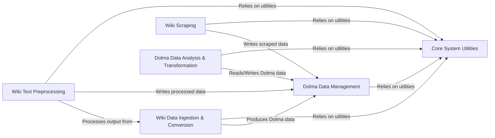

## Component Details

The `common-pile` project is designed for ingesting, processing, and managing large-scale wiki data, converting it into the standardized Dolma format. The main flow involves downloading raw wiki dumps, preprocessing the text, and then performing various analyses and transformations on the Dolma-formatted data, all supported by a set of core system utilities.

### Wiki Data Ingestion & Conversion
This component is responsible for the initial acquisition of wiki data, including downloading dumps from various sources like Wikimedia, Fandom, and Internet Archive, and then converting these raw wiki data formats (primarily XML dumps) into the standardized Dolma format for further processing.

**Related Classes/Methods**:

- `common_pile.sources.wiki.to_dolma` (1:130)
- `common_pile.sources.wiki.archive.to_dolma` (full file reference)
- `common_pile.sources.wiki.archive.download_archive` (full file reference)
- `common_pile.sources.wiki.dump.download` (full file reference)

### Wiki Text Preprocessing
This component focuses on cleaning, normalizing, and enriching wikitext content. It handles complex wikitext syntax, extracts and replaces templates, fixes mathematical expressions, and performs general text formatting to prepare the data for analysis or downstream tasks.

**Related Classes/Methods**:

- `common_pile.sources.wiki.preprocess` (1:170)
- `common_pile.sources.wiki.wiki` (full file reference)

### Wiki Scraping
This component provides functionalities for programmatically interacting with wiki sites to scrape information such as namespaces, page lists, and specific page content. It also includes utilities for managing and retrieving metadata related to wiki archives.

**Related Classes/Methods**:

- `common_pile.sources.wiki.scrape.get_namespaces` (1:56)
- `common_pile.sources.wiki.scrape.list_pages` (full file reference)
- `common_pile.sources.wiki.scrape.export_pages` (full file reference)
- `common_pile.sources.wiki.scrape.utils` (full file reference)
- `common_pile.sources.wiki.archive.get_metadata` (full file reference)
- `common_pile.sources.wiki.archive.utils` (full file reference)

### Dolma Data Management
This core component is responsible for efficiently writing processed data into the Dolma format, which typically involves sharding the data across multiple files for distributed processing. It also provides general utilities for parsing XML files, a common input format for Dolma conversion.

**Related Classes/Methods**:

- `common_pile.common_pile.write` (1:170)
- `common_pile.common_pile.xml` (1:34)

### Core System Utilities
This foundational component provides a collection of general-purpose helper functions and classes used across the common-pile project. This includes logging configuration, file system utilities (like temporary directories and Dolma path handling), string manipulation, handling permissive licenses, and basic web page retrieval.

**Related Classes/Methods**:

- `common_pile.common_pile.logs` (full file reference)
- <a href="https://github.com/r-three/common-pile/blob/master/common_pile/utils.py#L1-L50" target="_blank" rel="noopener noreferrer">`common_pile.utils` (1:50)</a>
- <a href="https://github.com/r-three/common-pile/blob/master/common_pile/licenses.py#L14-L93" target="_blank" rel="noopener noreferrer">`common_pile.licenses.PermissiveLicenses` (14:93)</a>
- <a href="https://github.com/r-three/common-pile/blob/master/common_pile/scrape.py#L19-L37" target="_blank" rel="noopener noreferrer">`common_pile.scrape.get_page` (19:37)</a>

### Dolma Data Analysis & Transformation
This component contains scripts for analyzing, filtering, and transforming Dolma-formatted data, such as identifying specific content patterns (lyrics, transcripts), updating authors, removing HTML, calculating statistics, and combining files.

**Related Classes/Methods**:

- `common_pile.sources.wiki.scripts.find_lyrics` (1:80)
- `common_pile.sources.wiki.scripts.filter_lyrics` (full file reference)
- `common_pile.sources.wiki.scripts.find_transcripts` (full file reference)
- `common_pile.sources.wiki.scripts.filter_transcripts` (full file reference)
- `common_pile.sources.wiki.scripts.update_authors` (full file reference)
- `common_pile.common_pile.scripts.stats` (1:120)
- `common_pile.common_pile.scripts.remove_features` (full file reference)
- `common_pile.common_pile.scripts.remove_none` (full file reference)
- `common_pile.common_pile.scripts.combine_dolma` (full file reference)
- `common_pile.common_pile.scripts.id_to_shard` (full file reference)
- `common_pile.common_pile.scripts.compare_data` (full file reference)
- `common_pile.common_pile.scripts.remove_html` (full file reference)

### [FAQ](https://github.com/CodeBoarding/GeneratedOnBoardings/tree/main?tab=readme-ov-file#faq)