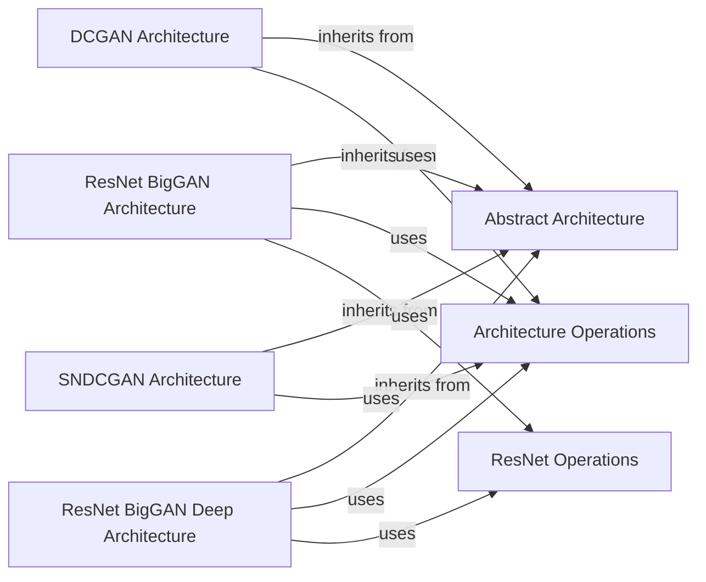

## Details

The Architecture Modules subsystem is structured around an abstract base (Abstract Architecture) that defines the common interface for all concrete GAN architectures. These concrete architectures (DCGAN Architecture, ResNet BigGAN Architecture, ResNet BigGAN Deep Architecture, SNDCGAN Architecture) inherit from this base, ensuring interchangeability. All concrete architectures heavily rely on shared utility components (Architecture Operations and ResNet Operations) for their fundamental building blocks and specialized ResNet patterns, respectively. This design promotes modularity, reusability, and facilitates rapid experimentation by allowing different architectures to be plugged in and out while leveraging a common set of low-level operations.

### Abstract Architecture
Defines the foundational interface (AbstractArchitecture class with an apply method) that all concrete neural network architectures must implement. This ensures a consistent API for integrating different generator/discriminator models, crucial for the modularity and extensibility of an ML research framework.

**Related Classes/Methods**:

- <a href="https://github.com/google/compare_gan/blob/master/compare_gan/architectures/abstract_arch.py" target="_blank" rel="noopener noreferrer">`AbstractArchitecture`</a>

### DCGAN Architecture
Implements the specific convolutional and deconvolutional layers and structure characteristic of the Deep Convolutional Generative Adversarial Network (DCGAN). Represents a concrete, interchangeable model architecture.

**Related Classes/Methods**:

- <a href="https://github.com/google/compare_gan/blob/master/compare_gan/architectures/dcgan.py" target="_blank" rel="noopener noreferrer">`DCGAN Architecture`</a>

### ResNet BigGAN Architecture
Implements a ResNet-based architecture optimized for BigGAN, incorporating specific ResNet block designs for both generator and discriminator. Another concrete, interchangeable model architecture.

**Related Classes/Methods**:

- <a href="https://github.com/google/compare_gan/blob/master/compare_gan/architectures/resnet_biggan.py" target="_blank" rel="noopener noreferrer">`ResNet BigGAN Architecture`</a>

### ResNet BigGAN Deep Architecture
Provides a deeper variant of the BigGAN ResNet architecture, featuring enhanced shortcut connections and potentially more complex ResNet blocks, aiming for improved performance or capacity. This component demonstrates the framework's support for architectural variations and experimentation.

**Related Classes/Methods**:

- <a href="https://github.com/google/compare_gan/blob/master/compare_gan/architectures/resnet_biggan_deep.py" target="_blank" rel="noopener noreferrer">`ResNet BigGAN Deep Architecture`</a>

### SNDCGAN Architecture
Implements the DCGAN architecture with the addition of Spectral Normalization, which is crucial for stabilizing GAN training. This highlights the framework's ability to integrate advanced techniques into existing architectures.

**Related Classes/Methods**:

- <a href="https://github.com/google/compare_gan/blob/master/compare_gan/architectures/sndcgan.py" target="_blank" rel="noopener noreferrer">`SNDCGAN Architecture`</a>

### Architecture Operations
Offers a comprehensive set of reusable, low-level neural network operations and layers, including various batch normalization techniques, linear layers, convolutional layers, and spectral normalization. It acts as a foundational utility library for building blocks, promoting code reuse and consistency across different architectures.

**Related Classes/Methods**:

- <a href="https://github.com/google/compare_gan/blob/master/compare_gan/architectures/arch_ops.py" target="_blank" rel="noopener noreferrer">`Architecture Operations`</a>

### ResNet Operations
Provides generic ResNet-related operations and building blocks (e.g., residual blocks, specific skip connections) that are common across different ResNet variants. This component encapsulates specific architectural patterns, making it easier to construct and modify ResNet-based models.

**Related Classes/Methods**:

- <a href="https://github.com/google/compare_gan/blob/master/compare_gan/architectures/resnet_ops.py" target="_blank" rel="noopener noreferrer">`ResNet Operations`</a>

### [FAQ](https://github.com/CodeBoarding/GeneratedOnBoardings/tree/main?tab=readme-ov-file#faq)