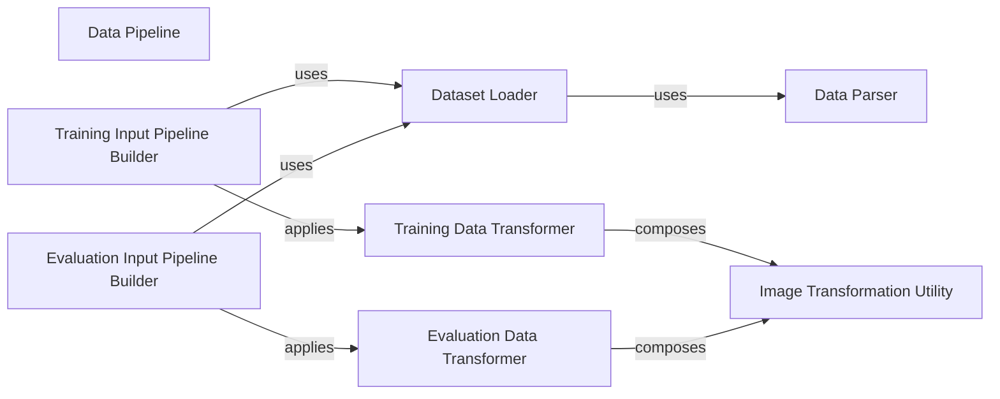

## Details

The `Data Pipeline` subsystem is crucial for preparing image datasets for the GAN training and evaluation processes. It encapsulates all functionalities related to data loading, parsing, preprocessing, and augmentation, ensuring a consistent and efficient data flow.

### Data Pipeline [[Expand]](./Data_Pipeline.md)
The overarching component responsible for efficient loading, preprocessing, and augmentation of image datasets for training and evaluation.

**Related Classes/Methods**:

- <a href="https://github.com/google/compare_gan/blob/master/compare_gan/datasets.py" target="_blank" rel="noopener noreferrer">`compare_gan.datasets`</a>

### Dataset Loader
Handles the initial loading of raw data records from storage, often leveraging TensorFlow's data loading capabilities.

**Related Classes/Methods**:

- <a href="https://github.com/google/compare_gan/blob/master/compare_gan/datasets.py" target="_blank" rel="noopener noreferrer">`compare_gan.datasets:_load_dataset`</a>

### Data Parser
Transforms raw data records (e.g., TFRecord entries) into a structured format suitable for further processing, typically extracting image data and labels.

**Related Classes/Methods**:

- <a href="https://github.com/google/compare_gan/blob/master/compare_gan/datasets.py" target="_blank" rel="noopener noreferrer">`compare_gan.datasets:_parse_fn`</a>

### Training Data Transformer
Orchestrates a sequence of transformations and augmentations specifically designed for training data, enhancing model generalization.

**Related Classes/Methods**:

- <a href="https://github.com/google/compare_gan/blob/master/compare_gan/datasets.py" target="_blank" rel="noopener noreferrer">`compare_gan.datasets:_train_transform_fn`</a>

### Evaluation Data Transformer
Orchestrates transformations for evaluation data, typically involving resizing and normalization without aggressive augmentation to ensure consistent evaluation.

**Related Classes/Methods**:

- <a href="https://github.com/google/compare_gan/blob/master/compare_gan/datasets.py" target="_blank" rel="noopener noreferrer">`compare_gan.datasets:_eval_transform_fn`</a>

### Image Transformation Utility
Provides core image manipulation functionalities such as resizing, cropping, and normalization, used by both training and evaluation transformation pipelines.

**Related Classes/Methods**:

- <a href="https://github.com/google/compare_gan/blob/master/compare_gan/datasets.py" target="_blank" rel="noopener noreferrer">`compare_gan.datasets:_transform_imagnet_image`</a>

### Training Input Pipeline Builder
Constructs the complete TensorFlow `tf.data.Dataset` pipeline specifically for the training phase, integrating loading, parsing, and training-specific transformations.

**Related Classes/Methods**:

- <a href="https://github.com/google/compare_gan/blob/master/compare_gan/datasets.py" target="_blank" rel="noopener noreferrer">`compare_gan.datasets:train_input_fn`</a>

### Evaluation Input Pipeline Builder
Constructs the complete TensorFlow `tf.data.Dataset` pipeline specifically for the evaluation phase, integrating loading, parsing, and evaluation-specific transformations.

**Related Classes/Methods**:

- <a href="https://github.com/google/compare_gan/blob/master/compare_gan/datasets.py" target="_blank" rel="noopener noreferrer">`compare_gan.datasets:eval_input_fn`</a>

### [FAQ](https://github.com/CodeBoarding/GeneratedOnBoardings/tree/main?tab=readme-ov-file#faq)