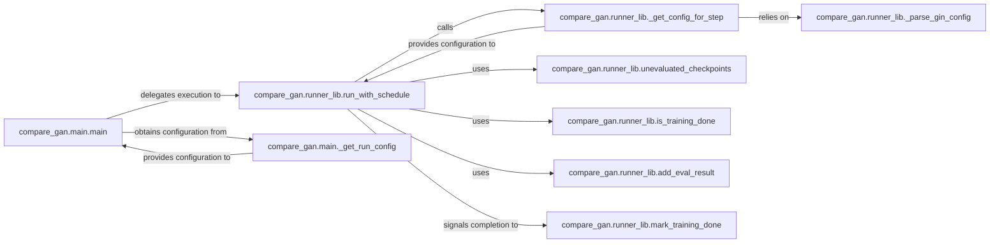

## Details

The `compare_gan` project's core subsystem orchestrates GAN experiment execution, following "Experiment Orchestration" and "Configuration-driven" patterns. The `compare_gan.main.main` component serves as the primary entry point, responsible for obtaining the overall experiment configuration via `compare_gan.main._get_run_config` and delegating the iterative training and evaluation flow to `compare_gan.runner_lib.run_with_schedule`. This `run_with_schedule` component is central to managing the experiment's lifecycle, dynamically retrieving step-specific configurations using `compare_gan.runner_lib._get_config_for_step` (which in turn relies on `compare_gan.runner_lib._parse_gin_config` for parsing Gin configurations). Throughout the experiment, `run_with_schedule` utilizes `compare_gan.runner_lib.is_training_done` to check for training completion, identifies pending evaluations with `compare_gan.runner_lib.unevaluated_checkpoints`, and records evaluation outcomes through `compare_gan.runner_lib.add_eval_result`. Upon completion, `run_with_schedule` signals the end of training via `compare_gan.runner_lib.mark_training_done`. This structured interaction ensures a robust and configurable experiment pipeline.

### compare_gan.main.main
The primary entry point for initiating a GAN experiment. It orchestrates the initial setup, retrieves the overall run configuration, and delegates the core execution flow. This embodies the "Experiment Orchestration" pattern by providing a single control point.

**Related Classes/Methods**:

- <a href="https://github.com/google/compare_gan/blob/master/compare_gan/main.py#L107-L128" target="_blank" rel="noopener noreferrer">`compare_gan.main.main`:107-128</a>

### compare_gan.runner_lib.run_with_schedule
Manages the iterative training and evaluation schedule of the GAN experiment. It orchestrates the progression through different steps, handles checkpoints, and ensures the experiment runs according to the defined schedule. This is the core of the "Pipeline Flow" and "Experiment Orchestration" patterns.

**Related Classes/Methods**:

- <a href="https://github.com/google/compare_gan/blob/master/compare_gan/runner_lib.py#L280-L354" target="_blank" rel="noopener noreferrer">`compare_gan.runner_lib.run_with_schedule`:280-354</a>

### compare_gan.main._get_run_config
Dynamically retrieves or generates the specific configuration required for the entire experiment run. This is a key aspect of the "Configuration-driven" pattern, enabling flexible experimentation.

**Related Classes/Methods**:

- <a href="https://github.com/google/compare_gan/blob/master/compare_gan/main.py#L79-L95" target="_blank" rel="noopener noreferrer">`compare_gan.main._get_run_config`:79-95</a>

### compare_gan.runner_lib._parse_gin_config
Parses configuration files, leveraging the Gin configuration library, to load experiment parameters. This is a direct implementation of the "Configuration-driven" pattern, allowing researchers to define experiments declaratively.

**Related Classes/Methods**:

- <a href="https://github.com/google/compare_gan/blob/master/compare_gan/runner_lib.py#L58-L69" target="_blank" rel="noopener noreferrer">`compare_gan.runner_lib._parse_gin_config`:58-69</a>

### compare_gan.runner_lib._get_config_for_step
Provides the appropriate configuration for a specific step within the experiment (e.g., a particular training step or evaluation checkpoint). This supports the "Configurability" and "Modular" patterns by allowing fine-grained control over different stages.

**Related Classes/Methods**:

- <a href="https://github.com/google/compare_gan/blob/master/compare_gan/runner_lib.py#L195-L205" target="_blank" rel="noopener noreferrer">`compare_gan.runner_lib._get_config_for_step`:195-205</a>

### compare_gan.runner_lib.unevaluated_checkpoints
Identifies and manages checkpoints that are pending evaluation, ensuring that all necessary evaluations are performed. This component supports the "Evaluation Metrics" and "Experiment Orchestration" patterns.

**Related Classes/Methods**:

- <a href="https://github.com/google/compare_gan/blob/master/compare_gan/runner_lib.py" target="_blank" rel="noopener noreferrer">`compare_gan.runner_lib.unevaluated_checkpoints`</a>

### compare_gan.runner_lib.is_training_done
Determines if the overall training process for the GAN experiment has completed. This is part of the "Experiment Orchestration" and "Pipeline Flow" patterns, enabling the system to react to training completion.

**Related Classes/Methods**:

- <a href="https://github.com/google/compare_gan/blob/master/compare_gan/runner_lib.py#L128-L129" target="_blank" rel="noopener noreferrer">`compare_gan.runner_lib.is_training_done`:128-129</a>

### compare_gan.runner_lib.add_eval_result
Records and stores the results obtained from an evaluation step. This is crucial for the "Evaluation Metrics" and "Data Management" aspects of a research framework, allowing for systematic tracking of experiment outcomes.

**Related Classes/Methods**:

- <a href="https://github.com/google/compare_gan/blob/master/compare_gan/runner_lib.py#L207-L224" target="_blank" rel="noopener noreferrer">`compare_gan.runner_lib.add_eval_result`:207-224</a>

### compare_gan.runner_lib.mark_training_done
Signals the completion of the training process by creating a marker file. This is a critical step in the "Experiment Orchestration" and "State Management" patterns, indicating that the training phase has concluded.

**Related Classes/Methods**:

- <a href="https://github.com/google/compare_gan/blob/master/compare_gan/runner_lib.py#L124-L126" target="_blank" rel="noopener noreferrer">`compare_gan.runner_lib.mark_training_done`:124-126</a>

### [FAQ](https://github.com/CodeBoarding/GeneratedOnBoardings/tree/main?tab=readme-ov-file#faq)