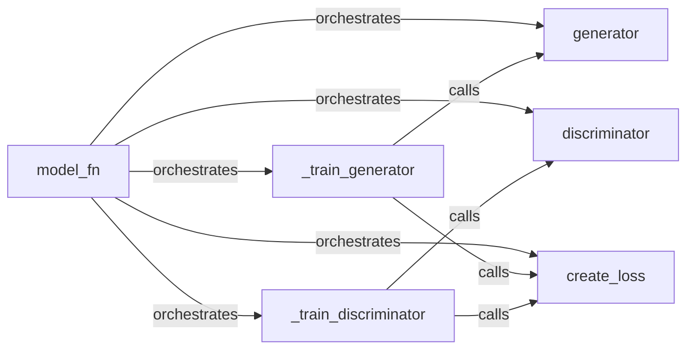

## Details

The GAN Model Core subsystem, as defined by the compare_gan.gans.modular_gan.py file, encapsulates the fundamental logic for Generative Adversarial Networks within the compare_gan project. This subsystem aligns with the project's ML Toolkit/Research Framework patterns by providing modular and configurable components for GAN experimentation.

### model_fn
The central orchestrator of the GAN training process within the TensorFlow Estimator API. It defines the model graph, training operations, and evaluation metrics for the entire GAN. This component is crucial for integrating all other parts of the GAN.

**Related Classes/Methods**:

- <a href="https://github.com/google/compare_gan/blob/master/compare_gan/gans/modular_gan.py#L1-L100" target="_blank" rel="noopener noreferrer">`compare_gan.gans.modular_gan:model_fn`:1-100</a>

### generator
Represents the generator neural network. Its primary role is to produce synthetic data (e.g., images) from latent vectors and conditional inputs. This is a core model component.

**Related Classes/Methods**:

- <a href="https://github.com/google/compare_gan/blob/master/compare_gan/gans/modular_gan.py#L1-L100" target="_blank" rel="noopener noreferrer">`compare_gan.gans.modular_gan:generator`:1-100</a>

### discriminator
Represents the discriminator neural network. Its role is to distinguish between real and synthetic data and potentially classify conditional inputs. This is the other core model component in a GAN.

**Related Classes/Methods**:

- <a href="https://github.com/google/compare_gan/blob/master/compare_gan/gans/modular_gan.py#L1-L100" target="_blank" rel="noopener noreferrer">`compare_gan.gans.modular_gan:discriminator`:1-100</a>

### create_loss
Calculates the adversarial loss functions for both the generator and discriminator, often incorporating conditional information. This component abstracts the loss calculation, allowing for easy interchangeability of loss functions.

**Related Classes/Methods**:

- <a href="https://github.com/google/compare_gan/blob/master/compare_gan/gans/modular_gan.py#L1-L100" target="_blank" rel="noopener noreferrer">`compare_gan.gans.modular_gan:create_loss`:1-100</a>

### _train_generator
Encapsulates the training step for the generator, applying gradients based on its calculated loss. This component isolates the generator's optimization logic.

**Related Classes/Methods**:

- <a href="https://github.com/google/compare_gan/blob/master/compare_gan/gans/modular_gan.py#L1-L100" target="_blank" rel="noopener noreferrer">`compare_gan.gans.modular_gan:_train_generator`:1-100</a>

### _train_discriminator
Encapsulates the training step for the discriminator, applying gradients based on its calculated loss. This component isolates the discriminator's optimization logic.

**Related Classes/Methods**:

- <a href="https://github.com/google/compare_gan/blob/master/compare_gan/gans/modular_gan.py#L1-L100" target="_blank" rel="noopener noreferrer">`compare_gan.gans.modular_gan:_train_discriminator`:1-100</a>

### [FAQ](https://github.com/CodeBoarding/GeneratedOnBoardings/tree/main?tab=readme-ov-file#faq)