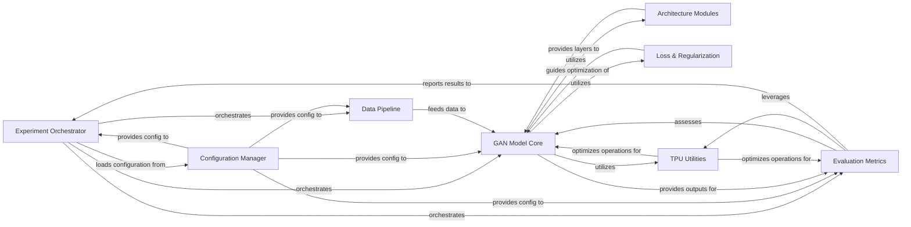

## Details

The `compare_gan` project is structured around a central `Experiment Orchestrator` that manages the entire GAN experiment lifecycle. It dynamically loads configurations from the `Configuration Manager` and orchestrates the `Data Pipeline` to feed preprocessed data to the `GAN Model Core`. The `GAN Model Core`, which encapsulates the generator and discriminator, leverages `Architecture Modules` for its neural network structures, applies `Loss & Regularization` techniques to guide its optimization process, and utilizes `TPU Utilities` for optimized performance. Generated outputs from the `GAN Model Core` are then passed to `Evaluation Metrics` for comprehensive assessment, with results reported back to the `Experiment Orchestrator` to inform the overall experiment progress and decision-making.

### Experiment Orchestrator [[Expand]](./Experiment_Orchestrator.md)
The central control unit managing the entire GAN experiment lifecycle, from setup and configuration to training and evaluation.

**Related Classes/Methods**:

- <a href="https://github.com/google/compare_gan/blob/master/compare_gan/main.py" target="_blank" rel="noopener noreferrer">`compare_gan/main.py`</a>
- <a href="https://github.com/google/compare_gan/blob/master/compare_gan/runner_lib.py" target="_blank" rel="noopener noreferrer">`compare_gan/runner_lib.py`</a>

### Configuration Manager
Handles dynamic loading and application of Gin configurations, enabling flexible component selection and parameter tuning.

**Related Classes/Methods**:

- <a href="https://github.com/google/compare_gan/blob/master/compare_gan/runner_lib.py" target="_blank" rel="noopener noreferrer">`compare_gan/runner_lib.py`</a>

### Data Pipeline [[Expand]](./Data_Pipeline.md)
Responsible for efficient loading, preprocessing, and augmentation of image datasets for training and evaluation.

**Related Classes/Methods**:

- <a href="https://github.com/google/compare_gan/blob/master/compare_gan/datasets.py" target="_blank" rel="noopener noreferrer">`compare_gan/datasets.py`</a>

### GAN Model Core [[Expand]](./GAN_Model_Core.md)
Encapsulates the primary GAN logic, including generator and discriminator models, and their training steps, integrating various architectural modules and loss functions.

**Related Classes/Methods**:

- <a href="https://github.com/google/compare_gan/blob/master/compare_gan/gans/modular_gan.py" target="_blank" rel="noopener noreferrer">`compare_gan/gans/modular_gan.py`</a>

### Architecture Modules [[Expand]](./Architecture_Modules.md)
A library of reusable neural network architectures (e.g., DCGAN, ResNet variants) serving as interchangeable building blocks for GAN generators and discriminators.

**Related Classes/Methods**:

- <a href="https://github.com/google/compare_gan/blob/master/compare_gan/architectures/abstract_arch.py" target="_blank" rel="noopener noreferrer">`compare_gan/architectures/abstract_arch.py`</a>
- <a href="https://github.com/google/compare_gan/blob/master/compare_gan/architectures/dcgan.py" target="_blank" rel="noopener noreferrer">`compare_gan/architectures/dcgan.py`</a>
- <a href="https://github.com/google/compare_gan/blob/master/compare_gan/architectures/resnet_biggan.py" target="_blank" rel="noopener noreferrer">`compare_gan/architectures/resnet_biggan.py`</a>
- <a href="https://github.com/google/compare_gan/blob/master/compare_gan/architectures/resnet_biggan_deep.py" target="_blank" rel="noopener noreferrer">`compare_gan/architectures/resnet_biggan_deep.py`</a>
- <a href="https://github.com/google/compare_gan/blob/master/compare_gan/architectures/arch_ops.py" target="_blank" rel="noopener noreferrer">`compare_gan/architectures/arch_ops.py`</a>

### Loss & Regularization
Contains a collection of loss functions and regularization techniques crucial for stable and effective GAN training.

**Related Classes/Methods**:

- <a href="https://github.com/google/compare_gan/blob/master/compare_gan/gans/loss_lib.py" target="_blank" rel="noopener noreferrer">`compare_gan/gans/loss_lib.py`</a>
- <a href="https://github.com/google/compare_gan/blob/master/compare_gan/gans/penalty_lib.py" target="_blank" rel="noopener noreferrer">`compare_gan/gans/penalty_lib.py`</a>

### Evaluation Metrics
Implements a comprehensive suite of quantitative metrics to assess the quality, diversity, and training stability of generated samples and GAN models.

**Related Classes/Methods**:

- <a href="https://github.com/google/compare_gan/blob/master/compare_gan/metrics/kid_score.py" target="_blank" rel="noopener noreferrer">`compare_gan/metrics/kid_score.py`</a>
- <a href="https://github.com/google/compare_gan/blob/master/compare_gan/metrics/fid_score.py" target="_blank" rel="noopener noreferrer">`compare_gan/metrics/fid_score.py`</a>
- <a href="https://github.com/google/compare_gan/blob/master/compare_gan/metrics/accuracy.py" target="_blank" rel="noopener noreferrer">`compare_gan/metrics/accuracy.py`</a>
- <a href="https://github.com/google/compare_gan/blob/master/compare_gan/metrics/fractal_dimension.py" target="_blank" rel="noopener noreferrer">`compare_gan/metrics/fractal_dimension.py`</a>
- <a href="https://github.com/google/compare_gan/blob/master/compare_gan/metrics/jacobian_conditioning.py" target="_blank" rel="noopener noreferrer">`compare_gan/metrics/jacobian_conditioning.py`</a>
- <a href="https://github.com/google/compare_gan/blob/master/compare_gan/metrics/ms_ssim_score.py" target="_blank" rel="noopener noreferrer">`compare_gan/metrics/ms_ssim_score.py`</a>
- <a href="https://github.com/google/compare_gan/blob/master/compare_gan/metrics/gilbo.py" target="_blank" rel="noopener noreferrer">`compare_gan/metrics/gilbo.py`</a>
- <a href="https://github.com/google/compare_gan/blob/master/compare_gan/metrics/prd_score.py" target="_blank" rel="noopener noreferrer">`compare_gan/metrics/prd_score.py`</a>

### TPU Utilities
Provides specialized utilities and operations optimized for efficient execution on TensorFlow Processing Units (TPUs).

**Related Classes/Methods**:

- <a href="https://github.com/google/compare_gan/blob/master/compare_gan/tpu/tpu_ops.py" target="_blank" rel="noopener noreferrer">`compare_gan/tpu/tpu_ops.py`</a>
- <a href="https://github.com/google/compare_gan/blob/master/compare_gan/tpu/tpu_random.py" target="_blank" rel="noopener noreferrer">`compare_gan/tpu/tpu_random.py`</a>
- <a href="https://github.com/google/compare_gan/blob/master/compare_gan/tpu/tpu_summaries.py" target="_blank" rel="noopener noreferrer">`compare_gan/tpu/tpu_summaries.py`</a>

### [FAQ](https://github.com/CodeBoarding/GeneratedOnBoardings/tree/main?tab=readme-ov-file#faq)