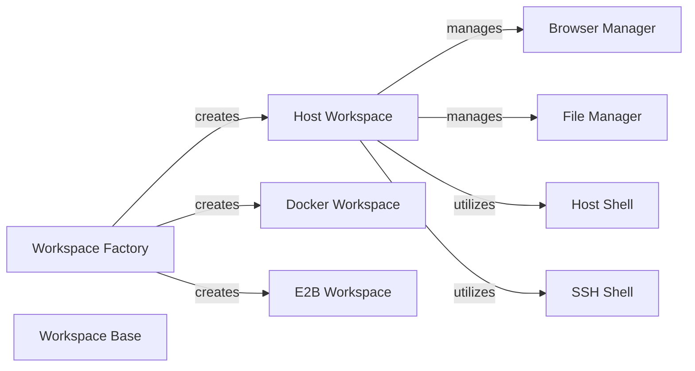

## Component Details

One paragraph explaining the functionality which is represented by this graph. What the main flow is and what is its purpose.

### Workspace Factory
The central component responsible for creating, retrieving, and managing the lifecycle (setup and teardown) of various execution environments (workspaces). It acts as the primary interface for obtaining a workspace instance.

**Related Classes/Methods**:

- <a href="https://github.com/ComposioHQ/composio/blob/master/python/composio/tools/env/factory.py#L59-L149" target="_blank" rel="noopener noreferrer">`composio.tools.env.factory.WorkspaceFactory` (59:149)</a>

### Workspace Base
An abstract base class (or set of interfaces) that defines the common contract and functionalities for all concrete workspace implementations. It ensures a consistent interface for managing different execution environments.

**Related Classes/Methods**:

- <a href="https://github.com/ComposioHQ/composio/blob/master/python/composio/tools/env/base.py#L144-L201" target="_blank" rel="noopener noreferrer">`composio.tools.env.base.Workspace` (144:201)</a>

### Host Workspace
A concrete implementation of a workspace that operates directly on the host machine. it provides access to host-based shell, file system, and browser automation capabilities.

**Related Classes/Methods**:

- <a href="https://github.com/ComposioHQ/composio/blob/master/python/composio/tools/env/host/workspace.py#L0-L0" target="_blank" rel="noopener noreferrer">`composio.tools.env.host.workspace` (0:0)</a>

### Docker Workspace
A concrete implementation of a workspace that utilizes Docker containers as isolated execution environments. It manages the container lifecycle and provides an interface to a tooling server within the container.

**Related Classes/Methods**:

- <a href="https://github.com/ComposioHQ/composio/blob/master/python/composio/tools/env/docker/workspace.py#L0-L0" target="_blank" rel="noopener noreferrer">`composio.tools.env.docker.workspace` (0:0)</a>

### E2B Workspace
A concrete implementation of a workspace that integrates with the E2B sandbox environment. It manages the E2B sandbox lifecycle and provides access to its functionalities.

**Related Classes/Methods**:

- <a href="https://github.com/ComposioHQ/composio/blob/master/python/composio/tools/env/e2b/workspace.py#L0-L0" target="_blank" rel="noopener noreferrer">`composio.tools.env.e2b.workspace` (0:0)</a>

### Browser Manager
Provides a high-level interface for browser automation within an execution environment, including navigation, element interaction (click, type), and screenshot capabilities.

**Related Classes/Methods**:

- <a href="https://github.com/ComposioHQ/composio/blob/master/python/composio/tools/env/browsermanager/manager.py#L0-L0" target="_blank" rel="noopener noreferrer">`composio.tools.env.browsermanager.manager` (0:0)</a>

### File Manager
Offers functionalities for managing files and directories within the workspace, such as opening, creating, renaming, searching (grep, find), listing contents, and changing directories. It also includes a method for executing commands.

**Related Classes/Methods**:

- <a href="https://github.com/ComposioHQ/composio/blob/master/python/composio/tools/env/filemanager/manager.py#L0-L0" target="_blank" rel="noopener noreferrer">`composio.tools.env.filemanager.manager` (0:0)</a>

### Host Shell
Provides a direct interface for executing shell commands on the host machine using subprocess.Popen. It manages the input and output streams of the shell process.

**Related Classes/Methods**:

- <a href="https://github.com/ComposioHQ/composio/blob/master/python/composio/tools/env/host/shell.py#L0-L0" target="_blank" rel="noopener noreferrer">`composio.tools.env.host.shell` (0:0)</a>

### SSH Shell
Provides an interface for executing shell commands over an SSH connection using the paramiko library. It enables remote command execution within an SSH-configured environment.

**Related Classes/Methods**:

- <a href="https://github.com/ComposioHQ/composio/blob/master/python/composio/tools/env/host/shell.py#L0-L0" target="_blank" rel="noopener noreferrer">`composio.tools.env.host.shell` (0:0)</a>

### [FAQ](https://github.com/CodeBoarding/GeneratedOnBoardings/tree/main?tab=readme-ov-file#faq)