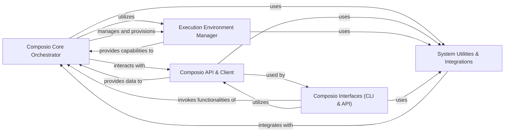

## Component Details

The `composio` project's architecture is designed around a core orchestration engine that manages tools, interacts with a remote API, and operates within various execution environments. The system provides both a Command Line Interface (CLI) and an API server for user and programmatic interaction, supported by essential utilities and external integrations.

### Composio Core Orchestrator
This is the central intelligence of the Composio system. It is responsible for the discovery, management, and execution of all tools, whether they are defined locally or retrieved from the remote Composio platform. It handles the intricate details of tool schema processing, transforms requests and responses, and integrates various tool definitions into a unified execution flow.

**Related Classes/Methods**:

- <a href="https://github.com/ComposioHQ/composio/blob/master/python/composio/tools/toolset.py#L1-L1" target="_blank" rel="noopener noreferrer">`composio.tools.toolset.ComposioToolSet` (1:1)</a>
- <a href="https://github.com/ComposioHQ/composio/blob/master/python/composio/tools/toolset.py#L1-L1" target="_blank" rel="noopener noreferrer">`composio.tools.toolset.SchemaHelper` (1:1)</a>
- <a href="https://github.com/ComposioHQ/composio/blob/master/python/composio/tools/toolset.py#L1-L1" target="_blank" rel="noopener noreferrer">`composio.tools.toolset.ProcessorHelper` (1:1)</a>
- <a href="https://github.com/ComposioHQ/composio/blob/master/python/composio/tools/local/handler.py#L12-L57" target="_blank" rel="noopener noreferrer">`composio.tools.local.handler.LocalClient` (12:57)</a>
- <a href="https://github.com/ComposioHQ/composio/blob/master/python/composio/tools/local/codeanalysis/actions/create_codemap.py#L40-L307" target="_blank" rel="noopener noreferrer">`composio.tools.local.codeanalysis.actions.create_codemap.CreateCodeMap` (40:307)</a>

### Composio API & Client
This component serves as the primary interface for all interactions with the remote Composio platform. It provides structured access to various API resources, including actions, triggers, and connected accounts. It also manages API key validation, handles data synchronization (e.g., caching and refreshing metadata), and ensures secure and efficient communication with the Composio backend.

**Related Classes/Methods**:

- <a href="https://github.com/ComposioHQ/composio/blob/master/python/composio/client/__init__.py#L1-L1" target="_blank" rel="noopener noreferrer">`composio.client.__init__.Composio` (1:1)</a>
- <a href="https://github.com/ComposioHQ/composio/blob/master/python/composio/client/collections.py#L1-L1" target="_blank" rel="noopener noreferrer">`composio.client.collections` (1:1)</a>
- <a href="https://github.com/ComposioHQ/composio/blob/master/python/composio/client/utils.py#L1-L1" target="_blank" rel="noopener noreferrer">`composio.client.utils` (1:1)</a>

### Execution Environment Manager
This component provides an essential abstraction layer for different execution environments, referred to as "workspaces." It is responsible for creating, retrieving, and tearing down these environments (e.g., host-based, Docker). Crucially, it also offers low-level interfaces for tools to interact with the underlying system, including file system operations, shell command execution, and browser automation within the designated environment.

**Related Classes/Methods**:

- <a href="https://github.com/ComposioHQ/composio/blob/master/python/composio/tools/env/factory.py#L59-L149" target="_blank" rel="noopener noreferrer">`composio.tools.env.factory.WorkspaceFactory` (59:149)</a>
- <a href="https://github.com/ComposioHQ/composio/blob/master/python/composio/tools/env/host/workspace.py#L1-L1" target="_blank" rel="noopener noreferrer">`composio.tools.env.host.workspace.HostWorkspace` (1:1)</a>
- <a href="https://github.com/ComposioHQ/composio/blob/master/python/composio/tools/env/browsermanager/manager.py#L26-L287" target="_blank" rel="noopener noreferrer">`composio.tools.env.browsermanager.manager.BrowserManager` (26:287)</a>
- <a href="https://github.com/ComposioHQ/composio/blob/master/python/composio/tools/env/filemanager/manager.py#L41-L432" target="_blank" rel="noopener noreferrer">`composio.tools.env.filemanager.manager.FileManager` (41:432)</a>
- <a href="https://github.com/ComposioHQ/composio/blob/master/python/composio/tools/env/host/shell.py#L51-L175" target="_blank" rel="noopener noreferrer">`composio.tools.env.host.shell.HostShell` (51:175)</a>
- <a href="https://github.com/ComposioHQ/composio/blob/master/python/composio/tools/env/host/shell.py#L178-L281" target="_blank" rel="noopener noreferrer">`composio.tools.env.host.shell.SSHShell` (178:281)</a>

### Composio Interfaces (CLI & API)
This component represents the primary interaction layers for users and external systems with the Composio platform. It encompasses the Command Line Interface (CLI) for direct user interaction and the FastAPI server, which exposes Composio's functionalities and tools as a web API, enabling programmatic access and integration with other systems.

**Related Classes/Methods**:

- <a href="https://github.com/ComposioHQ/composio/blob/master/python/composio/cli/__init__.py#L1-L1" target="_blank" rel="noopener noreferrer">`composio.cli.__init__.composio` (1:1)</a>
- <a href="https://github.com/ComposioHQ/composio/blob/master/python/composio/cli/context.py#L1-L1" target="_blank" rel="noopener noreferrer">`composio.cli.context.Context` (1:1)</a>
- <a href="https://github.com/ComposioHQ/composio/blob/master/python/composio/server/api.py#L1-L1" target="_blank" rel="noopener noreferrer">`composio.server.api.create_app` (1:1)</a>

### System Utilities & Integrations
This component provides essential cross-cutting services and specific external integration capabilities that support the entire Composio system. Its core responsibilities include a centralized logging mechanism for consistent system-wide logging and an integration layer (e.g., OpenAI plugin) that adapts Composio's internal tool definitions to be compatible with external platforms, enabling seamless utilization of Composio tools by third-party services.

**Related Classes/Methods**:

- <a href="https://github.com/ComposioHQ/composio/blob/master/python/composio/utils/logging.py#L1-L1" target="_blank" rel="noopener noreferrer">`composio.utils.logging.get` (1:1)</a>
- `composio.plugins.openai.composio_openai.toolset.ComposioToolSet` (1:1)

### [FAQ](https://github.com/CodeBoarding/GeneratedOnBoardings/tree/main?tab=readme-ov-file#faq)