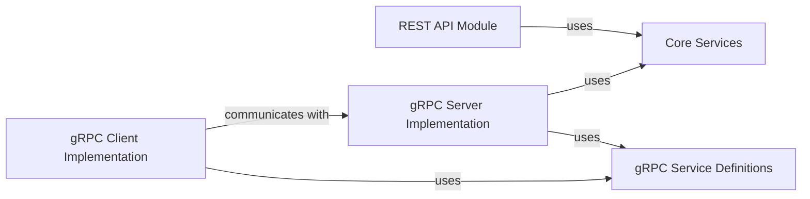

## Component Details

The API & Communication Gateway component serves as the external interface for the Conductor server, facilitating interactions through both RESTful HTTP APIs and high-performance gRPC services. It is crucial for enabling various clients and the UI to manage workflows, tasks, and metadata. This component is broken down into four fundamental sub-components, each playing a distinct role in providing robust and flexible communication channels.

### REST API Module
This module provides the RESTful HTTP endpoints for interacting with the Conductor server. It defines the controllers and resources that expose core functionalities such as workflow management, task operations, and metadata handling over HTTP. It acts as the primary interface for web-based clients and the Conductor UI.

**Related Classes/Methods**:

- `com.netflix.conductor.rest.config.RestConfiguration` (0:0)
- `com.netflix.conductor.rest.controllers.AdminResource` (0:0)
- `com.netflix.conductor.rest.controllers.EventResource` (0:0)
- `com.netflix.conductor.rest.controllers.HealthCheckResource` (0:0)
- `com.netflix.conductor.rest.controllers.MetadataResource` (0:0)
- `com.netflix.conductor.rest.controllers.QueueAdminResource` (0:0)
- `com.netflix.conductor.rest.controllers.TaskResource` (0:0)
- `com.netflix.conductor.rest.controllers.WorkflowBulkResource` (0:0)
- `com.netflix.conductor.rest.controllers.WorkflowResource` (0:0)

### gRPC Service Definitions
This module defines the Protocol Buffer (Proto) contracts for all gRPC services. It includes the `.proto` files that specify the service interfaces and the data structures (messages) used for communication. It also contains mappers responsible for converting between internal Java objects and the Proto-generated objects, ensuring data consistency and type safety across the gRPC interface.

**Related Classes/Methods**:

- `com.netflix.conductor.grpc.AbstractProtoMapper` (0:0)
- `com.netflix.conductor.grpc.ProtoMapper` (0:0)
- `grpc.event_service` (0:0)
- `grpc.metadata_service` (0:0)
- `grpc.task_service` (0:0)
- `grpc.workflow_service` (0:0)
- `model.workflow` (0:0)
- `model.task` (0:0)
- `model.workflowdef` (0:0)

### gRPC Server Implementation
This module implements the server-side logic for the gRPC services defined in the `gRPC Service Definitions`. It is responsible for hosting the gRPC endpoints, receiving incoming gRPC requests, and translating them into calls to the core Conductor services for business logic execution. It manages the gRPC protocol specifics and the lifecycle of gRPC connections.

**Related Classes/Methods**:

- `com.netflix.conductor.grpc.server.GRPCServer` (0:0)
- `com.netflix.conductor.grpc.server.GrpcConfiguration` (0:0)
- `com.netflix.conductor.grpc.server.service.EventServiceImpl` (0:0)
- `com.netflix.conductor.grpc.server.service.MetadataServiceImpl` (0:0)
- `com.netflix.conductor.grpc.server.service.TaskServiceImpl` (0:0)
- `com.netflix.conductor.grpc.server.service.WorkflowServiceImpl` (0:0)

### gRPC Client Implementation
This module provides client-side stubs and helper classes that simplify interaction with the Conductor gRPC server. It abstracts the complexities of gRPC communication, enabling other applications to easily make gRPC calls to the Conductor server for managing workflows and tasks.

**Related Classes/Methods**:

- `com.netflix.conductor.client.grpc.ClientBase` (0:0)
- `com.netflix.conductor.client.grpc.EventClient` (0:0)
- `com.netflix.conductor.client.grpc.MetadataClient` (0:0)
- `com.netflix.conductor.client.grpc.TaskClient` (0:0)
- `com.netflix.conductor.client.grpc.WorkflowClient` (0:0)

### Core Services
Core Conductor services providing business logic execution.

**Related Classes/Methods**: _None_

### [FAQ](https://github.com/CodeBoarding/GeneratedOnBoardings/tree/main?tab=readme-ov-file#faq)