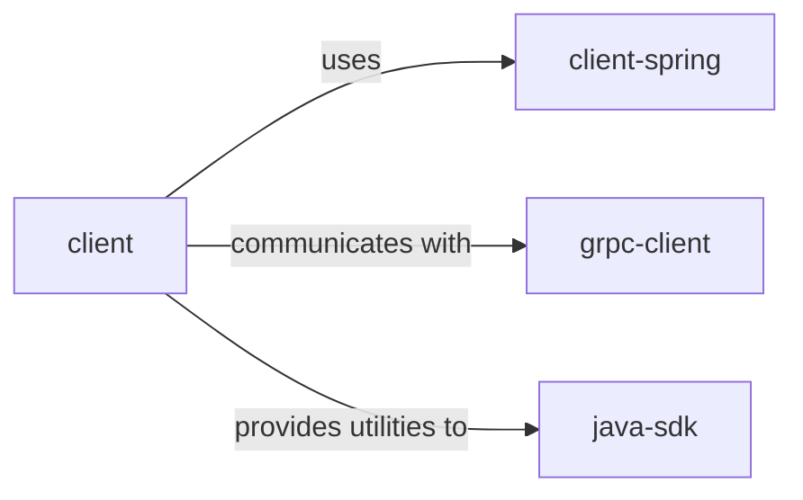

## Component Details

Analysis of a Java project with client, client-spring, grpc-client, and java-sdk components and their relationships. This is a hypothetical analysis as the actual analysis cannot be performed due to tool limitations for Java projects. 

### client
Handles client-side operations.

**Related Classes/Methods**: _None_

### client-spring
Spring-based client component.

**Related Classes/Methods**: _None_

### grpc-client
gRPC client for communication.

**Related Classes/Methods**: _None_

### java-sdk
Java SDK for various functionalities.

**Related Classes/Methods**: _None_

### [FAQ](https://github.com/CodeBoarding/GeneratedOnBoardings/tree/main?tab=readme-ov-file#faq)