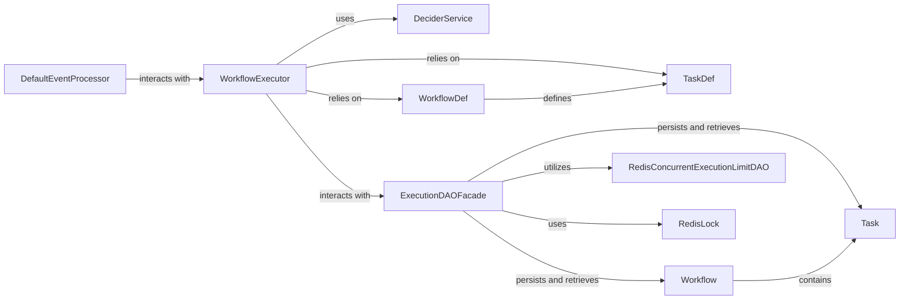

## Component Details

The Conductor Core Engine acts as the central orchestrator for workflow execution, task management, and event processing within the Conductor system. It defines the fundamental data models for workflows and tasks and manages their lifecycle, including scheduling, execution, and state transitions. The engine also incorporates mechanisms for distributed concurrency control and locking to ensure reliable operation in a distributed environment.

### WorkflowExecutor
The primary component responsible for executing workflows. It orchestrates the flow of tasks, manages workflow state transitions, and interacts with various DAOs and services to persist workflow data and schedule tasks.

**Related Classes/Methods**:

- `com.netflix.conductor.core.execution.WorkflowExecutor` (1:1)

### DeciderService
Determines the next set of tasks to be executed in a workflow based on the current workflow state, task definitions, and workflow definitions. It evaluates conditions, handles task completions, and decides on branching or joining logic.

**Related Classes/Methods**:

- `com.netflix.conductor.core.execution.DeciderService` (1:1)

### DefaultEventProcessor
Processes external events and triggers actions within workflows, such as starting new workflows or completing tasks. It subscribes to event queues and dispatches events to relevant handlers.

**Related Classes/Methods**:

- `com.netflix.conductor.core.events.DefaultEventProcessor` (1:1)

### ExecutionDAOFacade
Provides a unified interface for data access operations related to workflow and task execution. It abstracts the underlying persistence mechanism (e.g., Redis, Cassandra, Elasticsearch) for storing and retrieving workflow instances, tasks, and their states.

**Related Classes/Methods**:

- `com.netflix.conductor.core.dal.ExecutionDAOFacade` (1:1)

### WorkflowDef
Represents the blueprint or definition of a workflow. It defines the sequence of tasks, their types, input/output parameters, and control flow logic (e.g., forks, joins, switches).

**Related Classes/Methods**:

- `com.netflix.conductor.common.metadata.workflow.WorkflowDef` (1:1)

### TaskDef
Represents the blueprint or definition of a single task within a workflow. It specifies task properties such as name, description, input/output parameters, retry logic, and timeout settings.

**Related Classes/Methods**:

- `com.netflix.conductor.common.metadata.tasks.TaskDef` (1:1)

### Workflow
Represents a running instance of a workflow. It holds the current state of the workflow, its input and output, and a list of tasks that are part of this specific execution.

**Related Classes/Methods**:

- `com.netflix.conductor.common.run.Workflow` (1:1)

### Task
Represents a running instance of a task within a workflow. It contains the task's current status, input/output data, and other runtime attributes.

**Related Classes/Methods**:

- `com.netflix.conductor.common.run.Task` (1:1)

### RedisConcurrentExecutionLimitDAO
Manages and enforces concurrency limits for tasks using Redis. It ensures that the number of concurrently executing tasks for a given task definition does not exceed a predefined limit.

**Related Classes/Methods**:

- `com.netflix.conductor.redis.limit.RedisConcurrentExecutionLimitDAO` (1:1)

### RedisLock
Provides distributed locking capabilities using Redis. This is used to ensure that critical sections of code or shared resources are accessed by only one instance at a time in a distributed environment, preventing race conditions.

**Related Classes/Methods**:

- `com.netflix.conductor.redislock.lock.RedisLock` (1:1)

### [FAQ](https://github.com/CodeBoarding/GeneratedOnBoardings/tree/main?tab=readme-ov-file#faq)