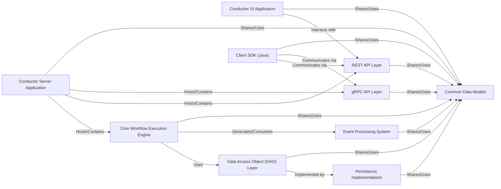

## Component Details

The Conductor Server & UI subsystem is composed of two primary applications: the Conductor Server (backend) and the Conductor UI (frontend). These two components, along with several crucial internal modules, form the complete Conductor system for workflow orchestration and management.

### Conductor Server Application
The main executable application that initializes, configures, and runs all backend services of Conductor. It acts as the central orchestrator, bringing together the core workflow engine, API layers, and persistence mechanisms.

**Related Classes/Methods**:

- `com.netflix.conductor.Conductor` (1:1)

### Conductor UI Application
A web-based graphical user interface that provides a visual means for users to define, monitor, debug, and manage workflows and tasks. It offers essential operational visibility into the Conductor system.

**Related Classes/Methods**:

- `App.jsx` (1:1)
- `index.js` (1:1)

### Core Workflow Execution Engine
The brain of Conductor, responsible for interpreting workflow definitions, scheduling tasks, managing workflow state transitions, and executing the logic that drives workflows from start to completion.

**Related Classes/Methods**:

- `com.netflix.conductor.core.execution.WorkflowExecutor` (1:1)
- `com.netflix.conductor.core.execution.DeciderService` (1:1)

### REST API Layer
Provides a set of RESTful HTTP endpoints that allow external systems, including the Conductor UI, to programmatically interact with the Conductor server. This includes operations for creating, starting, pausing, resuming, and searching workflows and tasks, as well as managing metadata.

**Related Classes/Methods**:

- `com.netflix.conductor.rest.controllers.WorkflowResource` (1:1)
- `com.netflix.conductor.rest.controllers.TaskResource` (1:1)

### gRPC API Layer
Offers an alternative, high-performance, and language-agnostic API for interacting with the Conductor server using gRPC. It provides similar functionalities to the REST API but is optimized for efficient inter-service communication.

**Related Classes/Methods**:

- `com.netflix.conductor.grpc.server.service.WorkflowServiceImpl` (1:1)
- `com.netflix.conductor.grpc.server.service.TaskServiceImpl` (1:1)

### Data Access Object (DAO) Layer
An abstract layer that defines the contracts (interfaces) for all data persistence operations within Conductor. It decouples the core business logic from the specifics of the underlying database technology, allowing for interchangeable persistence implementations.

**Related Classes/Methods**:

- `com.netflix.conductor.core.dal.ExecutionDAOFacade` (1:1)
- `com.netflix.conductor.dao.ExecutionDAO` (1:1)

### Persistence Implementations
Concrete modules that provide the actual implementation of the DAO interfaces for specific database technologies. These modules handle the low-level details of storing and retrieving workflow, task, and event data in chosen persistence stores.

**Related Classes/Methods**:

- `com.netflix.conductor.redis.dao.RedisExecutionDAO` (1:1)
- `com.netflix.conductor.cassandra.dao.CassandraExecutionDAO` (1:1)
- `com.netflix.conductor.es6.dao.index.ElasticSearchDAOV6` (1:1)

### Event Processing System
Manages the ingestion and processing of external and internal events. It enables event-driven workflows by allowing Conductor to react to messages from external queues or internal state changes, triggering workflow executions or task updates.

**Related Classes/Methods**:

- `com.netflix.conductor.core.events.DefaultEventProcessor` (1:1)
- `com.netflix.conductor.core.events.EventQueueManager` (1:1)

### Client SDK (Java)
A client library that provides a high-level, idiomatic Java interface for external applications (workers) to interact with the Conductor server. It simplifies the process of polling for tasks, updating task status, and starting workflows, abstracting away the underlying communication protocols (REST/gRPC).

**Related Classes/Methods**:

- `com.netflix.conductor.client.http.WorkflowClient` (1:1)
- `com.netflix.conductor.client.worker.Worker` (1:1)

### Common Data Models
A shared module that defines the fundamental data structures and models used across the entire Conductor system, such as `WorkflowDef` (workflow definition), `TaskDef` (task definition), `Workflow` (workflow instance), and `Task` (task instance).

**Related Classes/Methods**:

- `com.netflix.conductor.common.metadata.workflow.WorkflowDef` (1:1)
- `com.netflix.conductor.common.run.Workflow` (1:1)
- `com.netflix.conductor.common.metadata.tasks.Task` (1:1)

### [FAQ](https://github.com/CodeBoarding/GeneratedOnBoardings/tree/main?tab=readme-ov-file#faq)