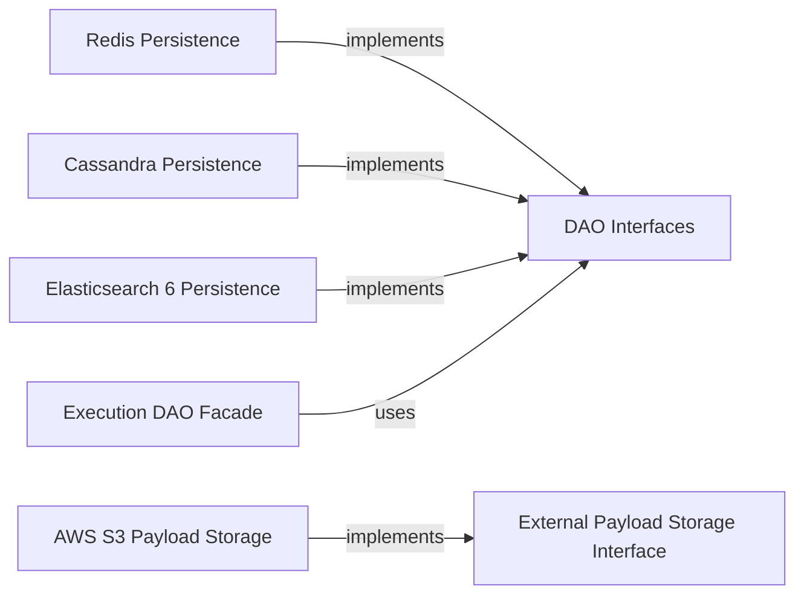

## Component Details

The Data Persistence & Indexing Layer in Conductor is a critical subsystem responsible for all data storage, retrieval, and indexing operations. It offers a pluggable architecture, allowing different database technologies to be used for various data types, ensuring flexibility and scalability.

### DAO Interfaces
This component defines the abstract contracts (interfaces) for all Data Access Objects (DAOs) within Conductor. These interfaces specify the operations for managing workflow executions (`ExecutionDAO`), metadata (`MetadataDAO`), indexing (`IndexDAO`), queues (`QueueDAO`), event handlers (`EventHandlerDAO`), poll data (`PollDataDAO`), concurrent execution limits (`ConcurrentExecutionLimitDAO`), and rate limiting (`RateLimitingDAO`). It acts as the blueprint for data persistence.

**Related Classes/Methods**:

- `ExecutionDAO` (0:0)
- `MetadataDAO` (0:0)
- `IndexDAO` (0:0)

### Execution DAO Facade
This class serves as a unified facade, simplifying the interaction between the core workflow execution engine and the various underlying DAOs responsible for workflow and task states. It aggregates and orchestrates data operations across multiple DAOs, presenting a cohesive and simplified view to higher-level services.

**Related Classes/Methods**:

- `ExecutionDAOFacade` (0:0)

### External Payload Storage Interface
This interface defines the contract for storing and retrieving large workflow input/output payloads externally. This mechanism is essential for handling data that might exceed the practical storage limits of the primary workflow/task state database, ensuring efficient management of large data volumes.

**Related Classes/Methods**:

- `ExternalPayloadStorage` (0:0)

### Redis Persistence
This module provides concrete implementations of several DAO interfaces, including `ExecutionDAO`, `MetadataDAO`, `QueueDAO`, `EventHandlerDAO`, `PollDataDAO`, and `RateLimitingDAO`, utilizing Redis as the underlying data store. It leverages Redis's in-memory data structures for high-performance state management and rapid data access.

**Related Classes/Methods**:

- `RedisExecutionDAO` (0:0)
- `RedisMetadataDAO` (0:0)

### Cassandra Persistence
This module provides concrete implementations for `ExecutionDAO`, `MetadataDAO`, `EventHandlerDAO`, and `PollDataDAO` using Apache Cassandra. Cassandra is chosen for its highly scalable, fault-tolerant, and distributed database capabilities, making it suitable for persisting large volumes of workflow and task states.

**Related Classes/Methods**:

- `CassandraExecutionDAO` (0:0)
- `CassandraMetadataDAO` (0:0)

### Elasticsearch 6 Persistence
This module provides concrete implementations of the `IndexDAO` interface, enabling powerful indexing and search capabilities for workflow and task data using Elasticsearch version 6. It facilitates advanced querying for monitoring, auditing, and debugging workflows.

**Related Classes/Methods**:

- `ElasticSearchDAOV6` (0:0)

### AWS S3 Payload Storage
This module provides a concrete implementation of the `ExternalPayloadStorage` interface, specifically designed for storing and retrieving large workflow input/output payloads in Amazon S3. It leverages S3's cost-effective and highly scalable object storage.

**Related Classes/Methods**:

- `S3PayloadStorage` (0:0)

### [FAQ](https://github.com/CodeBoarding/GeneratedOnBoardings/tree/main?tab=readme-ov-file#faq)