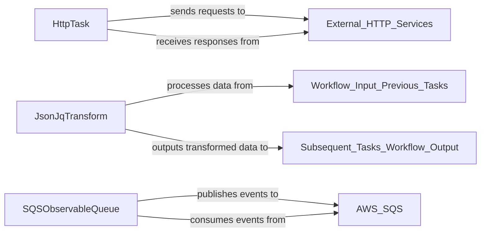

## Component Details

The System Tasks & Integrations component provides essential pre-built tasks for external interactions and data manipulation within workflows. The fundamental components chosen for this overview are HttpTask, JsonJqTransform, and SQSObservableQueue, as they directly correspond to the http-task, json-jq-task, and awssqs-event-queue descriptions provided, respectively. They are central because they encapsulate the core logic for performing HTTP requests, JSON transformations, and AWS SQS interactions, making them critical for extending workflow capabilities.

### HttpTask
This component is responsible for executing HTTP requests to external services. It allows workflows to interact with RESTful APIs, send data, and receive responses, enabling integration with a wide range of external systems.

**Related Classes/Methods**:

- `HttpTask` (1:1)

### JsonJqTransform
This component facilitates the transformation of JSON data using JQ expressions. It enables powerful in-workflow data manipulation, allowing for extraction, filtering, and restructuring of JSON payloads.

**Related Classes/Methods**:

- `JsonJqTransform` (1:1)

### SQSObservableQueue
This component provides integration with AWS SQS (Simple Queue Service) for event-driven architectures. It allows workflows to publish messages to SQS queues and consume messages from them, enabling asynchronous communication and event handling.

**Related Classes/Methods**:

- `SQSObservableQueue` (1:1)

### [FAQ](https://github.com/CodeBoarding/GeneratedOnBoardings/tree/main?tab=readme-ov-file#faq)